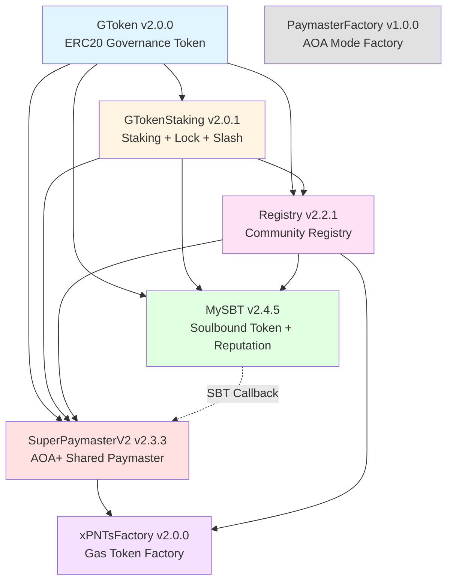
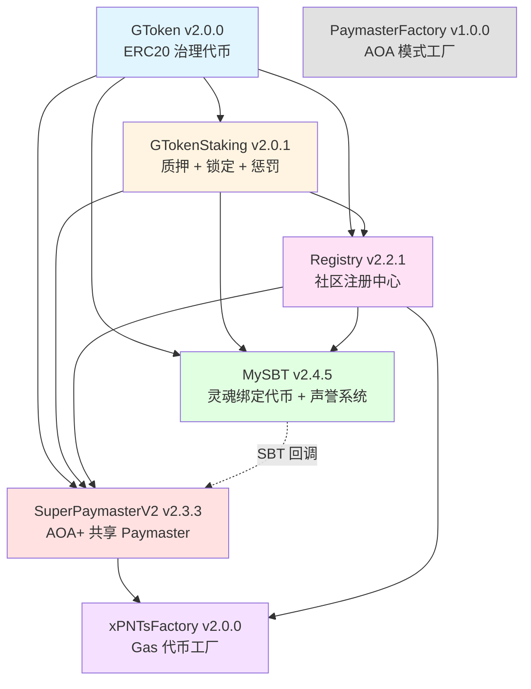
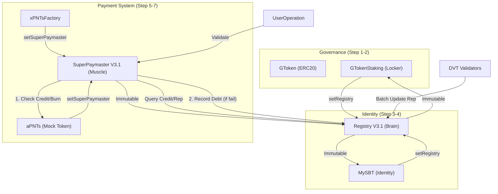

# SuperPaymaster - Decentralized Gas Payment Infrastructure

**[English](#english)** | **[中文](#chinese)**

<a name="english"></a>

---

## 🎯 What is SuperPaymaster?

SuperPaymaster is a **decentralized gas payment infrastructure** for ERC-4337 Account Abstraction that enables:

- **For Communities**: Deploy custom paymasters with your own community tokens (xPNTs)
- **For Users**: Seamless gas sponsorship using community points instead of ETH
- **For Developers**: Easy integration with shared configuration and battle-tested contracts
- **CLI Guide**: [Command Line Interface Guide](./docs/CLI_GUIDE.md)

### Key Features

✅ **Two Operating Modes**:
- **AOA Mode**: Independent paymaster for each community (via PaymasterFactory)
- **AOA+ Mode**: Shared multi-operator paymaster (via SuperPaymasterV2)

✅ **Community-First Design**:
- Register your community in the Registry
- Deploy custom xPNTs tokens for your members
- Manage SBT (Soulbound Token) memberships with reputation system

✅ **Security & Governance**:
- GToken staking system with slashing mechanism
- Chainlink oracle integration for price feeds (v2.0.1: enhanced security)
- Multi-layer validation and reputation tracking
- **V3.1.1 Testing & Security**:
  - 🧪 [V3.1.1 Testing Framework (Beginner Ready)](./docs/V3_Testing_Framework.md) - How to run V3 tests
  - 📜 [Stage 1 Audit Summary](./docs/Stage1_Audit_Summary.md) - Coverage & security audit report
  - 🛡️ [Security Architecture V3.1.1](./docs/Security_Architecture_V3_1.md) - DVT Slashing & Reputation System
  - 🚀 [Security & Performance Action Plan](./docs/SECURITY_AND_PERFORMANCE.md) - Best practices workflow
- **V3 Refactor Planned**: [Credit-Based Architecture & DVT Security](./docs/V3_REFACTOR_DESIGN.md) on Sepolia testnet
- Mainnet deployment ready (pending audit)

✅ **Production Ready**:
- 206/206 tests passing
- Deployed on Sepolia testnet

---

## 🏗️ Architecture Overview

### AAstar SuperPaymaster Ecosystem

```
┌────────────────────────────────────────────────────────────┐
│             AAstar SuperPaymaster Ecosystem                 │
├────────────────────────────────────────────────────────────┤
│                                                              │
│  【SuperPaymaster】(Core Contracts)                          │
│   Solidity Smart Contracts                                  │
│   ├─ SuperPaymasterV2 v2.3.3 (AOA+ Shared Mode)            │
│   ├─ PaymasterV4/V4_1 (AOA Independent Mode)               │
│   ├─ Registry v2.2.1 (Community Registry)                  │
│   ├─ GTokenStaking v2.0.1 (Staking + Slash)                │
│   ├─ MySBT v2.4.5 (Identity System)                        │
│   └─ xPNTsFactory v2.0.0 (Gas Token Factory)               │
│        ↓ Deployment                                          │
│        ↓ ABI + Addresses                                     │
│                                                              │
│  【shared-config】(Configuration Hub)                        │
│   npm package @aastar/shared-config v0.2.18                 │
│   ├─ All Contract Addresses (Sepolia)                       │
│   ├─ Network Configuration (RPC, Explorer)                  │
│   ├─ Constants (Fee Rates, Stake Amounts)                   │
│   └─ ABI Exports                                             │
│        ↓ Dependency                                          │
│        ↓                                                     │
│  【registry】(Operations Frontend)      ←─────┐              │
│   React 19 + TypeScript + Vite                │              │
│   ├─ DeployWizard (7-Step Deployment)        │              │
│   ├─ ExplorerHub (Registry Browser)          │              │
│   ├─ Analytics (Gas Analysis)                 │              │
│   └─ RPC Proxy (Vercel Serverless)           │              │
│                                                │              │
│  【faucet】(Testing Tools)              ←─────┘              │
│   Vercel Serverless + Pure HTML Frontend                    │
│   ├─ Distribute SBT/PNT/GToken/USDT                         │
│   ├─ Create SimpleAccount                                    │
│   └─ PaymasterV4 Liquidity Pool Init                        │
│                                                              │
└────────────────────────────────────────────────────────────┘
```

### Core Contracts (7 Main Components)

#### Contract Dependency Graph



**Deployment Order**:
1. GToken (no dependencies)
2. GTokenStaking (depends on GToken)
3. Registry (depends on GTokenStaking)
4. MySBT (depends on GToken, GTokenStaking, Registry)
5. SuperPaymasterV2 (depends on GTokenStaking, Registry, Chainlink Price Feed)
6. xPNTsFactory (depends on SuperPaymasterV2, Registry)
7. PaymasterFactory (no dependencies)

#### 1. **GToken** (Governance Token)
- **Version**: v2.0.0
- **Type**: ERC20 with Cap + Ownable
- **Purpose**: System governance token, supports staking and minting
- **Features**: Capped supply, transferable, mintable by owner

#### 2. **GTokenStaking** (Staking Contract)
- **Version**: v2.0.1
- **Type**: Staking + Lock + Slash Mechanism
- **Purpose**: GToken staking, locking, and slashing system
- **New Features**:
  - `stakeFor()` - Stake on behalf of other users
  - `balanceOf()` - Unified API for staked balance
- **Security**: Authorized locker system for Registry, MySBT, and SuperPaymaster

#### 3. **Registry** (Community Registry)
- **Version**: v2.2.1 (latest)
- **Type**: Community Registry + Slash System
- **Purpose**: Community registration, node management, slashing mechanism
- **Node Types**:
  - `PAYMASTER_AOA`: Independent paymaster (30 GT stake)
  - `PAYMASTER_SUPER`: Shared paymaster (50 GT stake)
  - `ANODE`: Community compute node (20 GT stake)
  - `KMS`: Key management service (100 GT stake)
- **New Features (v2.2.1)**:
  - `registerCommunityWithAutoStake()` - Single transaction registration
  - Duplicate prevention with `isRegistered` mapping

#### 4. **MySBT** (Soulbound Token)
- **Version**: v2.4.5 (latest)
- **Type**: ERC721 (Soulbound) + Reputation System
- **Purpose**: User identity, community membership, reputation tracking
- **Key Features**:
  - `mintWithAutoStake()` - Single transaction for staking + minting
  - NFT avatar binding
  - Multi-community membership support
  - Reputation scoring with activity bonuses
  - **SuperPaymaster callback** - Auto-register SBT holders in paymaster
- **Size**: 21.4KB (optimized from 27.2KB)

#### 5. **SuperPaymasterV2** (AOA+ Mode Paymaster)
- **Version**: v2.3.3 (latest)
- **Type**: ERC-4337 Paymaster + Multi-operator
- **Purpose**: Shared paymaster for AOA+ mode, aPNTs payment
- **Key Features (v2.3.3)**:
  - ✅ **PostOp Payment**: xPNTs transfer in postOp phase
  - ✅ **SBT Internal Registry**: MySBT callback integration
  - ✅ **Debt Tracking**: User debt management system
  - ✅ **Price Caching**: Optimized Chainlink oracle calls
  - ✅ Chainlink oracle validation with staleness check
  - ✅ Price bounds validation ($100-$100k)

#### 6. **PaymasterFactory** (Paymaster Factory)
- **Version**: v1.0.0
- **Type**: EIP-1167 Minimal Proxy Factory
- **Purpose**: Deploy independent AOA mode paymasters
- **Benefits**: Gas-efficient deployment, isolated operator control

#### 7. **xPNTsFactory** (xPNTs Token Factory)
- **Version**: v2.0.0
- **Type**: Token Factory
- **Purpose**: Deploy custom xPNTs tokens for communities
- **Features**: Exchange rate configuration, paymaster integration

---

## 🚀 Quick Start

### For Community Operators

#### 1. Register Your Community

```solidity
import "@aastar/shared-config/contracts/Registry.sol";

// Get Registry contract from shared-config
Registry registry = Registry(REGISTRY_ADDRESS);

// Register your community
registry.registerCommunity(
    "MyAwesomeCommunity",           // name
    "myawesome.eth",                // ENS name
    xpntsTokenAddress,              // your community token
    [mySBTAddress],                 // supported SBTs
    Registry.NodeType.PAYMASTER_AOA, // node type
    address(0)                       // paymaster (set later)
);
```

#### 2. Deploy Your xPNTs Token

```solidity
import "@aastar/shared-config/contracts/xPNTsFactory.sol";

xPNTsFactory factory = xPNTsFactory(XPNTS_FACTORY_ADDRESS);

address xpntsToken = factory.deployxPNTsToken(
    "MyAwesome Points",      // token name
    "MAP",                   // token symbol
    "MyAwesomeCommunity",    // community name
    "myawesome.eth",         // ENS name
    1 ether,                 // exchange rate (1:1)
    paymasterAddress         // your paymaster
);
```

#### 3. Choose Your Paymaster Mode

**Option A: AOA Mode (Independent Paymaster)**

```solidity
import "@aastar/shared-config/contracts/PaymasterFactory.sol";

PaymasterFactory factory = PaymasterFactory(PAYMASTER_FACTORY_ADDRESS);

address myPaymaster = factory.deployPaymaster(
    xpntsTokenAddress,       // your xPNTs token
    mySBTAddress,            // your MySBT contract
    treasuryAddress,         // your treasury
    200                      // fee rate (2%)
);
```

**Option B: AOA+ Mode (Shared Paymaster)**

```solidity
import "@aastar/shared-config/contracts/SuperPaymasterV2.sol";

SuperPaymasterV2 superPaymaster = SuperPaymasterV2(SUPERPAYMASTER_V2_ADDRESS);

// Join as operator
superPaymaster.depositAPNTs(
    operatorAddress,
    apntsAmount,
    xpntsTokenAddress,
    treasuryAddress,
    exchangeRate
);
```

### For Developers

#### Install Shared Config

```bash
npm install @aastar/shared-config
# or
pnpm add @aastar/shared-config
```

#### Use Contract Addresses

```typescript
import {
  getRegistryAddress,
  getSuperPaymasterAddress,
  getxPNTsFactoryAddress
} from '@aastar/shared-config';

const registryAddress = getRegistryAddress('sepolia');
const superPaymasterAddress = getSuperPaymasterAddress('sepolia');
```

#### Integrate with Your dApp

```javascript
import { ethers } from 'ethers';
import SuperPaymasterV2ABI from '@aastar/shared-config/abis/SuperPaymasterV2.json';

const superPaymaster = new ethers.Contract(
  superPaymasterAddress,
  SuperPaymasterV2ABI,
  signer
);

// Get operator info
const operatorInfo = await superPaymaster.accounts(operatorAddress);
console.log('aPNTs Balance:', operatorInfo.aPNTsBalance);
```

---

## 📱 Web Interface

The SuperPaymaster ecosystem has a full-featured web dashboard:

**Repository**: [AAStarCommunity/registry](https://github.com/AAStarCommunity/registry)

**Features**:
- 🌐 Community registration and management
- 🎫 Deploy xPNTs tokens
- 🚀 Launch paymasters (AOA & AOA+ modes)
- 👤 Mint and manage MySBT tokens
- 📊 Monitor paymaster activity and statistics
- 🔍 View community profiles and reputation

**Live Demo**: [superpaymaster.aastar.io](https://superpaymaster.aastar.io)

**Local Development**:
```bash
# Clone registry repository
git clone https://github.com/AAStarCommunity/registry.git
cd registry

# Install dependencies
pnpm install

# Start development server
pnpm dev

# Visit http://localhost:3000
```

---

## 💼 For Users

### Mint Your MySBT

```solidity
import "@aastar/shared-config/contracts/MySBT.sol";

MySBT mySBT = MySBT(MYSBT_ADDRESS);

// Mint with auto-stake (single transaction)
mySBT.mintWithAutoStake{value: mintFee}(
    communityAddress,
    minLockAmount,
    metadata
);
```

### Use Gas Sponsorship

Your dApp can sponsor user transactions using community tokens:

```javascript
// Prepare UserOperation with paymaster
const userOp = {
  sender: userAddress,
  // ... other fields
  paymasterAndData: encodePaymasterData(
    paymasterAddress,
    validUntil,
    validAfter,
    signature
  )
};

// Send to bundler
const result = await bundler.sendUserOperation(userOp, entryPointAddress);
```

---

## 🛠️ Development

### Prerequisites

- [Foundry](https://book.getfoundry.sh/) - Smart contract development framework
- [Node.js](https://nodejs.org/) v16+ - For scripts and testing
- [pnpm](https://pnpm.io/) - Package manager

### Repository Structure

```
SuperPaymaster/
├── contracts/                    # All Solidity code
│   ├── src/                      # Contract source
│   │   ├── paymasters/           # Paymaster implementations
│   │   │   ├── v2/              # SuperPaymasterV2
│   │   │   ├── v3/              # PaymasterV3 variants
│   │   │   └── v4/              # PaymasterV4 family
│   │   ├── tokens/              # MySBT, xPNTs tokens
│   │   ├── base/                # GToken, Staking, Registry
│   │   └── utils/               # Helper contracts
│   ├── test/                    # Test files (206 tests)
│   ├── lib/                     # Dependencies
│   └── deployments/             # Deployment records
├── script/                      # Foundry deployment scripts
├── docs/                        # Documentation
├── deprecated/                  # Archived old code
└── foundry.toml                 # Foundry configuration
```

### Installation

```bash
# Clone the repository
git clone https://github.com/AAStarCommunity/SuperPaymaster.git
cd SuperPaymaster

# Initialize submodules
git submodule update --init --recursive

# Install Foundry dependencies
forge install

# Build contracts
forge build
```

### Testing

```bash
# Run all tests
forge test

# Run with verbosity
forge test -vvv

# Run specific test file
forge test --match-path contracts/test/SuperPaymasterV2.t.sol

# Run specific test function
forge test --match-test test_PaymasterExecution

# Generate gas snapshot
forge snapshot

# Generate coverage report
forge coverage
```

### Deployment

#### Deploy to Sepolia Testnet

```bash
# Configure environment variables
cp .env.example .env
# Edit .env with your keys

# Deploy SuperPaymasterV2 v2.0.1
forge script script/DeploySuperPaymasterV2_0_1.s.sol:DeploySuperPaymasterV2_0_1 \
  --rpc-url $SEPOLIA_RPC_URL \
  --broadcast \
  --verify \
  -vvvv

# Check deployment info
cat contracts/deployments/superpaymaster-v2.0.1-sepolia.json
```

**Deployment Guides**:
- [SuperPaymasterV2 v2.0.1 Deployment](./docs/DEPLOY_SUPERPAYMASTER_V2.0.1.md)
- [Registry v2.2.0 Deployment](./docs/DEPLOY_REGISTRY_V2.2.0.md) (coming soon)
- [Full Deployment Guide](./docs/DEPLOYMENT_READY.md)

---

## 📊 Contract Addresses

### Sepolia Testnet

| Contract | Version | Address |
|----------|---------|---------|
| GToken | v2.0.0 | `0x99cCb70646Be7A5aeE7aF98cE853a1EA1A676DCc` |
| GTokenStaking | v2.0.1 | `0xbEbF9b4c6a4cDB92Ac184aF211AdB13a0b9BF6c0` |
| Registry | v2.2.1 | `0xf384c592D5258c91805128291c5D4c069DD30CA6` |
| MySBT | **v2.4.5** | `0xa4eda5d023ea94a60b1d4b5695f022e1972858e7` |
| SuperPaymasterV2 | **v2.3.3** | `0x7c3c355d9aa4723402bec2a35b61137b8a10d5db` |
| PaymasterFactory | v1.0.0 | `0x65Cf6C4ab3d40f3C919b6F3CADC09Efb72817920` |
| xPNTsFactory | v2.0.0 | `0x9dD72cB42427fC9F7Bf0c949DB7def51ef29D6Bd` |

**Latest Updates (2025-11-25)**:
- MySBT **v2.4.5**: Contract size optimized (27.2KB → 21.4KB), SuperPaymaster callback
- SuperPaymasterV2 **v2.3.3**: PostOp payment, SBT internal registry, debt tracking
- ✅ Gasless transaction verified: [0x9ea5ca...](https://sepolia.etherscan.io/tx/0x9ea5ca33fd7790a422cf27f2999d344f8a8f999beb5a15f03cd441ad07b494bb)

**Import via Shared Config**:
```typescript
import { SEPOLIA_ADDRESSES } from '@aastar/shared-config';

console.log(SEPOLIA_ADDRESSES.REGISTRY);
console.log(SEPOLIA_ADDRESSES.SUPERPAYMASTER_V2);
```

### Mainnet

Coming soon after security audit.

---

## 📖 Documentation

### Technical Documentation

- **[Contract Architecture](./docs/CONTRACT_ARCHITECTURE.md)** - Complete dependency graph, data structures, and constructor params
- **[Registry Role Mechanism](./contracts/docs/Registry_Role_Mechanism.md)** - Role configuration, management, and exit fee system
- [Two-Tier Slashing Mechanism](docs/Two_Tier_Slashing_Mechanism.md)
- [Admin Configuration Rights](docs/Admin_Configuration_Rights.md)
- [Phase 7: Credit System Redesign (用户信用债务系统)](docs/Phase7_Credit_System_Redesign.md)
- **[Phase 6 Verification Report](./contracts/docs/Phase6_Verification_Report.md)** - V3.1.1 test results and deployment readiness
- **[Developer Integration Guide](./docs/DEVELOPER_INTEGRATION_GUIDE.md)** - Gasless transaction integration
- **[Oracle Security Fix](./docs/ORACLE_SECURITY_FIX.md)** - v2.0.1 security enhancement details
- **[Repository Refactoring](./docs/REFACTORING_SUMMARY_2025-11-08.md)** - Recent improvements
- **[Deployment Guide](./docs/DEPLOY_SUPERPAYMASTER_V2.0.1.md)** - Step-by-step deployment

### User Guides

- **[MySBT User Guide](./docs/MYSBT_USER_GUIDE.md)** - Minting and managing SBT tokens
- **[Community Registration](./docs/COMMUNITY_REGISTRATION.md)** - Registering your community
- **[Paymaster Operator Guide](./docs/PAYMASTER_OPERATOR_GUIDE.md)** - Operating AOA/AOA+ paymasters
- **[Gasless Test Guide](./docs/GASLESS_TEST_GUIDE.md)** - Testing gasless transactions

### API References

- **[SuperPaymaster API](./docs/API_SUPERPAYMASTER.md)** - SuperPaymasterV2 v2.3.3 API
- **[MySBT API](./docs/API_MYSBT.md)** - MySBT v2.4.5 API
- **[Registry API](./docs/API_REGISTRY.md)** - Registry v2.2.1 API

### Testing & Evaluation
- **[Anvil Testing Guide](./docs/Anvil_Testing_Guide.md)** - Complete guide for local Anvil testing (NEW)
- **[Local Test Guide](./docs/Local_Test_Guide.md)** - Getting started with local Anvil testing
- **[Coverage & Scenario Matrix](./docs/Coverage_and_Scenario_Matrix.md)** - Function coverage audit and multi-role testing

### Security

- **[Security Policy](./docs/SECURITY_PGP.md)** - Vulnerability reporting and bug bounty

---

## 🔐 Security

### Audit Status

- ✅ Internal security review completed
- ✅ 206/206 tests passing
- ✅ Oracle security fix applied (v2.0.1)
- 🔄 External audit pending for mainnet deployment

### Security Features

**SuperPaymasterV2 v2.0.1**:
- Chainlink oracle validation (`answeredInRound >= roundId`)
- Price staleness check (1-hour timeout)
- Price bounds validation ($100-$100k)
- Multi-operator slashing mechanism

**GTokenStaking**:
- 7-day unstaking delay
- Authorized locker system
- Slashing protection with appeal period

**Registry**:
- Fibonacci-based slashing algorithm
- Node-type specific stake requirements
- Community reputation tracking

### Report a Vulnerability

**Security Contact**: security@aastar.io

For security details, see: **[Security Policy](./docs/SECURITY.md)**

---

## 🌐 Network Support

| Network | Status | EntryPoint v0.7 | Chainlink Feed |
|---------|--------|----------------|----------------|
| Ethereum Sepolia | ✅ Live | `0x0000000071727De22E5E9d8BAf0edAc6f37da032` | `0x694AA1769357215DE4FAC081bf1f309aDC325306` |
| Ethereum Mainnet | 🔜 Soon | `0x0000000071727De22E5E9d8BAf0edAc6f37da032` | `0x5f4eC3Df9cbd43714FE2740f5E3616155c5b8419` |
| Polygon | 🔜 Soon | `0x0000000071727De22E5E9d8BAf0edAc6f37da032` | `0xAB594600376Ec9fD91F8e885dADF0CE036862dE0` |
| Arbitrum | 🔜 Soon | `0x0000000071727De22E5E9d8BAf0edAc6f37da032` | `0x639Fe6ab55C921f74e7fac1ee960C0B6293ba612` |
| Base | 📋 Planned | `0x0000000071727De22E5E9d8BAf0edAc6f37da032` | TBD |

---

## 🤝 Contributing

We welcome contributions! Please see our [Contributing Guide](./CONTRIBUTING.md).

### Development Workflow

1. Fork the repository
2. Create a feature branch: `git checkout -b feature/amazing-feature`
3. Make your changes
4. Run tests: `forge test`
5. Commit changes: `git commit -m 'feat: Add amazing feature'`
6. Push to branch: `git push origin feature/amazing-feature`
7. Open a Pull Request

### Code Style

- Solidity: Follow [Solidity Style Guide](https://docs.soliditylang.org/en/latest/style-guide.html)
- Use `forge fmt` for formatting
- Add comprehensive tests for new features
- Document public functions with NatSpec

---

## 📄 License

This project is licensed under the MIT License - see the [LICENSE](./LICENSE) file for details.

---

## 🔗 Links

- **Website**: [aastar.io](https://aastar.io)
- **Web Dashboard**: [superpaymaster.aastar.io](https://superpaymaster.aastar.io)
- **Docs**: [docs.aastar.io](https://docs.aastar.io)
- **GitHub**: [AAStarCommunity/SuperPaymaster](https://github.com/AAStarCommunity/SuperPaymaster)
- **Registry Frontend**: [AAStarCommunity/registry](https://github.com/AAStarCommunity/registry)
- **Discord**: [discord.gg/aastar](https://discord.gg/aastar)
- **Twitter**: [@AAStarCommunity](https://twitter.com/AAStarCommunity)

---

## 📞 Support

- **Documentation**: [docs.aastar.io](https://docs.aastar.io)
- **GitHub Issues**: [Report a bug](https://github.com/AAStarCommunity/SuperPaymaster/issues)
- **Discord Community**: [discord.gg/aastar](https://discord.gg/aastar)
- **Email**: support@aastar.io

---

<a name="chinese"></a>

# SuperPaymaster - 去中心化燃料费支付基础设施

**[English](#english)** | **[中文](#chinese)**

## 🎯 什么是 SuperPaymaster？

SuperPaymaster 是一个用于 ERC-4337 账户抽象的**去中心化燃料费支付基础设施**，它能够：

- **对于社区**: 使用自己的社区代币 (xPNTs) 部署自定义 paymaster
- **对于用户**: 使用社区积分而不是 ETH 实现无缝 gas 赞助
- **对于开发者**: 通过共享配置和经过实战检验的合约轻松集成

### 核心特性

✅ **两种运营模式**:
- **AOA 模式**: 每个社区独立的 paymaster（通过 PaymasterFactory）
- **AOA+ 模式**: 共享的多运营商 paymaster（通过 SuperPaymasterV2）

✅ **社区优先设计**:
- 在 Registry 中注册你的社区
- 为你的成员部署自定义 xPNTs 代币
- 管理带有声誉系统的 SBT（灵魂绑定代币）会员资格

✅ **安全与治理**:
- 带有惩罚机制的 GToken 质押系统
- Chainlink 预言机集成用于价格信息（v2.0.1：增强安全性）
- 多层验证和声誉追踪

✅ **生产就绪**:
- 206/206 测试通过
- 已部署在 Sepolia 测试网
- 主网部署就绪（等待审计）
- **安全与性能**: [🛡️ 安全与性能最佳实践](./docs/SECURITY_AND_PERFORMANCE.md)
- **V3 重构计划**: [基于信用的架构与 DVT 安全](./docs/V3_REFACTOR_DESIGN.md)

---

## 🏗️ 架构概览

### AAstar SuperPaymaster 生态系统

```
┌────────────────────────────────────────────────────────────┐
│             AAstar SuperPaymaster 生态系统                   │
├────────────────────────────────────────────────────────────┤
│                                                              │
│  【SuperPaymaster】(核心合约)                                │
│   Solidity智能合约                                            │
│   ├─ SuperPaymasterV2 v2.3.3 (AOA+共享模式)                 │
│   ├─ PaymasterV4/V4_1 (AOA独立模式)                         │
│   ├─ Registry v2.2.1 (社区注册中心)                         │
│   ├─ GTokenStaking v2.0.1 (质押+slash)                      │
│   ├─ MySBT v2.4.5 (身份系统)                                │
│   └─ xPNTsFactory v2.0.0 (Gas代币工厂)                      │
│        ↓ 部署                                                │
│        ↓ ABI + 地址                                          │
│                                                              │
│  【shared-config】(配置中心)                                 │
│   npm包 @aastar/shared-config v0.2.18                        │
│   ├─ 所有合约地址 (Sepolia)                                  │
│   ├─ 网络配置 (RPC, Explorer)                                │
│   ├─ 常量 (费率, 质押量)                                      │
│   └─ ABI导出                                                 │
│        ↓ 被依赖                                              │
│        ↓                                                     │
│  【registry】(运营前端)                ←─────┐                │
│   React 19 + TypeScript + Vite               │                │
│   ├─ DeployWizard (7步部署流程)             │                │
│   ├─ ExplorerHub (注册表浏览器)             │                │
│   ├─ Analytics (Gas分析)                     │                │
│   └─ RPC代理 (Vercel serverless)            │                │
│                                              │                │
│  【faucet】(测试工具)                   ←─────┘                │
│   Vercel Serverless + 纯HTML前端                              │
│   ├─ 分发 SBT/PNT/GToken/USDT                                │
│   ├─ 创建 SimpleAccount                                       │
│   └─ PaymasterV4 流动性池初始化                               │
│                                                              │
└────────────────────────────────────────────────────────────┘
```

### 核心合约（7 个主要组件）

#### 合约依赖关系图



**部署顺序**:
1. GToken（无依赖）
2. GTokenStaking（依赖 GToken）
3. Registry（依赖 GTokenStaking）
4. MySBT（依赖 GToken, GTokenStaking, Registry）
5. SuperPaymasterV2（依赖 GTokenStaking, Registry, Chainlink Price Feed）
6. xPNTsFactory（依赖 SuperPaymasterV2, Registry）
7. PaymasterFactory（无依赖）

#### 1. **GToken**（治理代币）
- **版本**: v2.0.0
- **类型**: 带上限的 ERC20 + Ownable
- **用途**: 系统治理代币，支持质押和铸造
- **特性**: 供应量上限，可转让，所有者可铸造

#### 2. **GTokenStaking**（质押合约）
- **版本**: v2.0.1
- **类型**: 质押 + 锁定 + 惩罚机制
- **用途**: GToken 质押、锁定和惩罚系统
- **新功能**:
  - `stakeFor()` - 代表其他用户质押
  - `balanceOf()` - 统一的质押余额 API
- **安全性**: 为 Registry、MySBT 和 SuperPaymaster 提供授权锁定系统

#### 3. **Registry**（社区注册中心）
- **版本**: v2.2.1（最新）
- **类型**: 社区注册 + 惩罚系统
- **用途**: 社区注册、节点管理、惩罚机制
- **节点类型**:
  - `PAYMASTER_AOA`: 独立 paymaster（30 GT 质押）
  - `PAYMASTER_SUPER`: 共享 paymaster（50 GT 质押）
  - `ANODE`: 社区计算节点（20 GT 质押）
  - `KMS`: 密钥管理服务（100 GT 质押）
- **新功能 (v2.2.1)**:
  - `registerCommunityWithAutoStake()` - 单笔交易注册
  - 使用 `isRegistered` 映射防止重复注册

#### 4. **MySBT**（灵魂绑定代币）
- **版本**: v2.4.5（最新）
- **类型**: ERC721（灵魂绑定）+ 声誉系统
- **用途**: 用户身份、社区会员、声誉追踪
- **关键功能**:
  - `mintWithAutoStake()` - 单笔交易完成质押 + 铸造
  - NFT 头像绑定
  - 多社区会员支持
  - 带活动奖励的声誉评分
  - **SuperPaymaster 回调** - 自动注册 SBT 持有者到 paymaster
- **大小**: 21.4KB（从 27.2KB 优化）

#### 5. **SuperPaymasterV2**（AOA+ 模式 Paymaster）
- **版本**: v2.3.3（最新）
- **类型**: ERC-4337 Paymaster + 多运营商
- **用途**: AOA+ 模式共享 paymaster，aPNTs 支付
- **核心功能 (v2.3.3)**:
  - ✅ **PostOp 支付**: xPNTs 在 postOp 阶段转账
  - ✅ **SBT 内部注册**: MySBT 回调集成
  - ✅ **债务追踪**: 用户债务管理系统
  - ✅ **价格缓存**: 优化 Chainlink 预言机调用
  - ✅ Chainlink 预言机验证与过期检查
  - ✅ 价格边界验证（$100-$100k）

#### 6. **PaymasterFactory**（Paymaster 工厂）
- **版本**: v1.0.0
- **类型**: EIP-1167 最小代理工厂
- **用途**: 部署独立的 AOA 模式 paymaster
- **优势**: Gas 高效部署，隔离的运营商控制

#### 7. **xPNTsFactory**（xPNTs 代币工厂）
- **版本**: v2.0.0
- **类型**: 代币工厂
- **用途**: 为社区部署自定义 xPNTs 代币
- **特性**: 兑换率配置，paymaster 集成

---

## 🚀 快速开始

### 对于社区运营者

#### 1. 注册你的社区

```solidity
import "@aastar/shared-config/contracts/Registry.sol";

// 从 shared-config 获取 Registry 合约
Registry registry = Registry(REGISTRY_ADDRESS);

// 注册你的社区
registry.registerCommunity(
    "我的超棒社区",                    // name
    "myawesome.eth",                // ENS 名称
    xpntsTokenAddress,              // 你的社区代币
    [mySBTAddress],                 // 支持的 SBT
    Registry.NodeType.PAYMASTER_AOA, // 节点类型
    address(0)                       // paymaster（稍后设置）
);
```

#### 2. 部署你的 xPNTs 代币

```solidity
import "@aastar/shared-config/contracts/xPNTsFactory.sol";

xPNTsFactory factory = xPNTsFactory(XPNTS_FACTORY_ADDRESS);

address xpntsToken = factory.deployxPNTsToken(
    "我的超棒积分",               // 代币名称
    "MAP",                        // 代币符号
    "我的超棒社区",               // 社区名称
    "myawesome.eth",             // ENS 名称
    1 ether,                     // 兑换率（1:1）
    paymasterAddress             // 你的 paymaster
);
```

#### 3. 选择你的 Paymaster 模式

**选项 A: AOA 模式（独立 Paymaster）**

```solidity
import "@aastar/shared-config/contracts/PaymasterFactory.sol";

PaymasterFactory factory = PaymasterFactory(PAYMASTER_FACTORY_ADDRESS);

address myPaymaster = factory.deployPaymaster(
    xpntsTokenAddress,       // 你的 xPNTs 代币
    mySBTAddress,            // 你的 MySBT 合约
    treasuryAddress,         // 你的财务地址
    200                      // 费率（2%）
);
```

**选项 B: AOA+ 模式（共享 Paymaster）**

```solidity
import "@aastar/shared-config/contracts/SuperPaymasterV2.sol";

SuperPaymasterV2 superPaymaster = SuperPaymasterV2(SUPERPAYMASTER_V2_ADDRESS);

// 作为运营商加入
superPaymaster.depositAPNTs(
    operatorAddress,
    apntsAmount,
    xpntsTokenAddress,
    treasuryAddress,
    exchangeRate
);
```

### 对于开发者

#### 安装 Shared Config

```bash
npm install @aastar/shared-config
# 或
pnpm add @aastar/shared-config
```

#### 使用合约地址

```typescript
import {
  getRegistryAddress,
  getSuperPaymasterAddress,
  getxPNTsFactoryAddress
} from '@aastar/shared-config';

const registryAddress = getRegistryAddress('sepolia');
const superPaymasterAddress = getSuperPaymasterAddress('sepolia');
```

#### 与你的 dApp 集成

```javascript
import { ethers } from 'ethers';
import SuperPaymasterV2ABI from '@aastar/shared-config/abis/SuperPaymasterV2.json';

const superPaymaster = new ethers.Contract(
  superPaymasterAddress,
  SuperPaymasterV2ABI,
  signer
);

// 获取运营商信息
const operatorInfo = await superPaymaster.accounts(operatorAddress);
console.log('aPNTs 余额:', operatorInfo.aPNTsBalance);
```

---

## 📱 Web 界面

SuperPaymaster 生态系统有一个功能齐全的 Web 仪表板：

**仓库**: [AAStarCommunity/registry](https://github.com/AAStarCommunity/registry)

**功能**:
- 🌐 社区注册和管理
- 🎫 部署 xPNTs 代币
- 🚀 启动 paymaster（AOA 和 AOA+ 模式）
- 👤 铸造和管理 MySBT 代币
- 📊 监控 paymaster 活动和统计
- 🔍 查看社区资料和声誉

**在线演示**: [superpaymaster.aastar.io](https://superpaymaster.aastar.io)

**本地开发**:
```bash
# 克隆 registry 仓库
git clone https://github.com/AAStarCommunity/registry.git
cd registry

# 安装依赖
pnpm install

# 启动开发服务器
pnpm dev

# 访问 http://localhost:3000
```

---

## 💼 对于用户

### 铸造你的 MySBT

```solidity
import "@aastar/shared-config/contracts/MySBT.sol";

MySBT mySBT = MySBT(MYSBT_ADDRESS);

// 使用自动质押铸造（单笔交易）
mySBT.mintWithAutoStake{value: mintFee}(
    communityAddress,
    minLockAmount,
    metadata
);
```

### 使用 Gas 赞助

你的 dApp 可以使用社区代币赞助用户交易：

```javascript
// 准备带有 paymaster 的 UserOperation
const userOp = {
  sender: userAddress,
  // ... 其他字段
  paymasterAndData: encodePaymasterData(
    paymasterAddress,
    validUntil,
    validAfter,
    signature
  )
};

// 发送到 bundler
const result = await bundler.sendUserOperation(userOp, entryPointAddress);
```

---

## 🛠️ 开发

### 前置要求

- [Foundry](https://book.getfoundry.sh/) - 智能合约开发框架
- [Node.js](https://nodejs.org/) v16+ - 用于脚本和测试
- [pnpm](https://pnpm.io/) - 包管理器

### 仓库结构

```
SuperPaymaster/
├── contracts/                    # 所有 Solidity 代码
│   ├── src/                      # 合约源码
│   │   ├── paymasters/           # Paymaster 实现
│   │   │   ├── v2/              # SuperPaymasterV2
│   │   │   ├── v3/              # PaymasterV3 变体
│   │   │   └── v4/              # PaymasterV4 系列
│   │   ├── tokens/              # MySBT, xPNTs 代币
│   │   ├── base/                # GToken, Staking, Registry
│   │   └── utils/               # 辅助合约
│   ├── test/                    # 测试文件（206 个测试）
│   ├── lib/                     # 依赖
│   └── deployments/             # 部署记录
├── script/                      # Foundry 部署脚本
├── docs/                        # 文档
├── deprecated/                  # 归档的旧代码
└── foundry.toml                 # Foundry 配置
```

### 安装

```bash
# 克隆仓库
git clone https://github.com/AAStarCommunity/SuperPaymaster.git
cd SuperPaymaster

# 初始化子模块
git submodule update --init --recursive

# 安装 Foundry 依赖
forge install

# 构建合约
forge build
```

### 测试

```bash
# 运行所有测试
forge test

# 详细输出
forge test -vvv

# 运行特定测试文件
forge test --match-path contracts/test/SuperPaymasterV2.t.sol

# 运行特定测试函数
forge test --match-test test_PaymasterExecution

# 生成 gas 快照
forge snapshot

# 生成覆盖率报告
forge coverage
```

### 部署

#### 部署到 Sepolia 测试网

```bash
# 配置环境变量
cp .env.example .env
# 编辑 .env 填入你的密钥

# 部署 SuperPaymasterV2 v2.0.1
forge script script/DeploySuperPaymasterV2_0_1.s.sol:DeploySuperPaymasterV2_0_1 \
  --rpc-url $SEPOLIA_RPC_URL \
  --broadcast \
  --verify \
  -vvvv

# 查看部署信息
cat contracts/deployments/superpaymaster-v2.0.1-sepolia.json
```

**部署指南**:
- [SuperPaymasterV2 v2.0.1 部署](./docs/DEPLOY_SUPERPAYMASTER_V2.0.1.md)
- [Registry v2.2.0 部署](./docs/DEPLOY_REGISTRY_V2.2.0.md)（即将推出）
- [完整部署指南](./docs/DEPLOYMENT_READY.md)

---

## 📊 合约地址

### Sepolia 测试网

| 合约 | 版本 | 地址 |
|------|------|------|
| GToken | v2.0.0 | `0x99cCb70646Be7A5aeE7aF98cE853a1EA1A676DCc` |
| GTokenStaking | v2.0.1 | `0xbEbF9b4c6a4cDB92Ac184aF211AdB13a0b9BF6c0` |
| Registry | v2.2.1 | `0xf384c592D5258c91805128291c5D4c069DD30CA6` |
| MySBT | **v2.4.5** | `0xa4eda5d023ea94a60b1d4b5695f022e1972858e7` |
| SuperPaymasterV2 | **v2.3.3** | `0x7c3c355d9aa4723402bec2a35b61137b8a10d5db` |
| PaymasterFactory | v1.0.0 | `0x65Cf6C4ab3d40f3C919b6F3CADC09Efb72817920` |
| xPNTsFactory | v2.0.0 | `0x9dD72cB42427fC9F7Bf0c949DB7def51ef29D6Bd` |

**最新更新 (2025-11-25)**:
- MySBT **v2.4.5**: 合约大小优化 (27.2KB → 21.4KB)，SuperPaymaster 回调
- SuperPaymasterV2 **v2.3.3**: PostOp 支付，SBT 内部注册，债务追踪
- ✅ Gasless 交易已验证: [0x9ea5ca...](https://sepolia.etherscan.io/tx/0x9ea5ca33fd7790a422cf27f2999d344f8a8f999beb5a15f03cd441ad07b494bb)

**通过 Shared Config 导入**:
```typescript
import { SEPOLIA_ADDRESSES } from '@aastar/shared-config';

console.log(SEPOLIA_ADDRESSES.REGISTRY);
console.log(SEPOLIA_ADDRESSES.SUPERPAYMASTER_V2);
```



### 主网

安全审计后即将推出。

---

## 📖 文档

### 技术文档

- **[合约架构](./docs/CONTRACT_ARCHITECTURE.md)** - 完整的依赖图、数据结构和构造函数参数
- **[开发者集成指南](./docs/DEVELOPER_INTEGRATION_GUIDE.md)** - Gasless 交易集成（新）
- **[预言机安全修复](./docs/ORACLE_SECURITY_FIX.md)** - v2.0.1 安全增强详情
- **[仓库重构](./docs/REFACTORING_SUMMARY_2025-11-08.md)** - 最近的改进
- **[部署指南](./docs/DEPLOY_SUPERPAYMASTER_V2.0.1.md)** - 分步部署说明

### 用户指南

- **[MySBT 用户指南](./docs/MYSBT_USER_GUIDE.md)** - 铸造和管理 SBT 代币
- **[社区注册指南](./docs/COMMUNITY_REGISTRATION.md)** - 注册你的社区
- **[Paymaster 运营指南](./docs/PAYMASTER_OPERATOR_GUIDE.md)** - 运营 AOA/AOA+ paymaster
- **[Gasless 测试指南](./docs/GASLESS_TEST_GUIDE.md)** - 测试 gasless 交易

### API 参考

- **[SuperPaymaster API](./docs/API_SUPERPAYMASTER.md)** - SuperPaymasterV2 v2.3.3 API
- **[MySBT API](./docs/API_MYSBT.md)** - MySBT v2.4.5 API
- **[Registry API](./docs/API_REGISTRY.md)** - Registry v2.2.1 API

### 测试与评估
- **[本地测试新手指南](./docs/Local_Test_Guide.md)** - 本地 Anvil 环境下的快速上手路径 (新)
- **[覆盖率与场景矩阵](./docs/Coverage_and_Scenario_Matrix.md)** - 函数级覆盖率审计与多角色场景测试 (新)

### 安全

- **[安全策略](./docs/SECURITY_PGP.md)** - 漏洞报告和赏金计划

---

## 🔐 安全

### 审计状态

- ✅ 内部安全审查完成
- ✅ 206/206 测试通过
- ✅ 预言机安全修复已应用（v2.0.1）
- 🔄 主网部署前等待外部审计

### 安全功能

**SuperPaymasterV2 v2.0.1**:
- Chainlink 预言机验证（`answeredInRound >= roundId`）
- 价格过期检查（1小时超时）
- 价格边界验证（$100-$100k）
- 多运营商惩罚机制

**GTokenStaking**:
- 7 天解除质押延迟
- 授权锁定器系统
- 带申诉期的惩罚保护

**Registry**:
- 基于斐波那契的惩罚算法
- 节点类型特定的质押要求
- 社区声誉追踪

### 报告漏洞

**安全联系**: security@aastar.io

安全详情请参阅：**[安全策略](./docs/SECURITY.md)**

---

## 🌐 网络支持

| 网络 | 状态 | EntryPoint v0.7 | Chainlink Feed |
|------|------|----------------|----------------|
| Ethereum Sepolia | ✅ 在线 | `0x0000000071727De22E5E9d8BAf0edAc6f37da032` | `0x694AA1769357215DE4FAC081bf1f309aDC325306` |
| Ethereum Mainnet | 🔜 即将 | `0x0000000071727De22E5E9d8BAf0edAc6f37da032` | `0x5f4eC3Df9cbd43714FE2740f5E3616155c5b8419` |
| Polygon | 🔜 即将 | `0x0000000071727De22E5E9d8BAf0edAc6f37da032` | `0xAB594600376Ec9fD91F8e885dADF0CE036862dE0` |
| Arbitrum | 🔜 即将 | `0x0000000071727De22E5E9d8BAf0edAc6f37da032` | `0x639Fe6ab55C921f74e7fac1ee960C0B6293ba612` |
| Base | 📋 计划中 | `0x0000000071727De22E5E9d8BAf0edAc6f37da032` | TBD |

---

## 🤝 贡献

我们欢迎贡献！请查看我们的 [贡献指南](./CONTRIBUTING.md)。

### 开发工作流程

1. Fork 仓库
2. 创建功能分支：`git checkout -b feature/amazing-feature`
3. 进行更改
4. 运行测试：`forge test`
5. 提交更改：`git commit -m 'feat: 添加惊人的功能'`
6. 推送到分支：`git push origin feature/amazing-feature`
7. 打开 Pull Request

### 代码风格

- Solidity：遵循 [Solidity 风格指南](https://docs.soliditylang.org/en/latest/style-guide.html)
- 使用 `forge fmt` 进行格式化
- 为新功能添加全面的测试
- 使用 NatSpec 文档化公共函数

---

## 📄 许可证

本项目采用 MIT 许可证 - 详见 [LICENSE](./LICENSE) 文件。

---

## 🔗 链接

- **网站**: [aastar.io](https://aastar.io)
- **Web 仪表板**: [superpaymaster.aastar.io](https://superpaymaster.aastar.io)
- **文档**: [docs.aastar.io](https://docs.aastar.io)
- **GitHub**: [AAStarCommunity/SuperPaymaster](https://github.com/AAStarCommunity/SuperPaymaster)
- **Registry 前端**: [AAStarCommunity/registry](https://github.com/AAStarCommunity/registry)
- **Discord**: [discord.gg/aastar](https://discord.gg/aastar)
- **Twitter**: [@AAStarCommunity](https://twitter.com/AAStarCommunity)

---

## 📞 支持

- **文档**: [docs.aastar.io](https://docs.aastar.io)
- **GitHub Issues**: [报告错误](https://github.com/AAStarCommunity/SuperPaymaster/issues)
- **Discord 社区**: [discord.gg/aastar](https://discord.gg/aastar)
- **邮箱**: support@aastar.io

---

**Built with ❤️ by [AAStarCommunity](https://github.com/AAStarCommunity)**
