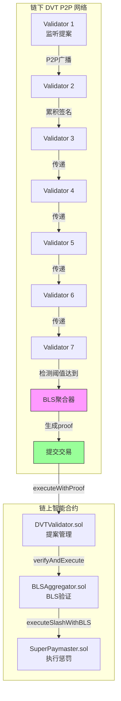
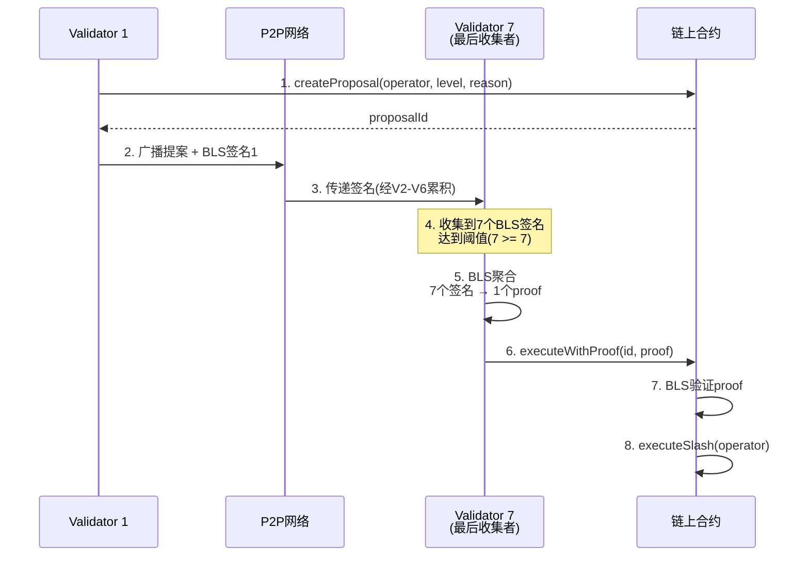

# DVT+BLS 去中心化验证者架构文档

## 概述

DVT(Distributed Validator Technology) + BLS(Boneh-Lynn-Shacham)签名聚合系统,用于去中心化的operator惩罚(slash)决策。

**核心特点**:
- **最小节点数**: 3个DVT验证者
- **阈值共识**: 2/3或大于2/3 (例如7个节点需要5个签名)
- **签名聚合**: 链下BLS聚合,链上单proof验证
- **Gas效率**: ~85% Gas节省 vs 链上多签

---

## 系统架构

### 整体架构图



### 数据流图



---

## 核心数据结构

### 1. 链上Proposal结构

```solidity
struct SlashProposal {
    address operator;        // 被惩罚的operator地址
    uint8 slashLevel;       // 惩罚级别: 0=WARNING, 1=MINOR, 2=MAJOR
    string reason;          // 惩罚原因
    bool executed;          // 是否已执行
    // ✅ 不存储个体签名 - 全部链下处理
}
```

### 2. BLS Proof格式

```solidity
// ABI编码格式
bytes memory proof = abi.encode(
    bytes pkG1,          // 聚合公钥 (G1点, 128字节)
    bytes sigG2,         // 聚合签名 (G2点, 256字节)
    bytes msgG2,         // 消息哈希的G2映射 (256字节)
    uint256 signerMask   // 签名者位掩码 (例如0x7F = 0111 1111)
);
```

**msgG2内容** (统一message schema):
```solidity
bytes memory msgG2Bytes = abi.encode(
    proposalId,    // 提案ID
    operator,      // operator地址
    slashLevel,    // 惩罚级别
    repUsers,      // reputation影响的用户
    newScores,     // 新的reputation分数
    epoch,         // epoch编号
    chainid        // 链ID(防跨链重放)
);
```

### 3. 签名者位掩码(Signer Mask)

```
示例: 7个validator签名
位掩码: 0x7F = 0b01111111

位0 → Validator #0 ✅
位1 → Validator #1 ✅
位2 → Validator #2 ✅
位3 → Validator #3 ✅
位4 → Validator #4 ✅
位5 → Validator #5 ✅
位6 → Validator #6 ✅
位7 → (未使用)

计数: __builtin_popcount(0x7F) = 7
```

---

## BLS签名格式

### 个体BLS签名

```typescript
// 单个validator的BLS签名
interface IndividualBLSSignature {
  validator: string;           // validator地址
  publicKey: Uint8Array;       // BLS公钥 (G1点, 48字节压缩)
  signature: Uint8Array;       // BLS签名 (G2点, 96字节压缩)
  message: Uint8Array;         // 被签名的消息
}
```

### 聚合BLS签名

```typescript
// 聚合后的BLS proof
interface AggregatedBLSProof {
  aggregatedPk: Uint8Array;    // 聚合公钥 (G1, 128字节未压缩)
  aggregatedSig: Uint8Array;   // 聚合签名 (G2, 256字节未压缩)
  messageG2: Uint8Array;       // 消息的G2映射 (256字节)
  signerMask: bigint;          // 签名者位掩码
}
```

---

## 链下DVT服务实现

### SDK代码示例

参考: `aastar-sdk` 仓库的DVT服务实现

**关键模块**:
```
aastar-sdk/
└── packages/
    └── dvt/
        ├── src/
        │   ├── p2p/
        │   │   ├── network.ts      # P2P网络层
        │   │   └── protocol.ts     # DVT协议
        │   ├── bls/
        │   │   ├── signer.ts       # BLS签名
        │   │   └── aggregator.ts   # BLS聚合 ⭐
        │   └── proposal/
        │       ├── monitor.ts      # 监听链上提案
        │       └── executor.ts     # 提交proof
        └── examples/
            └── dvt-node.ts         # 完整DVT节点示例
```

### BLS聚合核心代码

```typescript
// @aastar/dvt/src/bls/aggregator.ts
import { bls } from '@noble/curves/bls12-381';

export class BLSAggregator {
  /**
   * 聚合多个BLS签名
   * @param signatures - 个体签名数组
   * @returns 聚合后的proof
   */
  aggregateSignatures(
    signatures: IndividualBLSSignature[]
  ): AggregatedBLSProof {
    // 1. 验证所有签名针对同一消息
    const message = signatures[0].message;
    for (const sig of signatures) {
      if (!bytesEqual(sig.message, message)) {
        throw new Error('All signatures must be for same message');
      }
    }

    // 2. 聚合公钥 (G1点加法)
    const pks = signatures.map(s => bls.G1.ProjectivePoint.fromHex(s.publicKey));
    const aggregatedPk = pks.reduce((acc, pk) => acc.add(pk));

    // 3. 聚合签名 (G2点加法)
    const sigs = signatures.map(s => bls.G2.ProjectivePoint.fromHex(s.signature));
    const aggregatedSig = sigs.reduce((acc, sig) => acc.add(sig));

    // 4. 计算message的G2映射
    const messageG2 = bls.G2.hashToCurve(message);

    // 5. 生成签名者位掩码
    const signerMask = this.buildSignerMask(signatures);

    return {
      aggregatedPk: aggregatedPk.toRawBytes(),   // 128字节
      aggregatedSig: aggregatedSig.toRawBytes(), // 256字节
      messageG2: messageG2.toRawBytes(),         // 256字节
      signerMask
    };
  }

  /**
   * ABI编码proof用于链上提交
   */
  encodeProof(proof: AggregatedBLSProof): Uint8Array {
    return ethers.AbiCoder.defaultAbiCoder().encode(
      ['bytes', 'bytes', 'bytes', 'uint256'],
      [
        proof.aggregatedPk,
        proof.aggregatedSig,
        proof.messageG2,
        proof.signerMask
      ]
    );
  }
}
```

### DVT节点完整示例

```typescript
// @aastar/dvt/examples/dvt-node.ts
import { DVTNode } from '@aastar/dvt';
import { BLSAggregator } from '@aastar/dvt/bls';

async function runDVTNode() {
  // 1. 初始化DVT节点
  const node = new DVTNode({
    privateKey: process.env.VALIDATOR_PRIVATE_KEY!,
    p2pPort: 30303,
    bootstrap: ['validator1.example.com:30303'],
    threshold: 5,  // 7个节点需要5个签名 (2/3+)
    rpcUrl: 'https://sepolia.infura.io/v3/...'
  });

  // 2. 监听链上proposal事件
  node.on('ProposalCreated', async (event) => {
    const { proposalId, operator, level } = event.args;
    
    // 3. 验证proposal有效性
    if (await node.validateProposal(proposalId)) {
      // 4. BLS签名
      const signature = await node.signProposal(proposalId);
      
      // 5. P2P广播签名
      await node.broadcast({
        type: 'PROPOSAL_SIGNATURE',
        proposalId,
        signature
      });
    }
  });

  // 6. 收集P2P签名
  node.on('SignatureReceived', async (data) => {
    const { proposalId, signatures } = data;
    
    // 7. 检查是否达到阈值
    if (signatures.length >= node.threshold) {
      // 8. BLS聚合
      const aggregator = new BLSAggregator();
      const proof = aggregator.aggregateSignatures(signatures);
      const encodedProof = aggregator.encodeProof(proof);
      
      // 9. 提交到链上
      const tx = await node.contracts.dvtValidator.executeWithProof(
        proposalId,
        [], // repUsers
        [], // newScores
        0,  // epoch
        encodedProof
      );
      
      console.log(`Proposal ${proposalId} executed:`, tx.hash);
    }
  });

  await node.start();
  console.log('DVT node running on port', node.p2pPort);
}

runDVTNode();
```

---

## DVTValidator vs BLSAggregator: 是否应该合并?

### 当前职责分离

| 合约 | 职责 | 核心功能 |
|------|------|---------|
| **DVTValidator** | 提案管理 | - createProposal<br/>- 存储proposal信息<br/>- validator权限管理 |
| **BLSAggregator** | BLS验证 | - BLS proof验证<br/>- 执行slash<br/>- Registry更新 |

### 合并分析

#### 支持合并的理由 ✅

1. **职责重叠**
   - DVTValidator现在只是"转发器"
   - executeWithProof直接调用BLSAggregator

2. **Gas节省**
   - 少一层合约调用
   - 减少接口开销

3. **代码简化**
   - 单一合约更易维护
   - 减少部署复杂度

#### 反对合并的理由 ❌

1. **关注点分离**
   - DVTValidator = 业务层(提案治理)
   - BLSAggregator = 技术层(密码学验证)

2. **灵活性**
   - DVTValidator可以有其他执行路径
   - BLSAggregator可以被其他合约复用

3. **升级独立性**
   - 两个合约可独立升级
   - BLS验证算法变更不影响提案逻辑

### 推荐方案

**阶段性方案**:

**当前(V3)**: 保持分离
- ✅ 架构清晰
- ✅ 职责明确
- ✅ 易于理解

**未来(V4)**: 考虑合并
- 如果DVTValidator没有其他职责扩展
- 如果BLSAggregator只服务DVT
- 那么合并为`DVTSlashGovernance.sol`

**合并后结构**:
```solidity
contract DVTSlashGovernance {
    // Proposal管理
    function createProposal(...) external;
    
    // BLS验证 + 执行
    function executeWithBLSProof(uint256 id, bytes proof) external {
        // 1. 验证proposal存在
        // 2. BLS验证proof
        // 3. 执行slash
        // 4. 更新Registry
    }
}
```

---

## 关键配置参数

| 参数 | 值 | 说明 |
|------|-----|------|
| 最小DVT节点 | 3 | 保证基本去中心化 |
| 推荐DVT节点 | 7 | 平衡安全性和效率 |
| 阈值 | ≥ 2/3 | 拜占庭容错 |
| BLS曲线 | BLS12-381 | EIP-2537标准 |
| 公钥大小 | 48/128字节 | 压缩/未压缩 |
| 签名大小 | 96/256字节 | 压缩/未压缩 |

---

## 安全考虑

### 1. 消息绑定
- ✅ 统一message schema
- ✅ 包含proposalId防重放
- ✅ 包含chainid防跨链

### 2. 阈值验证
- ✅ 链上验证signerMask计数
- ✅ 要求 ≥ 2/3
- ✅ BLS数学验证

### 3. P2P安全
- ⚠️ 需要身份验证
- ⚠️ 需要加密通信
- ⚠️ 防止女巫攻击

---

## 参考资料

- [EIP-2537: BLS12-381 Precompiles](https://eips.ethereum.org/EIPS/eip-2537)
- [BLS Signatures](https://crypto.stanford.edu/~dabo/pubs/papers/BLSmultisig.html)
- [@noble/curves BLS12-381](https://github.com/paulmillr/noble-curves)
- [AAstar SDK DVT Module](https://github.com/AAStarCommunity/aastar-sdk/tree/main/packages/dvt)

---

## 更新日志

- **2026-01-09**: 初始版本,重构为纯BLS模式
- **阈值**: 修正为≥2/3
- **最小节点**: 明确为3个
