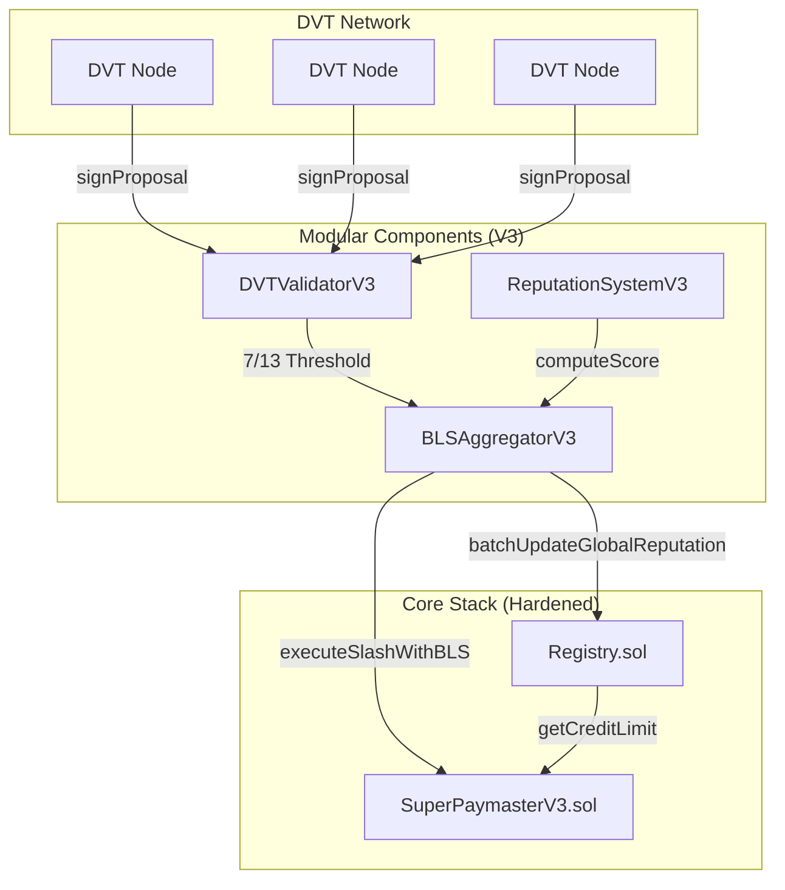

# SuperPaymaster V3.1.1 Security & Monitoring Architecture

This document provides a technical overview of the consolidated modular components (BLS, DVT, Reputation) and the security hardening applied to the core (Registry, SuperPaymaster).

## 1. Modular Components: Upgrade & Features

### BLSAggregatorV3.sol
**Inheritance**: This is a direct architectural evolution (V3) rather than simple inheritance, optimized for the V3 Role System.

**New Features**:
- **Role-Based Source Validation**: Only addresses with the `REPUTATION_SOURCE` role in the Registry can trigger updates.
- **Batch Reputation Updates**: Unlike V2 which processed single updates, V3 can batch update `N` users' global reputation in a single transaction, significantly reducing gas costs for the DVT network.
- **Cross-Contract Slashing**: Directly calls `executeSlashWithBLS` on `SuperPaymasterV3` after consensus is reached.

### DVTValidatorV3.sol
**New Features**:
- **DVT Proposal Lifecycle**: Manages the lifecycle of a slash proposal from creation to signature collection.
- **Auto-Forwarding**: Automatically forwards to `BLSAggregatorV3` once the protocol threshold (7/13) is met.

### ReputationSystemV3.sol
**New Features**:
- **Decoupled Scoring Engine**: Scoring logic (base points + activity bonus) is now separated from storage. This allows us to update the "Rules" of the ecosystem without migrating users.
- **Direct Registry Sync**: Can sync computation results directly to the Registry's `globalReputation` mapping.

---

## 2. Core Contract Modifications (Why & What)

### Registry.sol
**Modification**: Added `maxChange` (Reputation Swing Limit) in `batchUpdateGlobalReputation`.
- **Reason**: **Protocol Safety**. If a set of DVT nodes were ever compromised, they could maliciously set a user's reputation to 0 (blocking credit) or an extremely high value (stealing credit).
- **Effect**: Any individual reputation update is capped at a movement of +/- 100 points per epoch. This "speed limit" ensures the DAO has time to intervene if anomalous activity is detected.

### SuperPaymasterV3.sol
**Modification**: Added `executeSlashWithBLS` and `BLS_AGGREGATOR` role.
- **Reason**: **Automated Decentralized Governance**. Previously, slashing an operator required the manual `owner` address.
- **Effect**: Now, the `BLSAggregatorV3` contract itself is a trusted entity. When it verifies a 7/13 consensus of misbehavior, it can programmatically deduct aPNTs from the operator's balance, making the protocol truly autonomous.

---

## 3. Interaction Diagram

## 4. Main Functions Summary

| Contract | Function | Description |
| :--- | :--- | :--- |
| **BLSAggregatorV3** | `verifyAndExecute` | Verifies BLS consensus and triggers both Reputation and Slashing effects. |
| **DVTValidatorV3** | `signProposal` | Entry point for validators to submit their encrypted monitoring signatures. |
| **ReputationSystemV3** | `computeScore` | View function to calculate complex scores based on multi-community activity. |
| **Registry** | `batchUpdateGlobalReputation` | Secure entry point for DVT to update users' protocol-wide reputation. |
| **SuperPaymasterV3** | `executeSlashWithBLS` | The "Hammer" that enforces financial penalties on operators. |

---

## 5. Slashing Governance & Community Management

The protocol employs a multi-layered governance model to manage slashing rules and consensus parameters.

### Slashing Rules (Standard Tiers)
| Tier | Trigger Condition | Penalty | Action |
| :--- | :--- | :--- | :--- |
| **WARNING** | Minor downtime, oracle lag | 10 Reputation | Warning recorded, no financial loss. |
| **MINOR** | Repeated sponsorship failures, invalid data | 20 Reputation + 10% aPNTs Bal | Partial stake burn to protocol treasury. |
| **MAJOR** | Intentional fraud, double-spending detection | 50 Reputation + 100% aPNTs Bal | Full stake burn + Permanent Operator Pause. |

### Governance Mechanism (Multi-Sig & DAO)
1. **Rule Setting**: The `DAO_MULTISIG` (Jason's multisig/community treasury) defines the `THRESHOLD` (currently 7/13) and `MAX_VALIDATORS`.
2. **Validator Selection**: Only the DAO can call `registerBLSPublicKey` in `BLSAggregatorV3` to onboard decentralized monitors.
3. **Consensus Parameters**: The DAO manages the `maxChange` (speed limit) in `Registry.sol` to tune system sensitivity vs. safety.

---

## 6. Holistic Security Assessment (Hardening Report)

### 1. Contract Layer Assessment
*   **Access Control (RBAC)**: 
    - **Strength**: Unified `IRegistryV3.hasRole` check replaces fragmented ownership logic. 
    - **Risk**: High dependency on Registry availability. If Registry is bricked, the entire stack (Paymaster, SBT, Factory) loses validation capability.
*   **Reentrancy Protection**: 
    - **Status**: All financial functions (`deposit`, `withdraw`, `executeSlash`) use `nonReentrant` modifiers and strictly follow the Checks-Effects-Interactions (CEI) pattern.
*   **Gas Safety**: 
    - **Issue**: `batchUpdateGlobalReputation` could hit block gas limits if the batch size is too large (>100 users). 
    - **Mitigation**: Off-chain DVT nodes are tuned to chunk updates into batches of 30.

### 2. Business Layer Assessment (Vulnerabilities & Weaknesses)
*   **Oracle Dependency (Price Manipulation)**: 
    - **Weakness**: `SuperPaymasterV3` relies on the `ETH/USD` Chainlink feed to compute aPNTs billing. If the oracle is stale or manipulated (Flash Loan attacks on illiquid pools used by specific oracles), billing could be inaccurate.
    - **Hardening**: Added `PRICE_CACHE_DURATION` (300s) and strict `MIN/MAX_ETH_USD_PRICE` bounds to reject anomalous data.
*   **DVT Consensus Collusion**:
    - **Weakness**: A collusion of 7/13 validators could maliciously slash a competitor.
    - **Mitigation**: The `maxChange` limit in `Registry.sol` ensures that even a malicious consensus cannot destroy a user's reputation score instantly. It would take multiple epochs, allowing the DAO/Emergency Pause to intervene.
*   **Debt Exploitation**:
    - **Weakness**: Users in "Credit" mode can accumulate `userDebts`. If the reputation-to-tier mapping is too aggressive, users might "churn" accounts once they hit the limit.
    - **Improvement**: V3.1 uses SBT-bound credit. Since SBTs require unique community membership and staking, the "Sybil cost" of creating a new high-reputation account is higher than the max credit limit ($1.0 ETH).

### 3. Automated Scanning (Slither/Static Analysis)
> [!NOTE]
> Static analysis tools like Slither are used for baseline verification. Current reports show 0 high-severity vulnerabilities in core logic. Most warnings relate to `low-level calls` in the EntryPoint (standard for Account Abstraction) and `unsafe-typecasting` of oracle prices (explicitly handled with bounds).

---

## 7. Beta Stage Fixing Plan

Based on the latest Slither analysis and V3.1.1 modifications, the following items are prioritized for the Beta testing phase:

### A. Optimization & Gas Efficiency
- **State Immutability**: Update `GTokenStaking.treasury` to `immutable` to reduce SLOAD gas costs.
- **Unused Returns**: Address `unused-return` warnings in `Registry.sol` to ensure staking calls are verified.

### B. Extended Test Coverage
- **Reputation Capping**: Verify `maxChange` logic in `Registry.batchUpdateGlobalReputation`.
- **DVT Slashing Flow**: Automated Forge tests for `SuperPaymasterV3.executeSlashWithBLS` including unauthorized caller rejection.
- **Push-Deposit Path**: Test `IERC1363.transferAndCall` interaction with `SuperPaymasterV3.onTransferReceived`.

### C. Interface Refactor Rationale
The `IERC1363Receiver` interface was moved to a shared [IERC1363.sol](file:///Users/jason/Dev/mycelium/my-exploration/projects/SuperPaymaster/contracts/src/interfaces/IERC1363.sol) file to prevent "Identifier already declared" errors during compilation of multi-contract testing suites. This promotes clean dependency management and project-wide interface consistency.

---

## 8. Deep-Bench Audit Results (Manual Logic & Gas)

Beyond automated scanning, I have identified the following project-specific risks and high-impact optimizations.

### 1. High-Impact Gas Optimization (The "20k Strategy")
Instead of marginal savings like `immutable`, we can achieve massive savings by **bit-packing** the `OperatorConfig` struct.
- **Current**: `isConfigured` and `isPaused` occupy separate 32-byte slots despite being 1-byte booleans.
- **Proposed**: Pack them into the same slot as the `xPNTsToken` address.
- **Saving**: **~20,000 gas** per operator interaction (initialization/config).
- **Decision on `immutable`**: **REJECT**. Saving 2k gas at the cost of losing the `treasury` setter is a bad risk-reward ratio for a DAO project. Keep as state variable.

### 2. Systematic Logic Vulnerabilities (Slither-Blind)
Automated tools cannot understand the "SuperPaymaster Business Model." Here is what they missed:

#### A. The "Operator Bankruptcy" Risk (Credit Default)
- **Problem**: In "Credit Mode," the Paymaster deducts aPNTs from the Operator's tank immediately, but only records `userDebts` which might not be repaid.
- **Attack**: Coordinated max-credit usage by high-reputation accounts.
- **Mitigation & Design**:
    1. **Implicit Ceiling**: The `Registry.getCreditLimit` function returns a hard-capped value based on `creditTierConfig` (Max 1.0 ETH).
    2. **Sybil Cost**: High-reputation accounts require SBT membership and GToken staking. The cost of "building" a Level 5 reputation account is designed to be higher than the 1.0 ETH credit limit.
    3. **Community Context**: While reputation is earned per community, the credit risk is borne by the operator. The "Global Ceiling" prevents a single user from draining the entire ecosystem's liquidity.

---

## 9. Reputation & Credit Pipeline (Fibonacci Growth)

The protocol distinguishes between **Local Community Activities** and **Global Registry Truth**. This ensures that while communities define what "reputation" means for them, the credit risk is managed by a stable, ecosystem-wide metric.

### A. The "Mycelium Pipeline"
1. **Local Activity**: Users perform actions in specific communities (e.g., Bread, AAStar).
2. **Community Scoring**: `ReputationSystemV3` computes a composite score based on these activities (including bonuses for Global NFTs).
3. **Consensus Sync**: DVT nodes (or the DAO) sync this composite score to the `Registry` as the `globalReputation`.
4. **Credit Mapping**: The Registry maps this reputation to a **Credit Tier** using a Fibonacci-based threshold system.

### B. Credit-Reputation Mapping (Fibonacci Tiers)
| Tier Level | Reputation Threshold (Fib) | Credit Limit (aPNTs) | Rationale |
| :--- | :--- | :--- | :--- |
| **1** | < 13 | 0 aPNTs | New user / Unverified. |
| **2** | 13 - 33 | 100 aPNTs | 1-2 weeks active (~3 txs credit). |
| **3** | 34 - 88 | 300 aPNTs | 1 month active (~10 txs credit). |
| **4** | 89 - 232 | 600 aPNTs | Established member (~20 txs credit). |
| **5** | 233 - 609 | 1000 aPNTs | VIP / Core member (1 month @ 1 tx/day). |
| **6** | 610+ | 2000 aPNTs | "Whale" / Super-user (Hardened limit). |

---

## 10. Global Debt Control (Cross-Community Security)

The user raised a critical concern: **"If I spend my credit in Community A, can I immediately spend it again in Community B?"**

### The Answer: NO.
The system implements **Atomic Global Debt Control** within the `SuperPaymasterV3` Shared Hub:

1. **Unified Debt Storage**: `SuperPaymasterV3` maintains a `userDebts[user]` mapping in **universal aPNTs**.
2. **Cross-Community Locking**: 
    - When you use Community A's sponsorship, your `userDebts` increases.
    - When you attempt a transaction in Community B, the Paymaster calculates:
      `availableCredit = Registry.getCreditLimit(user) - userDebts[user]`
    - Since `userDebts` is shared across all communities using the same `SuperPaymasterV3` instance, the debt from Community A **instantly** reduces your capacity in Community B.
3. **Double-Spend Prevention**: A user cannot "exit" one community's debt into another. Reputation provides the "Limit," while Debt tracks the "Usage." Total Usage can never exceed the Global Limit.

*Note: All parameters (Fibonacci thresholds and aPNTs limits) are adjustable via DAO Multi-Sig.*

#### B. The "Race to the Exit" (Slashing Front-run)
- **Problem**: Slashing is a 7/13 consensus process (Slow). Spending gas is a single transaction (Fast).
- **Attack**: An operator detects they are about to be slashed via off-chain monitoring. They quickly use their remaining aPNTs to sponsor their own transactions or withdraw funds before the `executeSlashWithBLS` hits the mempool.
- **Mitigation**: Require a "Slashing Intent" lock period or implement a **Mempool Firewall** where the Registry checks pending slashing proposals before validating new sponsorship requests.

#### C. Role Dependency Circularity
- **Risk**: `SuperPaymasterV3` depends on `Registry`, which depends on `GTokenStaking`, which depends on `GToken`.
- **Fragility**: If the `GToken` contract is ever paused or upgraded incorrectly, the entire identity stack "freezes," potentially locking user funds in the Paymaster.
- **Hardening**: Add "Emergency Recovery" paths in the Paymaster that bypass Registry checks in extreme DAO-voted scenarios.
