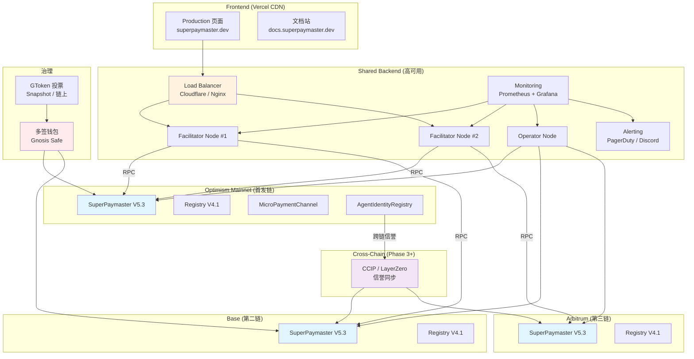
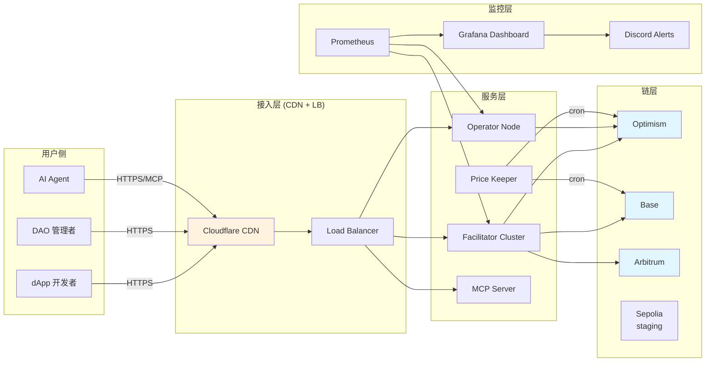
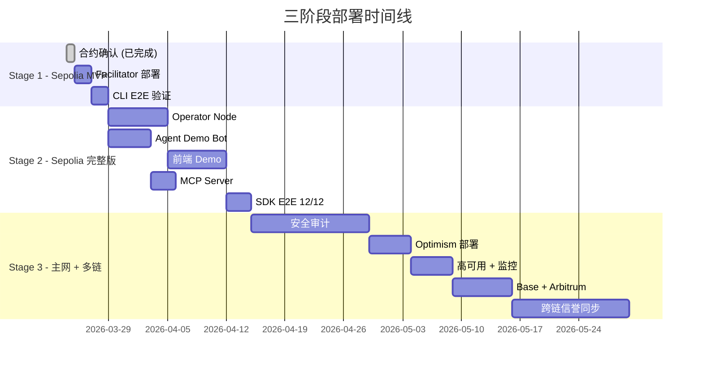

# Sepolia 测试网完整部署计划

> 目标：在 Sepolia 上建立完整的 Agent Economy Demo 环境
> 最终效果：一个 Agent 可以注册身份 → 获得社区赞助 → 用 xPNTs/USDC 购买 API → 通过微支付通道流式付费

---

## 当前状态 (2026-03-24)

### 已部署 ✅

| 组件 | 状态 | 地址/位置 |
|------|------|----------|
| SuperPaymaster V5.3 (UUPS) | ✅ 已部署 | `0x829C...6860` |
| Registry V4.1 (UUPS) | ✅ 已部署 | `0xD88C...0f6` |
| MicroPaymentChannel V1.0 | ✅ 已部署 | `0x5753...a36` |
| AgentIdentityRegistry | ✅ 已部署 | `0x4006...d9a` |
| AgentReputationRegistry | ✅ 已部署 | `0x2D82...a55` |
| x402 Facilitator Node | ✅ 代码就绪 | `packages/x402-facilitator-node/` |
| HMAC Challenge 中间件 | ✅ 代码就绪 | 集成到 facilitator node |
| aastar-sdk V5.3 | ✅ 已构建 | @aastar/x402, @aastar/channel, @aastar/cli |
| 368 Forge 测试 | ✅ 全通过 | |
| 48 SDK 测试 | ✅ 全通过 | |

### 未完成 ❌

| 组件 | 缺失 | 优先级 |
|------|------|--------|
| Facilitator Node 部署 | 未在公网运行 | P0 |
| Operator Node | 未搭建 | P0 |
| 前端 Demo 页面 | 无 | P1 |
| Agent Demo Bot | 无 | P0 |
| xPNTs 社区 Token 铸造 | 仅测试数据 | P0 |
| USDC 测试代币分发 | 手动 | P1 |
| SDK E2E 集成测试 | 无 | P0 |
| Agent SKILL.md 注册 | 模板已有 | P1 |

---

## Phase 0: 前置准备

### 0.1 测试账户体系

```
角色              EOA/AA                                    用途
─────────────────────────────────────────────────────────────
Jason (Admin)     0xb560...df0E (EOA)                      部署者、AAStar Operator
Anni (Community)  0xEcAA...33c9 (EOA)                      Demo Community Admin
User3 (Agent)     0x8574...ce68 (EOA)                      Agent 测试账户
AA-Account-A      0xECD9...dd70 (SimpleAccount)            终端用户 AA 钱包
AA-Account-B      0x179F...d31C (SimpleAccount)            Agent AA 钱包
```

### 0.2 测试代币准备

- [ ] 确保 Jason EOA 有足够 Sepolia ETH (>0.5 ETH)
- [ ] 确保 Anni EOA 有足够 Sepolia ETH (>0.1 ETH)
- [ ] 领取 Sepolia USDC: https://faucet.circle.com/ (每次 10 USDC)
- [ ] 分发 USDC 到 AA-Account-A 和 AA-Account-B (各 50 USDC)
- [ ] 确认 aPNTs 余额充足 (Operator 需要质押)
- [ ] 铸造 xPNTs 测试代币 (通过 xPNTsFactory)

### 0.3 环境变量清单

```bash
# .env.sepolia (所有服务共用)
RPC_URL=https://eth-sepolia.g.alchemy.com/v2/<key>
CHAIN_ID=11155111
PRIVATE_KEY=<facilitator-signer-key>

# 合约地址
SUPER_PAYMASTER=0x829C3178DeF488C2dB65207B4225e18824696860
REGISTRY=0xD88CF5316c64f753d024fcd665E69789b33A5EB6
MICRO_PAYMENT_CHANNEL=0x5753e9675f68221cA901e495C1696e33F552ea36
AGENT_IDENTITY_REGISTRY=0x400624Fa1423612B5D16c416E1B4125699467d9a
AGENT_REPUTATION_REGISTRY=0x2D82b2De1A0745454cDCf38f8c022f453d02Ca55
USDC=0x1c7D4B196Cb0C7B01d743Fbc6116a902379C7238
ENTRY_POINT=0x0000000071727De22E5E9d8BAf0edAc6f37da032

# Facilitator Node
FACILITATOR_PORT=3001
ENABLE_HMAC_CHALLENGE=false

# Operator Node
OPERATOR_PORT=3002
OPERATOR_ADDRESS=0xb5600060e6de5E11D3636731964218E53caadf0E

# Frontend
NEXT_PUBLIC_CHAIN_ID=11155111
NEXT_PUBLIC_FACILITATOR_URL=https://facilitator.superpaymaster.dev
NEXT_PUBLIC_SUPER_PAYMASTER=0x829C3178DeF488C2dB65207B4225e18824696860
```

---

## Phase 1: 后端服务部署 (P0)

### 1.1 x402 Facilitator Node

**目标**: 在公网运行 x402 结算服务，暴露 /verify, /settle, /quote 端点。

- [ ] **构建** facilitator node
  ```bash
  cd packages/x402-facilitator-node
  pnpm install && pnpm build
  ```
- [ ] **本地验证**
  ```bash
  source .env.sepolia
  pnpm start  # 或 node dist/index.js
  curl http://localhost:3001/health
  curl http://localhost:3001/quote
  ```
- [ ] **部署到云**（选择一个）
  - Option A: Railway / Render (最简单，免费 tier)
  - Option B: Cloudflare Workers (边缘部署，符合 x402 生态)
  - Option C: VPS (Hetzner / DigitalOcean, $5/月)
- [ ] **配置域名**: `facilitator.superpaymaster.dev` → 云服务
- [ ] **HTTPS 证书**: 自动 (Railway/Render/CF) 或 Let's Encrypt
- [ ] **验证公网端点**
  ```bash
  curl https://facilitator.superpaymaster.dev/health
  curl https://facilitator.superpaymaster.dev/.well-known/x-payment-info
  ```

### 1.2 Operator Node (新建)

**目标**: 运营商管理节点，提供社区管理、价格缓存更新、赞助策略配置。

- [ ] **创建** `packages/operator-node/` 基于 Hono
- [ ] **核心端点**:
  | 端点 | 方法 | 说明 |
  |------|------|------|
  | `/health` | GET | 健康检查 |
  | `/operator/config` | GET | 当前运营商配置 |
  | `/operator/balance` | GET | aPNTs 余额、质押状态 |
  | `/price/update` | POST | 手动触发价格缓存更新 |
  | `/price/keeper` | POST | Keeper 自动价格更新 |
  | `/community/register` | POST | 注册新社区 |
  | `/agent/register` | POST | 注册新 Agent |
  | `/agent/policies` | GET/POST | Agent 赞助策略管理 |
  | `/channel/list` | GET | 查询活跃通道 |
  | `/stats` | GET | 交易统计、收益报告 |
- [ ] **集成 keeper**：定时更新 SuperPaymaster 价格缓存
- [ ] **部署到云**（与 facilitator 同服务器或独立）
- [ ] **配置域名**: `operator.superpaymaster.dev`

### 1.3 Price Keeper (自动化)

- [ ] **设置 cron job** 每 5 分钟更新价格缓存
  ```bash
  # 可集成到 operator-node 或独立脚本
  node scripts/update-price-cache.js
  ```
- [ ] **确认价格缓存有效**（避免 E2E 测试因价格过期失败）

---

## Phase 2: 合约配置完善 (P0)

### 2.1 社区与 Operator 注册

- [ ] 确认 AAStar 社区已注册 (Registry)
- [ ] 确认 Jason 作为 Operator 已配置
- [ ] 设置 Operator 的 aPNTs 余额和交换率
- [ ] 配置 Agent 赞助策略
  ```bash
  # 通过 forge script 或 CLI
  cast send $SUPER_PAYMASTER "setAgentPolicies(address,tuple[])" ...
  ```

### 2.2 Agent 注册流程

- [ ] 在 AgentIdentityRegistry 铸造 Agent NFT (给 User3)
  ```bash
  cast send $AGENT_IDENTITY_REGISTRY "mint(address)" 0x8574...ce68
  ```
- [ ] 设置 Agent 信誉初始分数
  ```bash
  cast send $AGENT_REPUTATION_REGISTRY "giveFeedback(address,int256)" 0x8574...ce68 100
  ```
- [ ] 验证 Agent 赞助资格
  ```bash
  cast call $SUPER_PAYMASTER "isEligibleForSponsorship(address)" 0x8574...ce68
  # 应返回 true
  cast call $SUPER_PAYMASTER "getAgentSponsorshipRate(address,address)" 0x8574...ce68 $OPERATOR
  ```

### 2.3 EntryPoint 存款

- [ ] SuperPaymaster 在 EntryPoint 存款 (>=0.1 ETH)
  ```bash
  cast send $ENTRY_POINT "depositTo(address)" $SUPER_PAYMASTER --value 0.1ether
  ```
- [ ] PaymasterV4 在 EntryPoint 存款
- [ ] 验证存款余额

### 2.4 xPNTs 社区代币

- [ ] 通过 xPNTsFactory 为 AAStar 社区创建 xPNTs token
- [ ] 铸造测试 xPNTs 给测试账户
- [ ] 设置 xPNTs → aPNTs 交换率

---

## Phase 3: 前端 Demo 页面 (P1)

### 3.1 技术选型

```
Framework: Next.js 15 + App Router
UI: Tailwind CSS + shadcn/ui
Web3: viem + @aastar/sdk
Wallet: ConnectKit / RainbowKit (Sepolia)
Hosting: Vercel (免费)
Domain: demo.superpaymaster.dev
```

### 3.2 Demo 页面功能

- [ ] **首页**: 项目介绍 + 能力展示
- [ ] **Wallet Connect**: 连接 MetaMask / 其他钱包 (Sepolia)
- [ ] **Gasless Transfer Demo**
  - 输入收款地址和金额
  - 选择社区 (AAStar)
  - 一键发起 gasless 转账 (通过 SuperPaymaster)
  - 显示交易哈希和 gas 赞助信息
- [ ] **x402 Payment Demo**
  - 访问一个 402-protected API endpoint
  - 自动签名 EIP-3009 授权
  - 显示支付流程和结算结果
- [ ] **Micropayment Channel Demo**
  - 开通道 → 签 voucher → 部分结算 → 关闭
  - 可视化通道状态和余额变化
- [ ] **Agent Dashboard**
  - 显示 Agent NFT 状态 (ERC-8004)
  - 信誉分数和赞助等级
  - 当日 gas 赞助使用量

### 3.3 受保护 API 端点 (402 Demo)

- [ ] **创建** demo API 服务 (可集成到 facilitator node)
  ```
  GET /api/premium-data      → 402 (需要 0.01 USDC)
  GET /api/agent-report      → 402 (需要 0.05 USDC)
  POST /api/generate-image   → 402 (需要 0.10 USDC, 模拟 AI 服务)
  ```
- [ ] 每个端点返回标准 x402 v2 PAYMENT-REQUIRED header
- [ ] 成功支付后返回实际数据 + PAYMENT-RESPONSE header

---

## Phase 4: Agent Demo Bot (P0)

### 4.1 CLI Agent

**目标**: 一个命令行 Agent，演示完整的 Agent Economy 流程。

- [ ] **创建** `demos/agent-bot/` (TypeScript)
- [ ] **流程脚本**:
  ```typescript
  // 1. Agent 身份检查
  const isRegistered = await agentActions.isRegisteredAgent({ agent: agentAddr });
  const isEligible = await agentActions.isEligibleForSponsorship({ user: agentAddr });
  console.log(`Agent registered: ${isRegistered}, Sponsored: ${isEligible}`);

  // 2. Gasless 交易 (获得社区 gas 赞助)
  const userOp = buildUserOp(transferCall, superPaymasterAddr);
  const txHash = await bundler.sendUserOperation(userOp);
  console.log(`Gasless tx: ${txHash}`);

  // 3. x402 支付购买 API
  const response = await x402Client.x402Fetch('https://facilitator.superpaymaster.dev/api/premium-data');
  const data = await response.json();
  console.log(`Purchased data: ${JSON.stringify(data)}`);

  // 4. 开微支付通道 → 流式购买
  const channelId = await channelClient.openChannel({ payee, token: USDC, deposit: 5_000_000n, salt, authorizedSigner });
  for (let i = 1; i <= 10; i++) {
      const voucher = await channelClient.signVoucherOffline(channelId, BigInt(i * 100_000));
      // 每个 voucher 代表一次 API 调用
      const apiResult = await callPremiumAPI(voucher);
      console.log(`Call #${i}: ${apiResult.status}`);
  }
  // 最终结算
  const finalVoucher = await channelClient.signVoucherOffline(channelId, 1_000_000n);
  await channelClient.closeChannel(finalVoucher);
  ```

### 4.2 MCP Agent (Claude/GPT 集成)

- [ ] **创建** MCP server 配置 (基于 SKILL.md)
- [ ] Agent 通过 MCP 调用 SuperPaymaster 能力:
  - `gas-sponsor`: 请求 gas 赞助
  - `x402-pay`: 执行 x402 支付
  - `channel-open`: 开启微支付通道
  - `channel-voucher`: 签发 voucher
- [ ] **演示**: Claude Agent 自主调用 API 并自动付费

---

## Phase 5: SDK E2E 集成测试 (P0)

### 5.1 测试矩阵

| # | 测试场景 | SDK 包 | 合约调用 |
|---|---------|--------|---------|
| 1 | x402 createPayment + settleOnChain | @aastar/x402 | settleX402Payment |
| 2 | x402 createPayment + settleDirectOnChain | @aastar/x402 | settleX402PaymentDirect |
| 3 | x402Fetch 自动 402 流程 | @aastar/x402 | 全链路 |
| 4 | FacilitatorClient.verify() | @aastar/x402 | HTTP → facilitator |
| 5 | FacilitatorClient.settle() | @aastar/x402 | HTTP → facilitator → chain |
| 6 | Channel open → sign → settle → close | @aastar/channel | MicroPaymentChannel |
| 7 | Channel top-up → multiple vouchers | @aastar/channel | MicroPaymentChannel |
| 8 | Agent eligibility check | @aastar/core | isEligibleForSponsorship |
| 9 | Agent sponsorship rate query | @aastar/core | getAgentSponsorshipRate |
| 10 | CLI x402 quote | @aastar/cli | facilitatorFeeBPS |
| 11 | CLI channel status | @aastar/cli | getChannel |
| 12 | CLI agent status | @aastar/cli | isRegisteredAgent |

### 5.2 测试脚本

- [ ] **创建** `packages/x402/__tests__/e2e-sepolia.test.ts`
- [ ] **创建** `packages/channel/__tests__/e2e-sepolia.test.ts`
- [ ] **创建** `packages/cli/__tests__/e2e-sepolia.test.ts`
- [ ] 所有 E2E 测试使用 `SEPOLIA_E2E=true` 环境变量控制

### 5.3 运行

```bash
# 仅运行 E2E (需要 Sepolia 网络)
SEPOLIA_E2E=true pnpm vitest run --testPathPattern e2e

# 运行全部 (单元 + E2E)
SEPOLIA_E2E=true pnpm vitest run
```

---

## Phase 6: 文档与分享 (P1)

### 6.1 开发者文档

- [ ] **Quick Start Guide**: 5 分钟从零到 gasless 交易
- [ ] **x402 集成指南**: 如何为你的 API 添加 402 支付
- [ ] **Channel 集成指南**: 如何使用微支付通道
- [ ] **Agent 注册指南**: 如何注册 ERC-8004 Agent 身份
- [ ] **Operator 指南**: 如何运行自己的 Operator 节点

### 6.2 Demo 视频/GIF

- [ ] Gasless 转账 30 秒 demo
- [ ] x402 API 购买 demo
- [ ] Agent 自主支付 demo
- [ ] 微支付通道流式付费 demo

---

## 执行优先级

```
Week 1:  Phase 0 (准备) + Phase 2 (合约配置) + Phase 1.1 (Facilitator 部署)
Week 2:  Phase 4.1 (Agent Bot) + Phase 5 (SDK E2E)
Week 3:  Phase 1.2 (Operator Node) + Phase 3 (前端 Demo)
Week 4:  Phase 4.2 (MCP Agent) + Phase 6 (文档)
```

### 完成标准 (Definition of Done)

当以下场景全部可在 Sepolia 上端到端执行时，视为完成：

1. ✅ Agent 注册 ERC-8004 身份
2. ✅ Agent 获得社区 gas 赞助（gasless 交易）
3. ✅ Agent 用 USDC 通过 x402 购买 API
4. ✅ Agent 用 xPNTs 通过 direct 路径购买 API
5. ✅ Agent 开通道 → 流式签 voucher → 结算 → 关闭
6. ✅ 前端页面展示全部流程
7. ✅ CLI 工具可执行全部操作
8. ✅ SDK E2E 测试 12/12 通过

---

## 三阶段部署路线图：从 Sepolia 到主网到多链

### 总览

```
Stage 1: Sepolia MVP        →  Stage 2: Sepolia 完整版      →  Stage 3: 主网 + 多链
(核心合约 + Facilitator)       (全组件 + Agent 集成)           (生产部署 + 多链扩展)
```

---

### Stage 1: Sepolia MVP（最小可用测试环境）

**目标**: 验证核心支付链路 — gasless 交易 + x402 单笔支付

**组件清单**:
- 合约层: SuperPaymaster + Registry + EntryPoint (已部署)
- 后端: x402 Facilitator Node (1 个实例)
- 客户端: @aastar/cli + curl 测试
- 无前端、无 Agent Bot

```mermaid
graph TB
    subgraph "Sepolia Chain"
        EP[EntryPoint v0.7]
        SP[SuperPaymaster V5.3<br/>UUPS Proxy]
        REG[Registry V4.1<br/>UUPS Proxy]
        USDC[USDC Token]
        SP --> EP
        SP --> REG
        SP --> USDC
    end

    subgraph "Backend (单机部署)"
        FAC[x402 Facilitator Node<br/>Hono HTTP :3001]
    end

    subgraph "Client"
        CLI[@aastar/cli<br/>命令行工具]
        CURL[curl / httpie<br/>手动测试]
    end

    FAC -- "RPC (JSON-RPC)" --> SP
    FAC -- "读取费率/nonce" --> SP
    CLI -- "HTTP POST /settle" --> FAC
    CLI -- "直接 RPC" --> SP
    CURL -- "HTTP GET /health, /quote" --> FAC

    style SP fill:#e1f5fe
    style FAC fill:#fff3e0
    style CLI fill:#e8f5e9
```

**Stage 1 通信关系**:

| 从 | 到 | 协议 | 说明 |
|----|-----|------|------|
| CLI | Facilitator | HTTP REST | /verify, /settle, /quote |
| CLI | SuperPaymaster | JSON-RPC | 直接合约调用 (读取) |
| Facilitator | SuperPaymaster | JSON-RPC | settleX402Payment 写入 |
| Facilitator | USDC | JSON-RPC | transferWithAuthorization |
| SuperPaymaster | EntryPoint | EVM 内部调用 | validatePaymasterUserOp |
| SuperPaymaster | Registry | EVM 内部调用 | 查询 Operator 配置 |

**Stage 1 部署步骤**:
1. 确认合约已部署 (已完成)
2. `pnpm build` facilitator node
3. 部署到 Railway/Render (配置 .env.sepolia)
4. 验证: `curl https://facilitator.xxx/health`
5. CLI 测试: `aastar x402 quote`
6. E2E: 手动执行 x402 settle 交易

**Stage 1 完成标准**:
- [ ] Facilitator /health 返回 v5.3.0
- [ ] CLI aastar x402 quote 返回费率
- [ ] 手动 settleX402Payment 交易成功

---

### Stage 2: Sepolia 完整版（全组件 + Agent 集成）

**目标**: 完整的 Agent Economy Demo — gasless + x402 + 微支付通道 + Agent 身份

**新增组件** (在 Stage 1 基础上):
- 合约层: + MicroPaymentChannel + AgentRegistries (已部署)
- 后端: + Operator Node + Price Keeper
- 前端: Demo 页面 (Next.js)
- Agent: Demo Bot + MCP Server
- 402 API: 受保护的示例端点

```mermaid
graph TB
    subgraph "Sepolia Chain"
        EP[EntryPoint v0.7]
        SP[SuperPaymaster V5.3]
        REG[Registry V4.1]
        MPC[MicroPaymentChannel V1.0]
        AIR[AgentIdentityRegistry<br/>ERC-8004]
        ARR[AgentReputationRegistry]
        USDC[USDC Token]
        XPNTS[xPNTs Token]

        SP --> EP
        SP --> REG
        SP --> USDC
        SP --> AIR
        SP --> ARR
        MPC --> USDC
    end

    subgraph "Backend Services (云部署)"
        FAC[x402 Facilitator Node<br/>:3001]
        OPN[Operator Node<br/>:3002]
        KEP[Price Keeper<br/>cron job]
        API[402 Protected API<br/>:3003]
    end

    subgraph "Frontend"
        WEB[Demo 页面<br/>Next.js on Vercel]
    end

    subgraph "Agent"
        BOT[Agent Demo Bot<br/>TypeScript CLI]
        MCPS[MCP Server<br/>Claude/Cursor 集成]
    end

    subgraph "SDK"
        X402[@aastar/x402]
        CHN[@aastar/channel]
        CORE[@aastar/core]
    end

    %% Backend 通信
    FAC -- "JSON-RPC" --> SP
    OPN -- "JSON-RPC" --> SP
    OPN -- "JSON-RPC" --> REG
    KEP -- "JSON-RPC (定时)" --> SP
    API -- "HTTP → Facilitator" --> FAC

    %% Frontend 通信
    WEB -- "HTTP REST" --> FAC
    WEB -- "HTTP REST" --> OPN
    WEB -- "HTTP REST" --> API
    WEB -- "RPC (viem)" --> SP

    %% Agent 通信
    BOT -- "SDK 调用" --> X402
    BOT -- "SDK 调用" --> CHN
    MCPS -- "SDK 调用" --> CORE
    X402 -- "HTTP" --> FAC
    X402 -- "JSON-RPC" --> SP
    CHN -- "JSON-RPC" --> MPC

    %% Agent → 402 API 支付流程
    BOT -- "1. GET (收到 402)" --> API
    BOT -- "2. 签名 EIP-3009" --> X402
    BOT -- "3. 重试 + PAYMENT-SIGNATURE" --> API
    API -- "4. /settle" --> FAC
    FAC -- "5. settleX402Payment" --> SP

    style SP fill:#e1f5fe
    style MPC fill:#e1f5fe
    style FAC fill:#fff3e0
    style OPN fill:#fff3e0
    style WEB fill:#f3e5f5
    style BOT fill:#e8f5e9
    style MCPS fill:#e8f5e9
```

**Stage 2 新增通信关系**:

| 从 | 到 | 协议 | 说明 |
|----|-----|------|------|
| Operator Node | SuperPaymaster | JSON-RPC | 价格更新、赞助策略配置 |
| Operator Node | Registry | JSON-RPC | 社区管理、Operator 注册 |
| Price Keeper | SuperPaymaster | JSON-RPC (cron) | 每 5 分钟更新价格缓存 |
| Demo 页面 | Facilitator | HTTP REST | 支付流程 UI |
| Demo 页面 | Operator | HTTP REST | 状态查询 |
| Agent Bot | 402 API | HTTP (402→重试) | x402 自动支付流程 |
| Agent Bot | @aastar/channel | SDK | 签 voucher, 管理通道 |
| MCP Server | @aastar/core | SDK | Claude/Cursor 工具调用 |
| 402 API | Facilitator | HTTP POST /settle | 代理结算 |

**Stage 2 新增组件依赖关系**:

```mermaid
graph LR
    subgraph "构建依赖"
        CORE[@aastar/core] --> X402[@aastar/x402]
        CORE --> CHN[@aastar/channel]
        X402 --> CLII[@aastar/cli]
        CHN --> CLII
        CORE --> CLII
        X402 --> SDK[@aastar/sdk umbrella]
        CHN --> SDK
    end

    subgraph "运行时依赖"
        FAC[Facilitator Node] --> |ABI| CORE
        OPN[Operator Node] --> |ABI| CORE
        WEB[Demo 页面] --> |import| SDK
        BOT[Agent Bot] --> |import| SDK
        MCPS[MCP Server] --> |import| CORE
    end

    style CORE fill:#e1f5fe
    style SDK fill:#e1f5fe
```

**Stage 2 部署步骤**:
1. Stage 1 完成 ✅
2. 开发 Operator Node (`packages/operator-node/`)
3. 开发 Price Keeper (集成到 Operator Node 或独立 cron)
4. 创建 402 Protected API 示例端点
5. 开发前端 Demo 页面 (Next.js)
6. 开发 Agent Demo Bot
7. 开发 MCP Server
8. 部署全部服务到云 (Railway/Render + Vercel)
9. 配置 Agent 身份和赞助策略
10. 运行 SDK E2E 测试 12/12

**Stage 2 完成标准**:
- [ ] 12/12 SDK E2E 测试通过
- [ ] Agent Bot 完成全流程: 注册 → gasless → x402 → 通道
- [ ] Demo 页面可公开访问
- [ ] MCP Server 可被 Claude 调用

---

### Stage 3: 主网部署 + 多链扩展

**目标**: 生产环境上线 (Optimism 主网优先) + 扩展到其他 EVM 链

**新增/变更**:
- 合约: 主网部署 (审计后)
- 后端: 高可用 + 监控 + 告警
- 安全: 多签治理 + 审计报告
- 多链: Optimism → Base → Arbitrum



**Stage 3 网络拓扑**:



**Stage 3 部署步骤**:

**3A. 主网准备 (Optimism)**
1. 安全审计 (外部 + 内部)
2. 多签钱包创建 (Gnosis Safe, 3/5)
3. 主网合约部署 (deploy-core optimism)
4. 部署后验证 (verify-all.sh)
5. Facilitator Node 主网配置
6. 高可用部署 (2+ 实例 + LB)
7. 监控 + 告警配置

**3B. 上线运营**
8. 价格 Keeper 启动 (cron)
9. 首批 Operator 注册 + 配置
10. 前端切换到主网
11. 文档发布
12. 社区公告

**3C. 多链扩展**
13. Base 部署 (与 x402 生态共存)
14. Arbitrum 部署
15. 跨链信誉同步 (CCIP/LayerZero)
16. Facilitator 多链路由配置

**Stage 3 完成标准**:
- [ ] 审计报告无高危/中危
- [ ] 多签治理就绪
- [ ] Facilitator 99.9% 可用性
- [ ] 首个主网 Agent 支付交易
- [ ] 2+ 链部署并通信

---

### 阶段对比总览



| 维度 | Stage 1 | Stage 2 | Stage 3 |
|------|---------|---------|---------|
| **链** | Sepolia | Sepolia | Optimism + Base + Arbitrum |
| **合约** | SP + Registry | + MPC + AgentRegistries | 审计后全量 |
| **后端服务** | 1 (Facilitator) | 4 (+ Operator + Keeper + 402 API) | 高可用集群 |
| **前端** | 无 | Demo 页面 | 生产页面 + 文档站 |
| **Agent 集成** | CLI 手动 | Demo Bot + MCP Server | LangChain + 多框架 |
| **SDK** | @aastar/cli | 全 SDK E2E | + Python + Go |
| **安全** | 测试密钥 | 测试密钥 | 多签治理 + 审计 |
| **监控** | 手动 | 手动 | Prometheus + Grafana |
| **用户** | 开发者自测 | Demo 展示 | 真实用户 |
