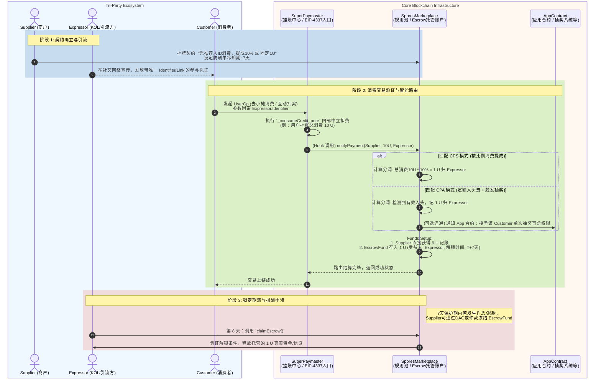

# Spores 协议设计方案 — 去中心化分润网络 (2026版)

**分支**: `feature/spores-protocol`（待创建，依赖 UUPS 迁移完成后从 main 拉取）
**状态**: 设计阶段
**前置依赖**: `feature/uups-migration` 完成并合并（需要 `_consumeCredit_pure` 内核）

---

## 1. 概述

基于 `SuperPaymaster` 的微支付内核扩展，引入 **Spores 协议（去中心化分润网络）** 是极其自然且具颠覆性的。当支付行为（如购买 NFT、特定消费、抽奖挂账）流经 `SuperPaymaster` 时，我们可以触发一个异步或同步的智能路由结算引擎。

---

## 2. 核心需求与业务场景

1. **公开与自由接入**：商户和推广者都可以随时签署挂牌这个分润契约。
2. **资金保护期（冷却系统）**：交易完成后，分润资金不应立刻进入接收者口袋，而是先进入时间锁定的托管账本，防止恶意刷单。保护期满后才能提取。
3. **灵活多态的奖励模型**：支持如 KOL 带客抽奖的按人头（CPA）计费、或者按销售比例（CPS）分成机制。

---

## 3. 架构设计与合约集成路径

为了不增加 `SuperPaymaster` 本身的复杂度和 Gas 开销，Spores 协议应当作为一个独立的边缘插件（SporesMarketplace）使用 Hook 模式外接。

### A. Spores 协议层 (SporesMarketplace Contract)
独立状态合约，负责记录"双方的分成契约与比例/固额"以及保护资金，包含核心参数：
- `merchant` & `promoter`
- `shareBps` (分成比例) 或 `fixedReward` (单额)
- `coolingPeriod` (冷却期)

### B. SuperPaymaster 微支付通道的回调改造
在独立剥离出的 `_consumeCredit_pure` 挂账内核之上扩展：前端在触发微支付时传入可选参数 `referrer` (推荐人/KOL)。
1. 主交易完成挂账扣费。
2. `SuperPaymaster` 发现 `referrer` 存在且满足预设置的 Spores 插件指向地址，便通过接口计算分成数额（比如分出商户总收入的 10%）。
3. 这 10% 的账单收益不是记给商户，而是挂账到 `SporesMarketplace` 托管地址名下，并带有 `unlockTime`（比如 7 天后）。
4. 冷却期满后，`referrer` 即可在市场提取（实现对等收益）。

---

## 4. 方案评估

1. **兼容性**：完美兼容。只需在独立下沉的新微支付内核中预留切口回调，把总交易额"切成两块各自结算给不同对象"，就能在不影响原 EIP-4337 底层逻辑的前提下进行业务结算抽水。
2. **防刷单逻辑**：借助链内智能合约提供的时间锁与托管功能，公开且透明。
3. **架构变动**：不需要侵入式改动 `SuperPaymaster` 原有参数，仅新挂载一个可配置的去中心化交易大盘即可连通。这让其成为具备"利益分配分发系统"架构的新型商业网关层。

---

## 5. 三方协议架构与数据流转图

### 核心参与方定义：
1. **Supplier (商户/资源提供方)**：
   - 提供可销售的 Item / 服务 / 抽奖活动池。
   - 行为：主动在 SporesMarketplace 设置分润参数（如：带来一个客户拿走 10% 销售额分润，冷却期 7 天；或是带来一人抽奖给固定人头费 1 U）。
2. **Expressor (宣传推广方/KOL/节点)**：
   - 负责引流。他们唯一的作用是宣传并让消费者带上属于他们的**唯一推荐标识 (e.g., referrer_ID)**。
3. **Customer (消费者与被邀请人)**：
   - 产生真实消费或互动的终端。
   - 行为要求：**必须**持有/出示 Expressor 的唯一标识才可参与店铺设置的专属互动（不仅限于返佣，还可能是针对 Customer 自身的"抽奖许可"等双向激励）。

### 业务流转架构图 (Mermaid 序列表)

下图展示了从**设置契约 -> 引流出示 -> Paymaster扣款与路由结算 -> 托管分账 -> 解锁提取** 的全链路数据运转。

### 设计评估：
通过此架构图可以看到，**核心 `SuperPaymaster` 绝不碰触复杂的"三人分润"与"冷却锁状态"**。
`SuperPaymaster` 只负责单纯的扣账单，随后将消息路由到 `SporesMarketplace`。由这个市场承载 `Escrow` 托管账户的建立并等待清算。如此既保持了核心执行引擎极高的 Gas 性能（原账本甚至无需升级 UUPS 之外的成分），又在生态上无限拓宽了三方（商业闭环）乃至多方的分红激励网。
