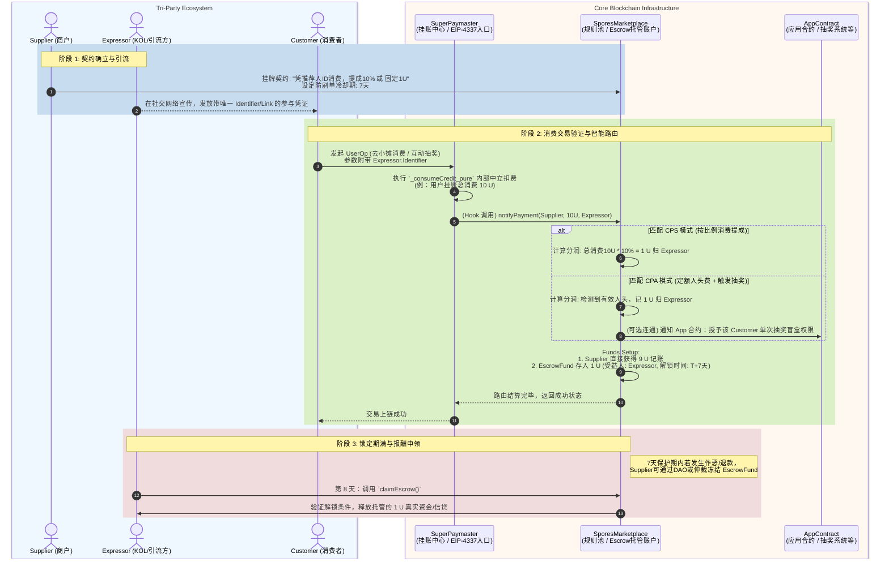

# SuperPaymaster UUPS 改版与微支付演进方案报告 (2026版)

## 设计原则与前提
基于当前的工程与业务反馈，我们确立本次架构升级的 6 大核心刚性原则：
1. **零历史包袱部署**：无需考虑老版本的线上存量用户数据迁移，即全新部署上线。
2. **面向未来（EIP-8141 / Native AA）兼容**：未来的 Native AA 将原生地把普通 EOA 升级为具备 AA 能力的账户，我们在保留目前 Gas 赞助服务（基于 EIP-4337）的同时，需要支持这层新底座带来的**跨环境微支付支持**。
3. **接口零感替换**：最高优先级保障原有的主要智能合约接口（如 ` deposit`, `postOp` `configureOperator` 等）签名不变。如果确有不可抗力的入口变动，必须被详细记录以便 SDK 同步。
4. **Gas 效率只增不降**：核心代付逻辑的单用户总 Gas 开销必须 **不超过** 现有版本的耗费。
5. **原有依赖图谱稳定性**：不破坏多个合约间的依赖关系与角色流转，所有现存业务逻辑内核保持 100% 相同。
6. **核心与边缘剥离**：非“强资产/状态托管”的纯工具性质合约（如只执行密码学计算的 `BLSValidator`）无需采取沉重的 UUPS 的模式，仅通过 Registry/SuperPaymaster 的指针管理进行插拔。

---

## 架构演进与应对方案

### 1. 核心与工具模块的隔离与 UUPS 支持

**A. 需升级为 UUPS 的“核心引擎”**：
- **`SuperPaymaster`**: 作为资金的进出枢纽与所有第三方前端、SDK 交互的“不动点”（Immutable Endpoint）。如果该地址改变，前端与 EntryPoint 的配置将全部作废。因此，此组件**必须**挂载在唯一代理之后，并通过 UUPS 自身实现逻辑的无缝插拔。
- **`Registry`**: 作为全系统的身份名册、声誉评分以及参数中枢，它的挂载可以保证整个系统的长期身份溯源和配置连续性，必须做 UUPS。

**B. 无需 UUPS，依赖指针更迭的“工具合约”**：
- **`BLSValidator` / `BLSAggregator`**：纯密码验证或数据归集逻辑，无链上状态包袱。当有了新的验证算法（比如更高效的 BLS12-381 实现），仅需在 Registry 里执行 `setBLSValidator(newAddress)` 即可。
- **工厂与资产合约 (`xPNTsFactory` 及 `xPNTsToken` 等)**：保持原来的生产机制，不需要加入不必要的代理开销。

> **变动记录（需同步至 SDK 和部署代码）**：
> 1. `SuperPaymaster` 和 `Registry` 的 `constructor` 会完全被废除，改为 `initialize(...)` 函数，使用 `@openzeppelin/contracts-upgradeable` 替代原有静态库。
> 2. `ethers` / `viem` 等前端 SDK 的合约地址连接层完全无需更改。仅在项目仓库内部的部署脚本（`DeployScript.s.sol` / bash scripts）中，部署形式由普通的 `new` 变更为拉起 `ERC1967Proxy` 再进行初始化的步骤。

### 2. 巧取豪夺：吞并 UUPS Gas 损耗的存储优化（Storage Packing）

由于全新部署，我们可以随心所欲地调整合约内的存储（Storage）布局。
引入 UUPS 代理将让外部合约呼叫额外付出 `DELEGATECALL` 约 **2600 Gas**。为了确保符合“Gas 不能更贵”的要求：
在 `validatePaymasterUserOp` 这个超高频调用方法中，原先对内存状态读取极为松散。
- 我们将把：`OperatorConfig`（包括其余额、配置状态等属性）以及当前操作这个用户独有的状态字典（包含拦截状态 `isBlocked` 和冷却时间 `lastTimestamp`），在底层压缩合并到极少量的存储槽（Slot）中。
- 大幅省去原来不必要的 `SLOAD` 和 `SSTORE`。一个冗余的 Cold SLOAD 消耗 2100 Gas。仅消除两次跨槽读取，即可**完全抵消并反赚** UUPS 带来的 Gas 损耗，使执行端感受到“比之前还要便宜”。

### 3. 解耦执行流：为 EIP-8141 及微支付创造内核通道

为实现微支付支持、跨环境扩展，以及不远的将来对接 EIP-8141（Native AA），我们需要将**核心账单结算器**从 EIP-4337 的繁杂参数中提取出来。

当前 `postOp` 内存在着大量的硬编码（比如计算以太坊相对 Token 的汇率与实际发生的 Gas Cost 的换算），我们要将其进行“纯函数化下沉”：

**核心抽象动作**：
在 `SuperPaymaster` 内部剥离出一个受到严格权限隔离的基础内部函数 `_consumeCredit_pure`:
```solidity
// 该函数脱离了 EIP-4337 UserOp 的限制，只关心“是谁、通过哪个算子、花了多少纯粹价值”
function _consumeCredit_pure(
    address user, 
    address operator, 
    uint256 usdAmountEquivalent
) internal returns (bool success) {
    // 1. 验证可用额度与注册表
    // 2. 扣除算子抵押的等值 aPNTs
    // 3. 将对应 Debt 记录到 xPNTsToken
}
```

**外延入口的无限可能**：
基于这个干净牢固的核心基石，对外提供多种变体 Wrapper 包装：
1. **原兼容层（EIP-4337 原生）**：原本的 `validatePaymasterUserOp` 与 `postOp` 完全照旧工作，解析 UserOp 中的 Gas 限额后，依然向底层呼叫 `_consumeCredit_pure`。保证依赖关系与原逻辑零变化。
2. **微支付入口（Micro-payment）**：新增对外方法（比如 `chargeMicroPayment(...)`）。面向外部生态应用（比如特定的 NFT 发售或链上高频调用），提供用户的 EIP-712 签名，系统就可以使用这一套额度引擎提供支付担保，极大扩展 AA 生态的业务落地能力。
3. **EIP-8141 原生入口**：协议更新后，外部 EOA 可提交原生支持的新格式，我们的智能合约只需暴露出一个适配 EIP-8141 的新验证 Hook 同样对接底座，就可无缝过渡。

## 结论与行动方案
本次设计符合所有的硬性规定。由于不再考虑恶心的数据兼容迁移：
1. 我们建立了一条崭新干净、模块化极强的 UUPS 结构链。
2. Storage 的高强度压缩抹平了哪怕 1 Wei 的效率损耗。
3. `_consumeCredit_pure` 的抽象分离完成了协议层面对未来不可知（Native AA / 微支付）请求的普适性支持。

接下来将在新分支（`feature/uups-migration`）中按照这套思想逐步铺设内部存储与函数。

## 4. 各合约改造与处理细则

为确保平滑过渡并在全新部署下将代码变动降温，以下是系统内主要合约及其关联组件的具体处理流程：

### 4.1 核心层：SuperPaymaster 升级流程（UUPS + Storage Packing）
**定位**：EIP-4337 入口及微支付信贷结算中枢。
**变动幅度**：核心逻辑不改，存储与初始化需大修。
- **改动步骤**：
  1. **引入基础库**：废除现有的 `Ownable.sol` 等引用，全部替换为 `@openzeppelin/contracts-upgradeable` 家族等价物（如 `OwnableUpgradeable`），并继承 `UUPSUpgradeable`。
  2. **构造函数改造**：将 `BasePaymaster` 及 `SuperPaymaster` 中针对不可变变量（`immutable`，如 `entryPoint`）的部分保留在裸 `constructor` 内，并加上 `_disableInitializers()` 保护代理。业务相关的初始设置全部迁移至带 `@initializer` 修饰的 `initialize(...)` 函数。
  3. **存储压缩（Storage Packing）重构**：重新审视 `ISuperPaymaster.OperatorConfig` 与 `userOpState` 的存储排列。将用户的阻断状态（`isBlocked`）与最后访问时间戳（`lastTimestamp`）紧凑打包，从而在 `validatePaymasterUserOp` 中实现单次或最少的 `SLOAD` 查询。
  4. **抽取挂账内核**：编写仅限内部调用的纯粹算账函数 `_consumeCredit_pure()`，承接原本嵌在 `postOp` 里的代扣逻辑。原本的 `postOp` 改为先读取实际耗费，再投喂给这层挂账内核。
  5. **权限强化**：重写 `_authorizeUpgrade`，严格限制只有提权后的 Owner 才能执行升级。

### 4.2 核心层：Registry 升级流程（UUPS）
**定位**：系统的全局名册表，维系着所有的社区关系、声望点数和权限配置。
**变动幅度**：业务零变动，初始化重写。
- **改动步骤**：
  1. 剥离初始化相关的状态如 `roleConfigs`、`creditTierConfig` 和 `_initRole` 至独立的 `initialize()` 方法。
  2. 确保持续迭代中增加变量时，必须在合约尾部采用 `uint256[50] private __gap;` 以避免产生被引用的存储碰撞。

### 4.3 边缘层：工具类与预言机合约处理（非 UUPS 化）
**定位**：支持类的子依赖，如 `BLSValidator`、`xPNTsFactory`、以及具体生产出来的子币 `xPNTsToken`。
**变动幅度**：极低。维持原部署与运行态。
- **处理策略**：坚决不套用 UUPS 代理模式，只在核心合约的配置变量中对其指针地址做路由替换，完全保留原来对接口调用的最高效率。

### 4.4 整体部署与关联链变动分析
**部署依赖拓扑影响分析**：
1. 原本的依赖流（例如 `Registry` 创建然后赋权 `SuperPaymaster`）没有本质变化。
2. Forge 脚本层需要摒弃原有的 `new Contract()` 黑盒，而是：部署 Implementation -> 部署 `ERC1967Proxy` 及 Payload 执行 `initialize` -> 生成不可变代理地址。


## 5. Spores 协议内嵌支持评估 (去中心化分润网络)

基于 `SuperPaymaster` 的微支付内核扩展，引入 **Spores 协议（去中心化分润网络）** 是极其自然且具颠覆性的。当支付行为（如购买 NFT、特定消费、抽奖挂账）流经 `SuperPaymaster` 时，我们可以触发一个异步或同步的智能路由结算引擎。

### 5.1 核心需求与业务场景解构
1. **公开与自由接入**：商户和推广者都可以随时签署挂牌这个分润契约。
2. **资金保护期（冷却系统）**：交易完成后，分润资金不应立刻进入接收者口袋，而是先进入时间锁定的托管账本，防止恶意刷单。保护期满后才能提取。
3. **灵活多态的奖励模型**：支持如 KOL 带客抽奖的按人头（CPA）计费、或者按销售比例（CPS）分成机制。

### 5.2 架构设计与合约集成路径
为了不增加 `SuperPaymaster` 本身的复杂度和 Gas 开销，Spores 协议应当作为一个独立的边缘插件（SporesMarketplace）使用 Hook 模式外接。

**A. Spores 协议层 (SporesMarketplace Contract)**
独立状态合约，负责记录“双方的分成契约与比例/固额”以及保护资金，包含核心参数：
- `merchant` & `promoter`
- `shareBps` (分成比例) 或 `fixedReward` (单额)
- `coolingPeriod` (冷却期)

**B. SuperPaymaster 微支付通道的回调改造**
在独立剥离出的 `_consumeCredit_pure` 挂账内核之上扩展：前端在触发微支付时传入可选参数 `referrer` (推荐人/KOL)。
1. 主交易完成挂账扣费。
2. `SuperPaymaster` 发现 `referrer` 存在且满足预设置的 Spores 插件指向地址，便通过接口计算分成数额（比如分出商户总收入的 10%）。
3. 这 10% 的账单收益不是记给商户，而是挂账到 `SporesMarketplace` 托管地址名下，并带有 `unlockTime`（比如 7 天后）。
4. 冷却期满后，`referrer` 即可在市场提取（实现对等收益）。

### 5.3 方案评估总结
1. **兼容性**：完美兼容。只需在独立下沉的新微支付内核中预留切口回调，把总交易额“切成两块各自结算给不同对象”，就能在不影响原 EIP-4337 底层逻辑的前提下进行业务结算抽水。
2. **防刷单逻辑**：借助链内智能合约提供的时间锁与托管功能，公开且透明。
3. **架构变动**：不需要侵入式改动 `SuperPaymaster` 原有参数，仅新挂载一个可配置的去中心化交易大盘即可连通。这让其成为具备“利益分配分发系统”架构的新型商业网关层。

### 5.4 Spores 三方协议架构与数据流转图

为了精准刻画 Spores 协议嵌入后的资金流转与角色关系，我们需要在 `SuperPaymaster` 的生态中建立一个去中心化的 **托管账户系统 (EscrowFund)**，并明确定位三大参与方（Tri-Party）：

#### 核心参与方定义：
1. **Supplier (商户/资源提供方)**：
   - 提供可销售的 Item / 服务 / 抽奖活动池。
   - 行为：主动在 SporesMarketplace 设置分润参数（如：带来一个客户拿走 10% 销售额分润，冷却期 7 天；或是带来一人抽奖给固定人头费 1 U）。
2. **Expressor (宣传推广方/KOL/节点)**：
   - 负责引流。他们唯一的作用是宣传并让消费者带上属于他们的**唯一推荐标识 (e.g., referrer_ID)**。
3. **Customer (消费者与被邀请人)**：
   - 产生真实消费或互动的终端。
   - 行为要求：**必须**持有/出示 Expressor 的唯一标识才可参与店铺设置的专属互动（不仅限于返佣，还可能是针对 Customer 自身的“抽奖许可”等双向激励）。

#### 业务流转架构图 (Mermaid 序列表)

下图展示了从**设置契约 -> 引流出示 -> Paymaster扣款与路由结算 -> 托管分账 -> 解锁提取** 的全链路数据运转。



#### 设计评估：
通过此架构图可以看到，**核心 `SuperPaymaster` 绝不碰触复杂的“三人分润”与“冷却锁状态”**。
`SuperPaymaster` 只负责单纯的扣账单，随后将消息路由到 `SporesMarketplace`。由这个市场承载 `Escrow` 托管账户的建立并等待清算。如此既保持了核心执行引擎极高的 Gas 性能（原账本甚至无需升级 UUPS 之外的成分），又在生态上无限拓宽了三方（商业闭环）乃至多方的分红激励网。

