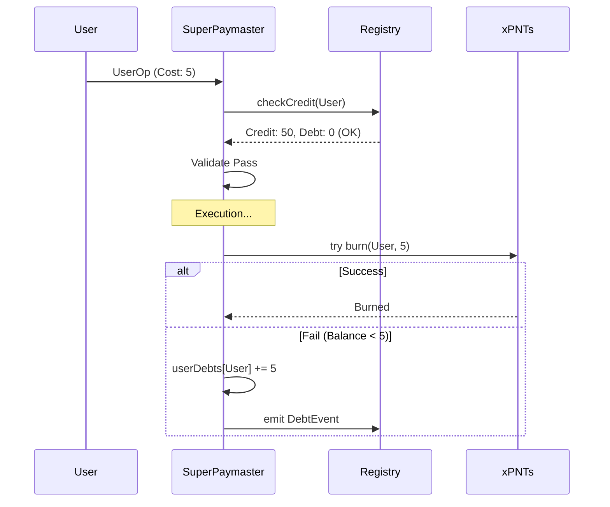
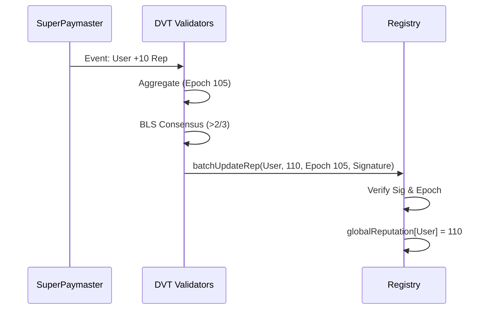

# SuperPaymaster V3 Refactor & Security Architecture

Status: **Planned**  
Date: 2025-12-18  
Version: 3.1-Draft  

## 1. Overview & Motivation

SuperPaymaster V3's initial design focused on extreme simplicity. This refactor re-introduces a **Credit-Based Post-Payment Model** and a **Decentralized Security Layer**, combining V3 efficiency with V2.3.3 robustness.

**Core Philosophy**: "Off-chain Compute, On-chain Verification".
- **Compute**: Complex scoring, aggregation, and fraud detection happen off-chain (Validator Network).
- **Verify**: Registry verifies DVT signatures; Token contract verifies Paymaster authority (optimistically).

---

## 2. Core Architecture

### 2.1 Credit-Based Payment (Revolving Credit)

**Concept**: Users have a `MaxCredit` limit based on Global Reputation.
- **Model**: **Revolving Credit** (Like a Credit Card).
- **Limit**: Defined by `Registry.CreditConfig` (DAO updatable).
- **Rule**: `AvailableCredit = MaxCredit - UserDebts`. Transaction passes if `Cost < AvailableCredit`.

**Workflow:**
1.  **Validate (Pre-check)**:
    *   Query Registry for `GlobalReputation`.
    *   Calculate `MaxCredit` from Credit Table (View).
    *   **New User (Rep=0)**: Must have `Deposit >= Cost`.
    *   **Trusted User (Rep>0)**: Pass if `Deposit + AvailableCredit >= Cost`.
2.  **Execution**: UserOp executes.
3.  **Post-Op (Settlement)**:
    *   **Attempt 1**: `burnFromWithOpHash(user, cost)`. (Normal Flow).
        *   Paymaster -> Token Contract.
    *   **On Failure**: Enter **Debt Recording Mode**.
        *   `userDebts[user] += cost`.
        *   `emit DebtRecorded(user, cost)`.
        *   (Optional) Trigger immediate Reputation slash event.

**Repayment**:
*   **Automatic Priority**: Any future `deposit()` calls from the user **automatically** repay `userDebts` first.
*   **Unlocked**: Once debt is cleared availability restores immediately.

### 2.2 Hybrid Reputation System (The "Engine")

**Architecture**:
*   **Data Layer (Sources)**:
    *   **Community A**: Activity events (e.g., Voting).
    *   **SuperPaymaster**: `emit UserReputationAccrued(user, aPNTsValue)`.
        *   **Standardization**: Uses `aPNTs` (Standard Gas Value) directly. `Rep += aPNTsAmount`. No complex conversion needed.
*   **Aggregation Layer (Off-chain Validator DVT)**:
    *   **Engine**: Runs on Validator nodes.
    *   **Formula**: `GlobalRep = Σ (Source_i * Weight_i)`.
    *   **Weights**: Defined in Registry `ReputationWeights` (DAO Gov).
*   **Settlement Layer (On-chain Registry)**:
    *   **Batch Update**: `batchUpdateGlobalReputation(users, scores, epoch, proof)`.
    *   **Security**: Verifies BLS Aggregate Signature from DVT Network.

### 2.3 Security & Slashing (The "Guardian")

**Threat Model**:
1.  **Malicious Paymaster**: Forges `userOpHash` to burn funds without valid UserOp.
2.  **Malicious Validator**: Fakes reputation updates.

**Defense 1: Validator DVT Consensus (Epoch-based)**
*   **Prevent Single Point of Failure**: Registry requires BLS Signature from >2/3 Validators.
*   **Prevent Replay**: Updates use `Epoch` (Nonce).
    *   `require(newEpoch > lastUserEpoch)`.
    *   Replayed or old updates revert.

**Defense 2: Fraud Proofs (Anti-Forgery)**
*   **Mechanism**: Validators monitor `Burn` events.
*   **Check**: "Does a valid UserOp with this Hash exist in the block/mempool?"
*   **Slashing**: If Paymaster burns user funds but no UserOp exists -> **Slash Paymaster Stake**.

**Defense 3: Circuit Breaker (Melt-down)**
*   **Rule**: If `TotalSlashed > 30% InitialStake`.
*   **Action**: **Force Stop** (Status = FROZEN).
*   **Recovery**: Requires Manual DAO Intervention.

---

## 3. Implementation Plan & Legacy Asset Recovery

### Step 1: Recover Legacy Contracts (Files Identified)
We will adapt these specific files:

1.  **DVT/Slashing Logic**:
    *   **Source**: `contracts/src/paymasters/superpaymaster/v2/SuperPaymasterV2_3.sol`
    *   **Action**: Extract `executeSlashWithBLS` logic. Note `DVT_AGGREGATOR` dependency.
2.  **Reputation Interfaces**:
    *   **Source**: `contracts/src/paymasters/v2/interfaces/IReputationCalculator.sol`
    *   **Source**: `contracts/src/paymasters/v2/extensions/MySBTReputationAccumulator.sol`
    *   **Action**: Adapt for V3 Registry interaction.

### Step 2: Registry Upgrade (The "Brain")
*   **Storage**:
    *   `mapping(address => uint256) public globalReputation;`
    *   `mapping(address => uint256) public lastReputationEpoch;`
    *   `mapping(uint256 => uint256) public creditTierConfig;` (Level -> Limit)
*   **Functions**:
    *   `updateGlobalReputation(..., proof)`

### Step 3: SuperPaymaster V3.1 (The "Muscle")
*   **PostOp**: Implement `try/catch` Debt Logic.
*   **Events**: Emit `UserReputationAccrued`.
*   **Slashing**: Integrate `ISlashingManager` interface.

---

## 4. Visual Flows

### Credit Payment Flow

### Validator Aggregation Flow

