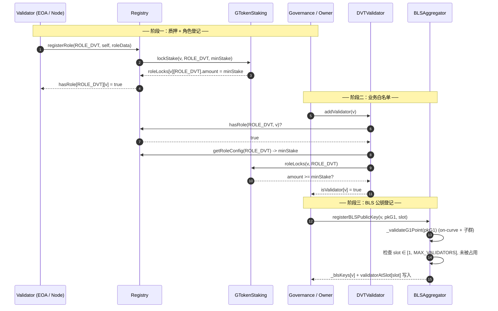
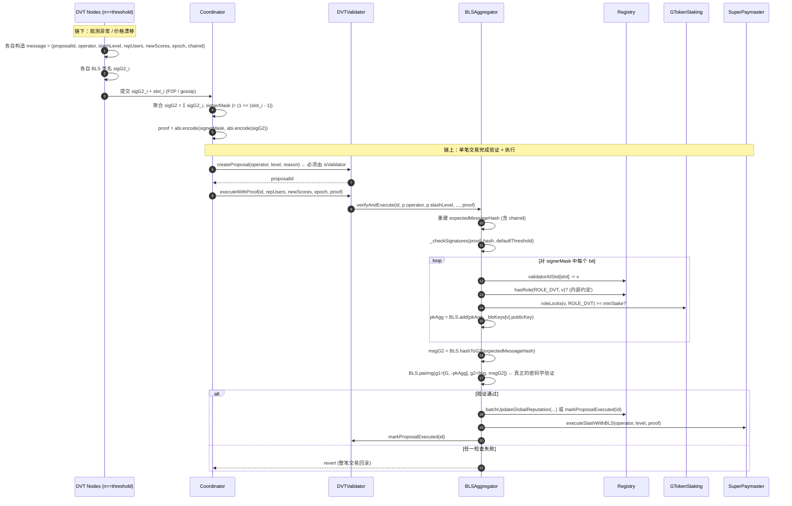

# DVT Validator 全生命周期工作流（注册 → 运行 → 撤销）

> **文档目的**：让一名刚加入项目的工程师 / SDK 集成方在阅读后，能完整理解 SuperPaymaster 中 DVT（Distributed Validator Technology）validator 从注册、签名、执行、到撤销的全部链路。
>
> **关联**：本文是 PR #112（`fix/p0-1-bls-rewrite`）的工程伴随文档。该 PR 重写了 `BLSAggregator` 的证明验证逻辑（pkAgg 不再由调用方提供，而是链上从 `validatorAtSlot[]` 重建），并对 ABI 做了破坏性变更。SDK 与 keeper 节点必须按本文 §6 的新格式重新编码 proof。
>
> **配套阅读**：`docs/security/2026-04-26-p0-prelaunch.md` §3 P0-1 / P0-2 / P0-4 / P0-17，`docs/security/2026-04-26-threat-model.md` T-01。

---

## 0. 一图看懂

DVT 链路把 BLS 共识作为 SuperPaymaster 的"治理层武器"——任何足额签名通过的 BLS proposal 都可以触发 slash、blacklist 同步、价格更新等高权限操作。整条链路共有 **5 个链上合约角色 + 2 个链下角色**。

链上角色之间存在一条严格的 **registry-of-truth** 关系链：

```
Registry.hasRole[ROLE_DVT][v]   ── 角色登记的权威源
     ↑
GTokenStaking.roleLocks[v][R]   ── 经济抵押的真相源（minStake gate）
     ↑
DVTValidator.isValidator[v]     ── DVT 业务白名单（必须先有上面两个才能被加进来）
     ↑
BLSAggregator._blsKeys[v] +     ── BLS 公钥 + signerMask 槽位映射
BLSAggregator.validatorAtSlot[s]
```

任何下游调用（`createProposal` / `executeWithProof` / `_reconstructPkAgg`）都会**实时**沿这条链向上回溯，缺一环就 revert。详见 §5。

---

## 1. 角色清单

| 角色 | 类型 | 路径 | 核心职责 | 不该做什么 |
|------|------|------|---------|-----------|
| **Registry** | 链上 UUPS proxy | `contracts/src/core/Registry.sol` | 角色登记中心；`hasRole` 的权威源；`registerRole` / `exitRole` 入口；持有 `ROLE_DVT` 常量与 `RoleConfig.minStake` 配置 | 不直接持有 stake；不参与 BLS 验证；不维护 BLS 公钥 |
| **GTokenStaking** | 链上 | `contracts/src/core/GTokenStaking.sol` | stake 锁定 / 解锁 / slash 的真相源；`roleLocks[user][roleId]` 是经济门槛检查的唯一来源 | 不感知 BLS；不感知 DVT 投票；只管 GToken 的会计 |
| **DVTValidator** | 链上 | `contracts/src/modules/monitoring/DVTValidator.sol` | DVT 业务层入口；维护 `isValidator` 名单；创建 `SlashProposal`；通过 `executeWithProof` 把 proposal 转交给 `BLSAggregator` | 不验证 BLS 签名（委托给 `BLSAggregator`）；不直接 slash（委托给 `SuperPaymaster`） |
| **BLSAggregator** | 链上 | `contracts/src/modules/monitoring/BLSAggregator.sol` | BLS 公钥注册（含 G1 on-curve + 子群校验）；signerMask → 链上重建 pkAgg；BLS12-381 配对验证；执行 slash / 通用 proposal | **不接受调用方传入的 pkAgg**（P0-1 已硬性禁止）；不维护业务白名单 |
| **SuperPaymaster** | 链上 UUPS proxy | `contracts/src/paymasters/superpaymaster/v3/SuperPaymaster.sol` | DVT 共识结果的接收方：`updatePriceDVT`（L342）、`executeSlashWithBLS`（L549）、blacklist 同步入口 | 不验证 BLS（信任 `msg.sender == BLS_AGGREGATOR`）；不维护 validator 名单 |
| **DVT Node Operator** | 链下 | 自托管节点 | 持 BLS 私钥；监听需要共识的事件（异常 operator、价格异动等）；按 P2P 协议生成签名 | 不上链 ── 单签不构成共识 |
| **Relayer / Coordinator** | 链下 | 自托管 / 公共 keeper | 收集足够多个 DVT 签名 → 聚合成 G2 签名 → 编码 proof → 上链调用 `executeWithProof` / `executeProposal` | 不持私钥；不 fork 业务逻辑 |

**关键不变量**：上述五个链上合约的所有跨合约调用都通过 **immutable** 引用或 owner-set 引用持有对方地址。`DVTValidator.REGISTRY` 与 `BLSAggregator.REGISTRY` 都是 `immutable`（`DVTValidator.sol:40`、`BLSAggregator.sol:71`），部署后不可改。

---

## 2. 注册流程（按时序）

完整注册一个新 DVT validator 必须**严格按以下顺序**执行 3 步。任何顺序颠倒（例如先 `addValidator` 再 `registerRole`）都会 revert。



| # | 调用方 | 被调用 | 函数 | 链上效果 |
|---|--------|--------|------|---------|
| 1 | Validator (EOA) | Registry | `registerRole(ROLE_DVT, v, roleData)`（`Registry.sol:192`） | 锁定 stake；写 `hasRole[ROLE_DVT][v] = true`；mint role-SBT |
| 2 | Owner / 治理 | DVTValidator | `addValidator(v)`（`DVTValidator.sol:97`） | 校验 `Registry.hasRole(ROLE_DVT, v)` + `roleLocks(v, ROLE_DVT).amount >= minStake`；写 `isValidator[v] = true` |
| 3 | Owner / 治理 | BLSAggregator | `registerBLSPublicKey(v, pkG1, slot)`（`BLSAggregator.sol:182`） | 校验 G1 点在 BLS12-381 曲线上 + 在素阶子群内 + slot 未占用；写 `_blsKeys[v]` 和 `validatorAtSlot[slot]` |

**步骤说明**：

- **Step 1 — `Registry.registerRole`**：调用方必须就是 validator 自己（`msg.sender != user → revert Unauthorized`，`Registry.sol:194`）。`roleData` 长度 ≤ 2048 bytes。Stake 由 Registry 内部转交 `GTokenStaking.lockStake`。
- **Step 2 — `DVTValidator.addValidator`**：P0-2 修复（`DVTValidator.sol:97-112`）— 现在**强制**检查 `Registry.hasRole(ROLE_DVT, v)` 与 `roleLocks(v, ROLE_DVT).amount >= cfg.minStake`，杜绝 owner 把无质押的地址塞进 quorum。`minStake` 从 `Registry.getRoleConfig(ROLE_DVT)` 动态读取，治理可通过 `configureRole` 调整无需重部。
- **Step 3 — `BLSAggregator.registerBLSPublicKey`**：P0-1 修复（`BLSAggregator.sol:182-209`）— 公钥以 **uncompressed EIP-2537 G1**（4×32 bytes）存储，便于 G1ADD precompile 直接消费。`slot ∈ [1, 13]`（`MAX_VALIDATORS = 13`），且必须未被占用；同一 validator 重复注册必须复用旧 slot。`_validateG1Point`（`BLSAggregator.sol:395-453`）通过 EIP-2537 G1ADD（`0x0b`）验 on-curve、G1MUL（`0x0c`）验素阶子群、并显式拒绝 identity 点（防 key-cancellation 攻击）。

**注意：步骤 2 的 stake 检查只在 `addValidator` 调用瞬间发生**。后续运行期间，validator 如果偷偷 `exitRole`，`isValidator` 不会自动变 `false`。但是——见 §5，下游执行路径会**实时回查** `hasRole` + `roleLocks`，所以退押 validator 即便仍在 `isValidator` 名单里，也无法继续投票。

---

## 3. 运行流程（按时序）

签名收集是**完全链下**的 P2P 流程；上链一次只发生在 Coordinator 把聚合后的证明提交给 `executeWithProof` 那一刻。



| # | 阶段 | 调用 | 关键校验 |
|---|------|------|---------|
| 1 | 链下 | DVT Node 构造 message + BLS 签名 | message 必须包含 `block.chainid`，否则配对验证会失败（链上重建时强制带 chainid） |
| 2 | 链下 | Coordinator 聚合签名 | 聚合方式：`sigAgg = Σ sigG2_i`（BLS 同态性）；`signerMask` 按 slot 编号置位 |
| 3 | 链上 | `DVTValidator.createProposal`（`DVTValidator.sol:114`） | `msg.sender ∈ isValidator`；写入 `proposals[id]`；P0-17 修复：显式 `p.executed = false` |
| 4 | 链上 | `DVTValidator.executeWithProof`（`DVTValidator.sol:154`） | P0-4：受 `onlyAuthorizedExecutor` modifier 保护（仅 BLS_AGGREGATOR 或 isValidator）；P0-17：`p.operator == 0` → `ProposalDoesNotExist` |
| 5 | 链上 | `BLSAggregator.verifyAndExecute`（`BLSAggregator.sol:273`） | 重建 `expectedMessageHash`（含 chainid）→ 调用 `_checkSignatures` |
| 6 | 链上 | `BLSAggregator._checkSignatures`（`BLSAggregator.sol:493`） | 解 proof → `_reconstructPkAgg` → `BLS.hashToG2` 派生 msgG2 → `BLS.pairing` |
| 7 | 链上 | `_reconstructPkAgg`（`BLSAggregator.sol:460`） | 遍历 signerMask 每个 bit；对每个 slot 取 `validatorAtSlot[slot]` → `_blsKeys[v]`；用 EIP-2537 G1ADD precompile 累加 |
| 8 | 链上 | `BLSAggregator._executeSlash`（`BLSAggregator.sol:557`） | → `SuperPaymaster.executeSlashWithBLS(operator, level, proof)`（`SuperPaymaster.sol:549`） |
| 9 | 链上 | `BLSAggregator → DVTValidator.markProposalExecuted`（`DVTValidator.sol:133`） | `msg.sender == BLS_AGGREGATOR` 才能调；P0-17：拒绝标记不存在的 proposal |

**通用 DVT 路径**：除了 slash，BLSAggregator 还提供 `executeProposal(proposalId, target, callData, requiredThreshold, proof)`（`BLSAggregator.sol:336`），把任意 callData 转发到任意 target。target 合约自行做 `msg.sender == BLS_AGGREGATOR` 鉴权。`SuperPaymaster.updatePriceDVT`（`SuperPaymaster.sol:342`）就是通过这条路径被驱动的——`msg.sender` 必须等于 `BLS_AGGREGATOR`，否则 revert。

---

## 4. 撤销 / 退出流程

DVT validator 退出有 3 条路径，每条都涉及多个合约的状态需要同步清理。**重要**：链上目前**没有**自动级联清理机制——validator `exitRole` 之后，`DVTValidator.isValidator` 与 `BLSAggregator._blsKeys` **不会**自动失效。需要 owner 手动调用清理函数（详见下表）。

### A. 自愿退出（validator 主动）

```
A1. Validator → Registry.exitRole(ROLE_DVT)            (Registry.sol:223)
       → roleLocks 解锁（受 lockDuration 锁仓窗口约束）
       → hasRole[ROLE_DVT][v] = false
       → MySBT 销毁（如果该 validator 没有其他角色）
       → ⚠️ 不会触碰 DVTValidator / BLSAggregator
A2. Owner → BLSAggregator.revokeBLSPublicKey(v)        (BLSAggregator.sol:212)
       → 清空 _blsKeys[v] 与 validatorAtSlot[slot]
       → idempotent；释放 slot 给后续 validator 复用
A3. （建议）Owner 在 DVTValidator 侧也清理 isValidator[v]
       → ⚠️ 当前合约**没有** removeValidator() 函数
       → 实践中即便 isValidator[v] 仍是 true，pkAgg 重建也会因
         A2 之后 _blsKeys[v].isActive == false 而 revert UnknownValidatorSlot
       → 所以 A2 是**关键**清理动作，A3 仅为业务可读性建议
```

### B. 强制移除（owner 主动）

```
B1. Owner → BLSAggregator.revokeBLSPublicKey(v)        (BLSAggregator.sol:212)
B2. （可选）Validator 自己 → Registry.exitRole(ROLE_DVT) 取回剩余 stake
```

### C. Slash（共识驱动惩罚）

```
C1. DVT 共识 → BLSAggregator.verifyAndExecute(...) 通过
C2. → BLSAggregator → SuperPaymaster.executeSlashWithBLS    (SuperPaymaster.sol:549)
       → 扣减 operator 在 SuperPaymaster 内的 aPNTsBalance（不是 GToken stake！）
C3. （独立路径）BLSAggregator → GTokenStaking.slashByDVT     (GTokenStaking.sol:412)
       → 扣 GToken stake；要求 setAuthorizedSlasher(blsAggregator, true)
C4. 通常配合 B1 把 BLS 公钥也撤掉，避免被 slash 的 validator 继续投票
```

**两层 slash 架构**（参见 `MEMORY.md`「Two-Tier Slash Architecture」）：
- **Tier 1**：`SuperPaymaster.executeSlashWithBLS` 扣运营资金（aPNTs）
- **Tier 2**：`GTokenStaking.slashByDVT` 扣治理质押（GToken）

两者互补；前者快速止损，后者是经济震慑。

### 清理函数现状速查

| 想清理 | 函数 | 位置 | 是否存在 |
|--------|------|------|---------|
| `Registry.hasRole` | `exitRole(roleId)` | `Registry.sol:223` | ✅ 仅 validator 自己可调 |
| `GTokenStaking.roleLocks` | `unlockAndTransfer`（由 `exitRole` 内部调） | `GTokenStaking.sol` | ✅ 自动 |
| `DVTValidator.isValidator` | — | — | ❌ **当前无 removeValidator / pruneValidator** |
| `BLSAggregator._blsKeys` | `revokeBLSPublicKey(v)` | `BLSAggregator.sol:212` | ✅ 仅 owner |
| `BLSAggregator.validatorAtSlot` | 同上 | `BLSAggregator.sol:212` | ✅ 由 `revokeBLSPublicKey` 一并清理 |

**关于「DVTValidator.isValidator 残留」的安全分析**：即使 owner 忘了清 `isValidator[v]`，下列两条防线依然生效——
1. 该 validator 即使能调 `createProposal`（合法），但他自己签名时 pkAgg 重建会因 `_blsKeys[v].isActive == false` 而 revert。
2. 其他 validator 的签名集如果不包含该 v（即 v 不在 signerMask），整笔流程不受影响。

所以 `revokeBLSPublicKey` 是**真正的**断电开关。

---

## 5. 实时校验防御

P0-1 / P0-2 / P0-4 / P0-17 共同构筑了一个**实时回查链**——每一次 `executeWithProof` / `_reconstructPkAgg` 的过程中，链上都会重新检查每一位签名 validator 的当前状态。这意味着：**你不能预先签好一份 proof 然后在退押后再用它**。

### 5.1 校验点矩阵

| 调用入口 | 校验项 | 校验位置 | 防御目标 |
|---------|--------|---------|---------|
| `DVTValidator.createProposal` | `isValidator[msg.sender]` | `DVTValidator.sol:115` | 非 DVT 节点不能凭空生 proposal |
| `DVTValidator.executeWithProof` | `msg.sender ∈ {BLS_AGGREGATOR} ∪ isValidator` | `DVTValidator.sol:79-84`（modifier）+ L160 | P0-4：阻止匿名地址直接触发执行 |
| `DVTValidator.executeWithProof` | `p.operator != address(0)` | `DVTValidator.sol:165` | P0-17：拒绝执行未创建的 proposal |
| `BLSAggregator.verifyAndExecute` | `msg.sender ∈ {DVT_VALIDATOR, owner}` | `BLSAggregator.sol:282-284` | 阻止外部直接绕过 DVT 流程 |
| `BLSAggregator._reconstructPkAgg` | `validatorAtSlot[slot] != address(0)` | `BLSAggregator.sol:476-477` | 拒绝 mask 选中空槽（已撤销 validator） |
| `BLSAggregator._reconstructPkAgg` | `_blsKeys[v].isActive == true` | `BLSAggregator.sol:478-479` | 拒绝 mask 选中已 revoke 的 validator |
| `BLSAggregator._reconstructPkAgg` | `signerMask >> MAX_VALIDATORS == 0` | `BLSAggregator.sol:468-470` | 拒绝高位 bit silent truncation |
| `BLSAggregator._checkSignatures` | `signerCount >= requiredThreshold` | `BLSAggregator.sol:507` | 拒绝低于法定门槛的签名集 |
| `BLSAggregator._checkSignatures` | `BLS.pairing(...)` 通过 | `BLSAggregator.sol:519` | 真正的密码学验证：proof 必须对应 message + 重建出的 pkAgg |

### 5.2 退押后无法投票的执行链

假设 validator V 已经 `exitRole(ROLE_DVT)`，但 owner 还没调 `revokeBLSPublicKey(V)`。攻击者拿着 V 历史上的合法签名想伪造一笔 slash：

```
1. 攻击者构造 signerMask 包含 V 的 slot
2. → DVTValidator.executeWithProof(...)
3. → BLSAggregator.verifyAndExecute(...)
4. → _checkSignatures → _reconstructPkAgg
5. → validatorAtSlot[V_slot] 仍指向 V （✓）
6. → _blsKeys[V].isActive 仍是 true （✓ 因为 owner 没 revoke）
7. → pkAgg 重建成功
8. → BLS.pairing(...) ── 但 message 必须含 block.chainid
   → 如果是新链 / 新区块的 proposal，message hash 不同
   → 攻击者无法用旧签名拼出新 message 的 pkAgg
   → revert SignatureVerificationFailed
```

**结论**：即便 owner 忘记 revoke，攻击者也无法重放历史签名。**真正的失效点**是 `revokeBLSPublicKey` —— 这是 hard kill。

> **当前合约层一个已知缺口**：`_reconstructPkAgg` 没有显式回查 `Registry.hasRole(ROLE_DVT, v)` 与 `roleLocks(v, ROLE_DVT) >= minStake`。第二层校验（stake gate）目前只在 `addValidator` 时执行一次（`DVTValidator.sol:97-112`，详见提交 `06b087c` 的 doc 备注）。这意味着：**stake 槛只在加入瞬间被强制**，后续 stake 被 slash 到 minStake 以下 / validator 主动 `exitRole` 之后，仍要靠 owner 手动 `revokeBLSPublicKey` 才能彻底剔除。这是 P0-2 修复时显式承认的限制 —— 见 `addValidator` 注释。

---

## 6. SDK / 集成方 ABI 变更（破坏性 ⚠️）

PR #112（`fix/p0-1-bls-rewrite`）是一次**破坏性升级**。所有调用 `verify` / `verifyAndExecute` / `executeProposal` / `executeWithProof` 的链下代码都要按本节重写 proof 编码。

### 6.1 Proof 编码

**旧（不安全，已废弃）**：

```solidity
abi.encode(
    bytes pkG1Bytes,    // 调用方提供 pkAgg
    bytes sigG2Bytes,
    bytes msgG2Bytes,   // 调用方提供 msgG2
    uint256 signerMask
)
```

**新（P0-1 之后）**：

```solidity
abi.encode(
    uint256 signerMask,
    bytes sigG2Bytes    // abi.encode(BLS.G2Point) of aggregated G2 signature
)
```

调用方**不能**也**不需要**再传 `pkG1Bytes` / `msgG2Bytes`：
- `pkAgg` 由 `BLSAggregator._reconstructPkAgg` 从 `validatorAtSlot[]` 链上重建（`BLSAggregator.sol:460-491`）
- `msgG2` 由 `BLS.hashToG2(expectedMessageHash)` 链上派生（`BLSAggregator.sol:510`）

### 6.2 `BLSAggregator.verify` 函数签名变更

**旧**：`verify(message, signerMask, pkAgg, sig)` — **数学上对调用方任意选择的 (sig, pkAgg) 组合都可满足配对方程**，已被 P0-1 删除。

**新**：

```solidity
function verify(
    bytes32 expectedMessageHash,
    uint256 signerMask,
    uint256 requiredThreshold,
    bytes calldata sigBytes
) external view returns (bool);
```

参数语义：

- `expectedMessageHash`：调用方在链下 hash 出的、与签名时一致的 message 摘要
- `signerMask`：bit i（0-indexed）= validator at slot i+1 是否签名
- `requiredThreshold`：调用方业务层的最小签名数要求；必须 `>= minThreshold`
- `sigBytes`：`abi.encode(BLS.G2Point)`，即 4×32 字节聚合 G2 签名

### 6.3 `BLSAggregator.registerBLSPublicKey` 函数签名变更

**旧**：`registerBLSPublicKey(address validator, bytes calldata publicKey)` — `publicKey.length == 48`（compressed G1）

**新**（`BLSAggregator.sol:182`）：

```solidity
function registerBLSPublicKey(
    address validator,
    BLS.G1Point calldata publicKey,   // uncompressed: 4 × bytes32 = 128 bytes
    uint8 slot                         // 1-indexed in [1, MAX_VALIDATORS]
) external onlyOwner;
```

### 6.4 链下责任清单

集成方（SDK / Coordinator / keeper）必须维护下列链下状态：

1. **validator → slot 映射**：通过监听 `BLSPublicKeyRegistered(address indexed validator, uint8 indexed slot)`（`BLSAggregator.sol:100`）与 `BLSPublicKeyRevoked`（L101）事件维护本地索引。这是构造 `signerMask` 的必需依据。
2. **签名时的 message 必须包含 `block.chainid`**：与链上重建逻辑严格一致。`verifyAndExecute` 路径的 message：
   ```
   keccak256(abi.encode(proposalId, operator, slashLevel, repUsers, newScores, epoch, block.chainid))
   ```
   `executeProposal` 路径的 message：
   ```
   keccak256(abi.encode(proposalId, target, keccak256(callData), requiredThreshold, block.chainid))
   ```
3. **注册时序**严格按 §2 三步走：先 `Registry.registerRole` → 再 `DVTValidator.addValidator` → 最后 `BLSAggregator.registerBLSPublicKey`。第二步会回查第一步，第三步独立但缺了前两步该 validator 实际无法参与共识。
4. **公钥格式**：必须用 EIP-2537 uncompressed G1（128 bytes 拆成 4 × `bytes32`）。compressed 48-byte 格式已废弃。
5. **slot 选择策略**：建议 SDK 维护一个全局可用 slot 池；同一 validator 重复注册必须复用旧 slot（`BLSAggregator.sol:196`），否则 revert `SlotAlreadyTaken`。

---

## 7. 部署 Runbook（最小集）

下列顺序与 `contracts/script/v3/DeployAnvil.s.sol`（`DeployAnvil.s.sol:77-152`）实际执行的顺序一致：

```
1. Deploy GToken                              (DeployAnvil.s.sol:78)
2. Deploy Registry impl + ERC1967Proxy        (DeployAnvil.s.sol:81-84)
   → initialize(deployer, address(0), address(0))
3. Deploy GTokenStaking(gtoken, treasury, registryProxy)   (DeployAnvil.s.sol:87)
   → REGISTRY 字段 immutable，从此固定
4. Deploy MySBT(gtoken, staking, registryProxy, dao)       (DeployAnvil.s.sol:88)
5. registry.setStaking(staking) + setMySBT(mysbt)          (DeployAnvil.s.sol:91-92)
6. registry.syncExitFees([5 个 operator role])             (DeployAnvil.s.sol:95-101)
7. Deploy SuperPaymaster impl + ERC1967Proxy               (DeployAnvil.s.sol:136-139)
   → initialize(owner, aPNTs, treasury, protocolFeeBPS)
8. Deploy ReputationSystem(registry)                       (DeployAnvil.s.sol:142)
9. Deploy BLSAggregator(registry, superPaymaster, address(0))  (DeployAnvil.s.sol:143)
   → DVT_VALIDATOR 此时还不存在，第 11 步 setDVTValidator 补上
10. Deploy DVTValidator(registry)                          (DeployAnvil.s.sol:144)
11. Wire（_executeWiring 内）：
    - dvtValidator.setBLSAggregator(blsAggregator)         (DVTValidator.sol:179)
    - blsAggregator.setDVTValidator(dvtValidator)          (BLSAggregator.sol:333)
    - registry.setBLSAggregator(blsAggregator)             (Registry.sol:166)
    - registry.setSuperPaymaster(superPaymaster)           (Registry.sol:159)
    - superPaymaster.setBLSAggregator(blsAggregator)       (SuperPaymaster admin path)
12. （DVT 运营前）governance → blsAggregator.setMinThreshold/setDefaultThreshold 调到生产值
13. （DVT 运营前）governance → gtokenStaking.setAuthorizedSlasher(blsAggregator, true)
    ← Tier 2 slash 必需，未设则 slashByDVT 永远 revert
```

**部署后验证**：跑 `contracts/script/checks/Check01-Check09` 与 `VerifyV3_1_1` —— 详见 `deploy-core` shell 脚本。

---

## 附录 A：常见错误对照表

| Revert | 含义 | 排查方向 |
|--------|------|---------|
| `NotValidator()` | createProposal 调用方不在 isValidator | Step 2 (`addValidator`) 没做 / 顺序错 |
| `ValidatorMissingRole()` | addValidator 时 hasRole 为 false | Step 1 (`registerRole`) 没做 |
| `ValidatorStakeBelowMinimum(actual, required)` | stake 不够 | 增加 stake 后重试 |
| `StakingNotConfigured()` | Registry 没 setStaking | 部署 wiring 漏了 |
| `UnknownValidatorSlot(slot)` | signerMask 选了一个未注册 / 已 revoke 的 slot | 检查链下 validator → slot 映射 |
| `SlotOutOfRange(slot)` | signerMask 高位有 bit 越过 MAX_VALIDATORS | 检查 mask 计算逻辑 |
| `SlotAlreadyTaken(slot)` | 注册时 slot 已被别人占 | 改用空闲 slot；同 validator 复用旧 slot |
| `EmptySignerMask()` | signerMask == 0 | 至少要有一个 bit |
| `InvalidSignatureCount(count, required)` | 签名数低于 threshold | 收集更多签名 |
| `SignatureVerificationFailed()` | 配对验证不通过 | message hash 与链上重建的不一致（最常见：忘了 chainid） |
| `InvalidBLSKeyNotOnCurve()` | 公钥不在 BLS12-381 G1 曲线上 | 检查公钥生成是否用了正确 group |
| `InvalidBLSKeyNotInSubgroup()` | 公钥不在素阶子群 | 同上；多发生在跨 BLS variant 时 |
| `ProposalDoesNotExist()` | executeWithProof 引用了未 createProposal 的 id | 先 createProposal |
| `ProposalAlreadyExecuted(id)` | 重放 | nonce / id 设计有问题 |
| `UnauthorizedCaller(addr)` | 调用方不是 DVT_VALIDATOR / owner | 走 DVTValidator 入口而不是直接调 BLSAggregator |
| `NotAuthorizedExecutor()` | executeWithProof 调用方不是 BLS_AGGREGATOR 也不是 isValidator | P0-4 防线生效 |

---

## 附录 B：版本与 PR 引用

- **BLSAggregator**：`"BLSAggregator-4.0.0"`（PR #112）
- **DVTValidator**：`"DVTValidator-0.5.0"`（P0-2 + P0-4 + P0-17）
- **Registry**：`"Registry-5.3.0"`（PR #112 兼容性 storage 字段保留）
- **相关 PR 栈**：main → PR #104 (P0-4+17) → PR #105 (P0-2) → PR #112 (P0-1)
- **测试覆盖**：437/437 通过，含 8 条新增 `BLSAggregator_PkAggReconstruct.t.sol` 用例
