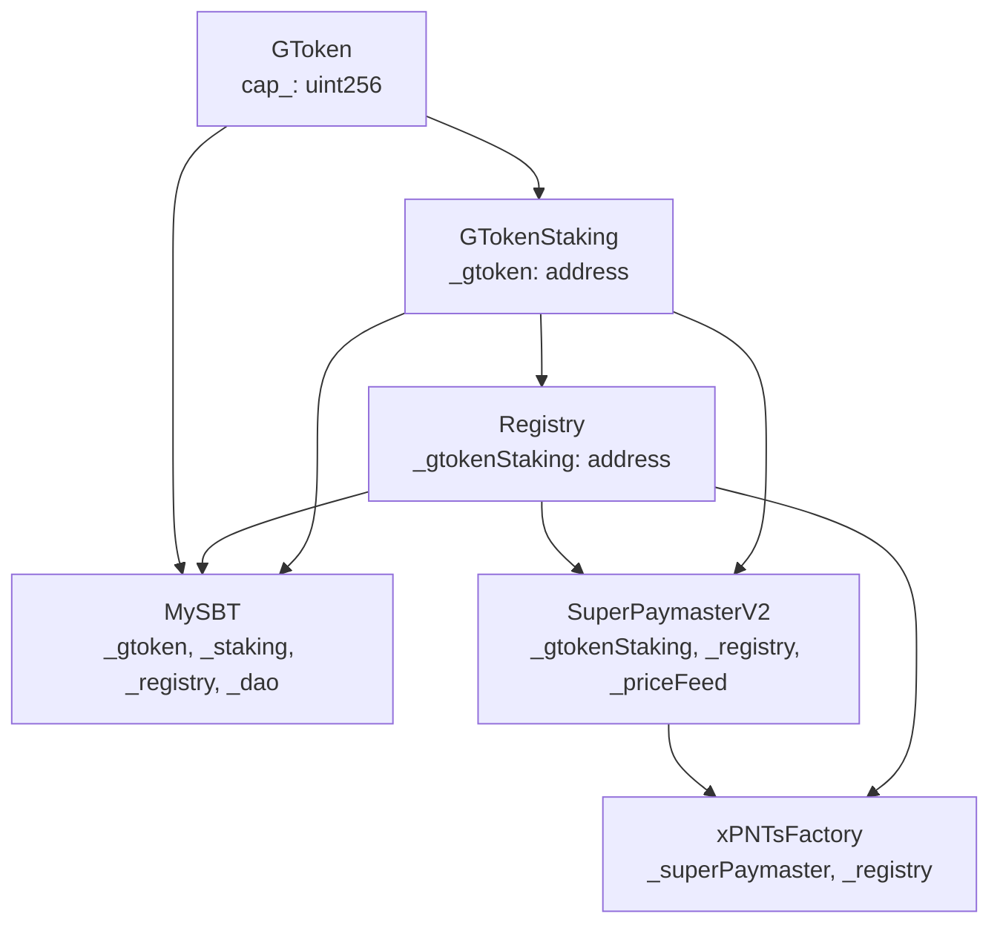

# SuperPaymaster 核心合约体系架构文档

> 最后更新: 2025-11-25
> 版本: SuperPaymasterV2 v2.3.3 / MySBT v2.4.5

---

## 项目目标

SuperPaymaster 项目的核心目标是提供符合 **ERC-4337** 标准的 Paymaster 服务，支持 EntryPoint v0.7 和 v0.8 版本。通过 `paymasterAndData` 字段，用户可以实现 gasless 交易。

### 两种 Paymaster 模式

| 模式 | 合约 | 说明 | 适用场景 |
|------|------|------|----------|
| **AOA模式** (自运营) | PaymasterV4.1 | 社区自己部署、管理的独立Paymaster | 有技术能力的社区 |
| **AOA+模式** (托管) | SuperPaymasterV2 | 多租户共享Paymaster，无需自己部署 | 无技术能力的社区 |

**AOA模式 (PaymasterV4.1)**:
- 社区通过 `PaymasterFactory` 部署自己的 Paymaster
- 需要自己管理 EntryPoint 的 ETH 存款
- 支持 SBT 验证 + ERC20 (xPNTs) 作为 gas token

**AOA+模式 (SuperPaymasterV2)**:
- 社区只需充值 aPNTs 到 SuperPaymaster
- SuperPaymaster 负责 ETH 存款管理
- 支持多社区 token、声誉系统、智能路由、ENS 等增值服务

---

## 一、系统对象概览

### 核心对象关系图

```
┌─────────────────────────────────────────────────────────────────────────────────┐
│                           SuperPaymaster 生态系统                                 │
├─────────────────────────────────────────────────────────────────────────────────┤
│                                                                                   │
│   ┌─────────┐      质押       ┌──────────────┐      锁定       ┌─────────────┐  │
│   │ GToken  │ ───────────────▶│ GTokenStaking │◀───────────────│  Registry   │  │
│   │ (ERC20) │                 │   (质押合约)   │                │ (社区注册)   │  │
│   └────┬────┘                 └───────┬───────┘                └──────┬──────┘  │
│        │                              │                               │          │
│        │ 铸造费                        │ 锁定                          │ 验证     │
│        ▼                              ▼                               ▼          │
│   ┌─────────┐                  ┌──────────────┐                 ┌─────────────┐  │
│   │  MySBT  │ ─── callback ───▶│SuperPaymaster│◀────注册────────│  Operator   │  │
│   │(灵魂绑定)│                  │   V2.3.3     │                 │  (运营商)    │  │
│   └────┬────┘                  └───────┬───────┘                └─────────────┘  │
│        │                              │                                          │
│        │ 会员资格                      │ gas赞助                                   │
│        ▼                              ▼                                          │
│   ┌─────────┐                  ┌──────────────┐                                  │
│   │  User   │ ◀───gas免费交易───│  EntryPoint  │                                  │
│   │ (用户)  │                   │   v0.7       │                                  │
│   └─────────┘                  └──────────────┘                                  │
│                                                                                   │
│   ┌─────────────────────────────────────────────────────────────────────────────┤
│   │ xPNTs 代币体系                                                               │
│   │   aPNTs (AAStar社区) ──▶ SuperPaymaster ──▶ 计算gas费用                      │
│   │   bPNTs (其他社区)    ──▶ 独立Paymaster  ──▶ AOA模式                         │
│   └─────────────────────────────────────────────────────────────────────────────┤
└─────────────────────────────────────────────────────────────────────────────────┘
```

---

## 二、核心合约列表

| 合约 | 版本 | 地址 (Sepolia) | 类型 | 作用 |
|------|------|---------------|------|------|
| **GToken** | 2.0.0 | `0x99cCb70646Be7A5aeE7aF98cE853a1EA1A676DCc` | ERC20 + Ownable | 系统治理代币 |
| **GTokenStaking** | 2.0.1 | `0xbEbF9b4c6a4cDB92Ac184aF211AdB13a0b9BF6c0` | Staking + Lock | 质押、锁定、惩罚 |
| **Registry** | 2.2.1 | `0x49245E1f3c2dD99b3884ffeD410d0605Cf4dC696` | Community Registry | 社区注册中心 |
| **MySBT** | 2.4.5 | `0xa4eda5d023ea94a60b1d4b5695f022e1972858e7` | ERC721 Soulbound | 用户身份 + SuperPaymaster回调 |
| **SuperPaymasterV2** | 2.3.3 | `0x7c3c355d9aa4723402bec2a35b61137b8a10d5db` | ERC-4337 Paymaster | AOA+共享Paymaster |
| **xPNTsFactory** | 2.0.0 | `0x40B4E57b1b21F41783EfD937aAcE26157Fb957aD` | Token Factory | 社区xPNTs工厂 |
| **aPNTs** | - | `0xBD0710596010a157B88cd141d797E8Ad4bb2306b` | ERC20 | AAStar社区代币 |
| **bPNTs** | - | `0xF223660d24c436B5BfadFEF68B5051bf45E7C995` | ERC20 | BuilderDAO社区代币 |
| **PaymasterFactory** | 1.0.0 | `0x65Cf6C4ab3d40f3C919b6F3CADC09Efb72817920` | EIP-1167 Factory | AOA模式Paymaster工厂 |
| **DVTValidator** | 2.0.0 | `0x937CdD172fb0674Db688149093356F6dA95498FD` | Distributed Validator | 分布式验证器 |
| **BLSAggregator** | 2.0.0 | `0x3Cf0587912c692aa0f5FEEEDC52959ABEEEFaEc6` | BLS Aggregator | BLS签名聚合 |
| **EntryPoint** | 0.7 | `0x0000000071727De22E5E9d8BAf0edAc6f37da032` | ERC-4337 Core | 账户抽象入口 |

### 合约分类

**核心合约 (Core)**:
- GToken, GTokenStaking - 治理代币和质押
- Registry - 社区注册中心
- MySBT - 灵魂绑定代币

**Paymaster合约**:
- PaymasterFactory + PaymasterV4.1 - AOA模式 (自运营)
- SuperPaymasterV2 - AOA+模式 (托管/多租户)

**Token合约**:
- xPNTsFactory - 社区代币工厂
- aPNTs, bPNTs... - 各社区的 gas token

**扩展合约 (Extensions)**:
- DVTValidator - 分布式验证 (惩罚机制)
- BLSAggregator - BLS签名聚合
- ReputationCalculator - 声誉计算

---

## 三、角色定义

### 1. User (用户)

- **描述**: 使用钱包进行交易的终端用户
- **类型**:
  - **EOA用户**: 普通外部账户 (用于某些管理操作)
  - **AA用户**: 合约账户 (主要测试对象，通过SimpleAccountFactory创建)
- **前置要求**:
  - 拥有AA账户 (通过SimpleAccountFactory创建)
  - 持有MySBT (需质押 **0.3 GT** + 支付 **0.1 GT** 铸造费)
  - AA账户已授权xPNTs给Paymaster
- **SBT说明**:
  - MySBT 类似于一个"白板"，用户首次铸造时必须加入一个社区
  - 社区名称会记录在 SBT 上
  - 用户可以随时加入其他社区，也可以退出社区
- **交互流程**:
  1. 用户构建UserOperation
  2. 指定Paymaster作为paymasterAndData
  3. 提交到Bundler → EntryPoint
  4. Paymaster验证SBT + 扣款xPNTs

### 2. Operator (运营商)

- **描述**: 为用户提供gas赞助服务的社区运营方
- **质押要求**: 最低 **30 GT** (可升级至更高等级)
- **注册流程**:
  ```
  1. GToken.approve(GTokenStaking, amount)
  2. GTokenStaking.stake(amount)
  3. SuperPaymaster.registerOperatorWithAutoStake()
     - 自动锁定GT质押
     - 存入aPNTs作为gas资金池
  ```
- **声誉系统**: Fibonacci等级 (1-144 GT)
  - Level 1-2: 1 GT
  - Level 3: 2 GT
  - Level 4: 3 GT
  - Level 5: 5 GT
  - ...
  - Level 12: 144 GT

### 3. Community (社区)

- **描述**: 在Registry注册的社区实体
- **质押要求**: 最低 **30 GT** (PAYMASTER_AOA) 或 **50 GT** (PAYMASTER_SUPER)
- **注册流程**:
  ```
  1. GToken.approve(GTokenStaking, amount)
  2. GTokenStaking.stake(amount)
  3. Registry.registerCommunity()
     - 自动锁定GT质押
     - 创建CommunityProfile
  ```
- **节点类型**:
  | NodeType | 最低质押 | 说明 |
  |----------|---------|------|
  | PAYMASTER_AOA | 30 GT | 独立Paymaster |
  | PAYMASTER_SUPER | 50 GT | 共享SuperPaymaster |
  | ANODE | 30 GT | 计算节点 |
  | KMS | 50 GT | 密钥管理 |

### 4. Deployer/Protocol (部署者/协议)

- **描述**: 合约部署和系统管理角色
- **两类部署者**:
  - **协议方 (Protocol)**: AAStar团队，部署基础设施合约 (GToken, Registry, MySBT, SuperPaymaster等)
  - **Operator**: 社区运营者，代表社区进行技术部署配置，最终会 `transferOwnership` 给社区多签
- **权限**:
  - 设置系统参数 (minOperatorStake, serviceFeeRate等)
  - 配置locker授权
  - 管理DVT/BLS验证器
- **关键配置**:
  - GTokenStaking.configureLocker() - 授权合约锁定质押
  - SuperPaymaster.setAPNTsToken() - 设置aPNTs地址
  - MySBT.setSuperPaymaster() - 设置回调地址

---

## 四、质押要求汇总

### 质押 (Stake) 和锁定 (Lock) 的区别

- **Stake**: 用户将 GToken 存入 GTokenStaking，获得 stGToken (质押凭证)
- **Lock**: 授权合约 (locker) 可以锁定用户的 stGToken，锁定期间不能解除质押
- **Locker**: 有权锁定他人质押的合约，目前有 SuperPaymaster 和 Registry

### 质押/锁定要求

| 角色 | 质押(Stake) | 锁定(Lock) | 销毁(Burn) | 说明 |
|------|------------|-----------|-----------|------|
| **用户铸造SBT** | 0.4 GT | 0.3 GT | 0.1 GT | 0.3锁定+0.1销毁 |
| **社区注册** | 30+ GT | 30 GT | 3 GT (计划) | 写入Registry |
| **Paymaster注册 (AOA)** | 30+ GT | 30 GT | 3 GT (计划) | 自运营模式 |
| **SuperPaymaster注册** | 50+ GT | 50 GT | 5 GT (计划) | 托管模式 |
| **Operator注册** | 30+ GT | 按等级 | - | Fibonacci递增 |

### 退出费用 (计划中)

| 角色 | 退出扣除 | 说明 |
|------|---------|------|
| 用户 (SBT) | 0.1 GT | Permissionless |
| 社区 | 3 GT | 需解锁质押 |
| Paymaster (AOA) | 3 GT | 需解锁质押 |
| SuperPaymaster | 5 GT | 需解锁质押 |

---

## 五、xPNTs 协议与 Gas 赞助机制

### xPNTs 协议概述

**xPNTs** 是一个社区代币协议，基于此协议发布的所有代币都可以作为 gas token 用于 gas sponsorship。

- **泛指**: xPNTs 是泛指所有符合协议的社区代币
- **具体**: 不同社区有不同的 token 名称
  - AAStar 社区: aPNTs (用于运营 SuperPaymaster 的基础设施代币)
  - BuilderDAO 社区: bPNTs
  - 其他社区: cPNTs, dPNTs...

### xPNTs 运作模式

**场景**: 社区 B 没有技术能力运营自己的 Paymaster，但想让成员使用 bPNTs 支付 gas。

```
1. 社区B购买aPNTs，充值到SuperPaymaster
2. 社区成员使用bPNTs作为gas token发起交易
3. Gas Sponsorship发生时执行两次转账:
   - 第1次: 从社区B在SuperPaymaster的aPNTs余额 → SuperPaymaster财库
   - 第2次: 从用户账户 → 社区B财库 (用户支付bPNTs)
```

**关键**: aPNTs 是"结算货币"，其他社区代币是"用户支付货币"。

### 交易流程 (V2.3.3 PostOp Payment)

```
┌─────────┐      ┌───────────┐      ┌────────────────┐      ┌─────────────┐
│  User   │─────▶│ Bundler   │─────▶│   EntryPoint   │─────▶│SuperPaymaster│
└─────────┘      └───────────┘      └────────────────┘      └──────┬──────┘
                                           │                       │
                                           │                       ▼
                                           │               ┌──────────────┐
                                           │               │validatePaymaster│
                                           │               │  (只读验证)     │
                                           │               └───────┬──────┘
                                           │                       │
                                           ▼                       │
                                    ┌──────────────┐               │
                                    │ 执行用户操作  │               │
                                    │ (transfer等) │               │
                                    └──────┬───────┘               │
                                           │                       │
                                           ▼                       ▼
                                    ┌──────────────┐       ┌──────────────┐
                                    │   postOp     │◀──────│  扣款xPNTs   │
                                    │ (结算阶段)    │       │  + 债务记录  │
                                    └──────────────┘       └──────────────┘
```

### V2.3.3 关键特性

1. **ERC-4337合规**: 验证阶段(`validatePaymasterUserOp`)只执行只读操作
2. **PostOp支付**: xPNTs扣款在`postOp`阶段执行
3. **债务跟踪**: 如果postOp扣款失败，记录用户债务，防止免费交易
4. **SBT内部注册表**: MySBT铸造时回调SuperPaymaster，避免外部调用 (~800 gas节省)

### Gas费计算公式

```solidity
// 1. 获取ETH/USD价格 (Chainlink)
int256 ethPrice = getLatestPrice();  // e.g., 3000 * 1e8

// 2. 计算ETH gas成本
uint256 ethCost = actualGasUsed * gasPrice;

// 3. 转换为USD
uint256 usdCost = ethCost * ethPrice / 1e8;

// 4. 转换为aPNTs (假设1 aPNTs = $0.02)
uint256 aPNTsCost = usdCost / aPNTsPriceUSD;

// 5. 加上服务费 (2%)
uint256 totalCost = aPNTsCost * (10000 + serviceFeeRate) / 10000;
```

---

## 六、合约依赖关系

### Constructor依赖链



### 部署顺序

```
1. GToken (无依赖)
   ↓
2. GTokenStaking (依赖: GToken)
   ↓
3. Registry (依赖: GTokenStaking)
   ↓
4. MySBT (依赖: GToken, GTokenStaking, Registry, DAO)
   ↓
5. SuperPaymasterV2 (依赖: GTokenStaking, Registry, PriceFeed)
   ↓
6. xPNTsFactory (依赖: SuperPaymasterV2, Registry)
```

### Locker授权配置 (关键!)

在部署后，必须配置以下locker授权:

```bash
# Registry需要能锁定质押
GTokenStaking.configureLocker(Registry, true, 0, 0, 0, [], [], address(0))

# SuperPaymaster需要能锁定质押
GTokenStaking.configureLocker(SuperPaymaster, true, 0, 0, 0, [], [], address(0))

# MySBT设置SuperPaymaster回调
MySBT.setSuperPaymaster(SuperPaymaster)

# SuperPaymaster设置aPNTs代币
SuperPaymaster.setAPNTsToken(aPNTs)
```

---

## 七、Constructor参数与初始化配置

### 1. GToken (无依赖)

```solidity
// Constructor
constructor(uint256 cap_) ERC20("GToken", "GT") ERC20Capped(cap_) Ownable(msg.sender)

// 参数说明
// cap_: 总供应量上限 (单位: ether)
```

### 2. GTokenStaking

```solidity
// Constructor
constructor(address _gtoken) Ownable(msg.sender)

// 参数说明
// _gtoken: GToken ERC20 合约地址 (immutable)

// 部署后必须配置:
// - configureLocker(Registry, true, ...)    // 允许 Registry 锁定
// - configureLocker(SuperPaymaster, true, ...) // 允许 SuperPaymaster 锁定
// - setTreasury(treasuryAddress)            // 设置退出费用接收地址
// - authorizeSlasher(Registry, true)        // 授权 Registry 执行 slash
// - authorizeSlasher(SuperPaymaster, true)  // 授权 SuperPaymaster 执行 slash
```

### 3. Registry

```solidity
// Constructor
constructor(address _gtoken, address _gtokenStaking) Ownable(msg.sender)

// 参数说明
// _gtoken: GToken ERC20 合约地址 (immutable)
// _gtokenStaking: GTokenStaking 合约地址 (immutable)

// 初始化默认 NodeType 配置:
// - PAYMASTER_AOA: 30 GT, 10 failures, 2%-10%
// - PAYMASTER_SUPER: 50 GT, 10 failures, 2%-10%
// - ANODE: 20 GT, 15 failures, 1%-5%
// - KMS: 100 GT, 5 failures, 5%-20%

// 部署后必须配置:
// - setOracle(oracleAddress)           // 设置预言机 (用于 slash)
// - setSuperPaymasterV2(superPaymaster) // 设置 SuperPaymaster 地址
```

### 4. MySBT

```solidity
// Constructor
constructor(
    address _g,   // GToken 地址
    address _s,   // GTokenStaking 地址
    address _r,   // Registry 地址
    address _d    // DAO Multisig 地址
) ERC721("Mycelium Soul Bound Token", "MySBT")

// 参数说明 (全部 immutable 或状态变量)
// GTOKEN: GToken 合约地址 (immutable)
// GTOKEN_STAKING: GTokenStaking 合约地址 (immutable)
// REGISTRY: Registry 合约地址 (mutable, 可更新)
// daoMultisig: DAO 多签地址 (mutable, 可更新)

// 部署后必须配置:
// - setSuperPaymaster(superPaymaster) // V2.4.5: 设置回调地址
// - setReputationCalculator(calculator) // 设置声誉计算器 (可选)
```

### 5. SuperPaymasterV2

```solidity
// Constructor
constructor(
    address _entryPoint,      // EntryPoint v0.7 地址
    address _gtoken,          // GToken 地址
    address _gtokenStaking,   // GTokenStaking 地址
    address _registry,        // Registry 地址
    address _ethUsdPriceFeed, // Chainlink ETH/USD Price Feed
    address _defaultSBT       // MySBT 地址
) BasePaymaster(IEntryPoint(_entryPoint), msg.sender)

// 参数说明 (全部 immutable)
// GTOKEN: GToken 合约地址
// GTOKEN_STAKING: GTokenStaking 合约地址
// REGISTRY: Registry 合约地址
// ethUsdPriceFeed: Chainlink AggregatorV3Interface
// DEFAULT_SBT: MySBT 地址

// 部署后必须配置:
// - setAPNTsToken(aPNTsAddress)  // 设置 aPNTs 代币
// - setSuperPaymasterTreasury(treasury) // 设置财库地址
// - setDVTAggregator(dvtAddress) // 设置 DVT 聚合器 (可选)
// - addDeposit() // 向 EntryPoint 存入 ETH
```

### 6. xPNTsFactory

```solidity
// Constructor
constructor(address _superPaymaster, address _registry) Ownable(msg.sender)

// 参数说明 (全部 immutable)
// SUPERPAYMASTER: SuperPaymaster v2 地址
// REGISTRY: Registry 合约地址

// 初始化默认行业乘数:
// - DeFi: 2.0x
// - Gaming: 1.5x
// - Social: 1.0x
// - DAO: 1.2x
// - NFT: 1.3x
// - aPNTsPriceUSD: $0.02
```

---

## 八、核心数据结构

### 1. GTokenStaking 数据结构

```solidity
// 用户质押信息
struct StakeInfo {
    uint256 amount;             // 原始质押 GToken 数量
    uint256 stGTokenShares;     // 用户 stGToken 份额
    uint256 slashedAmount;      // 被罚没数量 (用户级别)
    uint256 stakedAt;           // 质押时间戳
    uint256 unstakeRequestedAt; // 解除质押请求时间 (0=未请求)
}

// 锁定信息
struct LockInfo {
    uint256 amount;          // 锁定的 stGToken 数量
    uint256 lockedAt;        // 锁定时间戳
    string purpose;          // 锁定目的 (如 "MySBT membership")
    address beneficiary;     // 受益人 (锁定者地址)
}

// Locker 配置
struct LockerConfig {
    bool authorized;         // 是否授权锁定
    uint256 feeRateBps;      // 退出费率 (基点, 100 = 1%)
    uint256 minExitFee;      // 最低退出费 (如 0.01 ether)
    uint256 maxFeePercent;   // 最高费率百分比 (500 = 5%)
    uint256[] timeTiers;     // 时间阈值 (秒, 用于阶梯费率)
    uint256[] tierFees;      // 各阶梯费率 (基点)
    address feeRecipient;    // 费用接收地址 (0 = 默认 treasury)
}

// 映射
mapping(address => StakeInfo) public stakes;              // 用户 => 质押信息
mapping(address => mapping(address => LockInfo)) public locks; // 用户 => Locker => 锁定信息
mapping(address => uint256) public totalLocked;           // 用户 => 总锁定量
mapping(address => LockerConfig) public lockerConfigs;    // Locker => 配置
mapping(address => bool) public authorizedSlashers;       // Slasher => 是否授权
```

### 2. Registry 数据结构

```solidity
// 节点类型
enum NodeType {
    PAYMASTER_AOA,      // 0: AOA 独立 Paymaster
    PAYMASTER_SUPER,    // 1: SuperPaymaster 共享模式
    ANODE,              // 2: 计算节点
    KMS                 // 3: 密钥管理服务
}

// 节点类型配置
struct NodeTypeConfig {
    uint256 minStake;        // 最低质押量
    uint256 slashThreshold;  // Slash 触发阈值 (失败次数)
    uint256 slashBase;       // 基础罚没比例
    uint256 slashIncrement;  // 递增罚没比例
    uint256 slashMax;        // 最大罚没比例
}

// 社区资料
struct CommunityProfile {
    string name;                    // 社区名称
    string ensName;                 // ENS 域名
    address xPNTsToken;             // xPNTs 代币地址
    address[] supportedSBTs;        // 支持的 SBT 列表
    NodeType nodeType;              // 节点类型
    address paymasterAddress;       // Paymaster 地址
    address community;              // 社区所有者
    uint256 registeredAt;           // 注册时间
    uint256 lastUpdatedAt;          // 更新时间
    bool isActive;                  // 激活状态
    bool allowPermissionlessMint;   // 允许无权限铸造
}

// 社区质押
struct CommunityStake {
    uint256 stGTokenLocked;   // 锁定的 stGToken
    uint256 failureCount;     // 失败计数
    uint256 lastFailureTime;  // 最后失败时间
    uint256 totalSlashed;     // 累计罚没
    bool isActive;            // 激活状态
}

// 映射
mapping(address => CommunityProfile) public communities;     // 地址 => 社区资料
mapping(address => CommunityStake) public communityStakes;   // 地址 => 质押信息
mapping(string => address) public communityByName;           // 名称 => 地址
mapping(string => address) public communityByENS;            // ENS => 地址
mapping(address => address) public communityBySBT;           // SBT => 社区地址
mapping(address => bool) public isRegistered;                // 地址 => 是否已注册
address[] public communityList;                              // 社区列表
```

### 3. MySBT 数据结构

```solidity
// SBT 数据
struct SBTData {
    address holder;             // 持有者
    address firstCommunity;     // 首个社区
    uint256 mintedAt;           // 铸造时间
    uint256 totalCommunities;   // 加入社区数
}

// 社区成员身份
struct CommunityMembership {
    address community;          // 社区地址
    uint256 joinedAt;           // 加入时间
    uint256 lastActiveTime;     // 最后活跃时间
    bool isActive;              // 是否激活
    string metadata;            // 元数据 (JSON, 最大 1024 字节)
}

// 映射
mapping(address => uint256) public userToSBT;                          // 用户 => tokenId
mapping(uint256 => SBTData) public sbtData;                           // tokenId => SBT 数据
mapping(uint256 => CommunityMembership[]) private _m;                 // tokenId => 成员身份列表
mapping(uint256 => mapping(address => uint256)) public membershipIndex; // tokenId => 社区 => 索引
mapping(uint256 => mapping(address => uint256)) public lastActivityTime; // tokenId => 社区 => 最后活跃
```

### 4. SuperPaymasterV2 数据结构

```solidity
// Operator 账户
struct OperatorAccount {
    // Slot 0: addresses + bool (41 bytes)
    address xPNTsToken;         // 社区 xPNTs 代币
    address treasury;           // 财务地址 (接收用户 xPNTs)
    bool isPaused;              // 暂停状态

    // Slot 1-12: uint256 (按访问频率排序)
    uint256 aPNTsBalance;       // aPNTs 余额 (高频)
    uint256 totalSpent;         // 总消费 (高频)
    uint256 totalTxSponsored;   // 赞助交易数 (高频)
    uint256 stGTokenLocked;     // 锁定的 stGToken
    uint256 exchangeRate;       // xPNTs <-> aPNTs 兑换率 (18 decimals)
    uint256 reputationScore;    // 声誉分数
    uint256 reputationLevel;    // 声誉等级 (1-12, Fibonacci)
    uint256 stakedAt;           // 质押时间
    uint256 lastRefillTime;     // 最后充值时间
    uint256 lastCheckTime;      // 最后检查时间
    uint256 minBalanceThreshold;// 最低余额阈值
    uint256 consecutiveDays;    // 连续活跃天数
}

// Slash 记录
struct SlashRecord {
    uint256 timestamp;          // 时间戳
    uint256 amount;             // 罚没数量 (stGToken)
    uint256 reputationLoss;     // 声誉损失
    string reason;              // 原因
    SlashLevel level;           // Slash 级别
}

enum SlashLevel {
    WARNING,    // 警告
    MINOR,      // 轻微 (5% slash)
    MAJOR       // 严重 (10% slash + 暂停)
}

// SBT 持有者 (V2.3.3)
struct SBTHolder {
    address holder;     // 持有者地址
    uint256 tokenId;    // MySBT token ID
}

// 价格缓存 (V2.3.2)
struct PriceCache {
    int256 price;        // 缓存的 ETH/USD 价格
    uint256 updatedAt;   // 缓存时间戳
    uint80 roundId;      // Chainlink round ID
    uint8 decimals;      // 价格小数位
}

// 映射
mapping(address => OperatorAccount) public accounts;       // Operator => 账户
mapping(address => SlashRecord[]) public slashHistory;     // Operator => Slash 历史
mapping(address => SBTHolder) public sbtHolders;           // holder => SBT 信息 (V2.3.3)
mapping(uint256 => address) public tokenIdToHolder;        // tokenId => holder (V2.3.3)
mapping(address => uint256) public userDebts;              // user => 总债务 (V2.3.3)
mapping(address => mapping(address => uint256)) public userDebtsByToken; // user => token => 债务
```

### 5. xPNTsFactory 数据结构

```solidity
// AI 预测参数
struct PredictionParams {
    uint256 avgDailyTx;         // 日均交易数
    uint256 avgGasCost;         // 平均 gas 成本 (wei)
    uint256 industryMultiplier; // 行业系数 (18 decimals)
    uint256 safetyFactor;       // 安全系数 (18 decimals)
}

// 映射
mapping(address => address) public communityToToken;       // 社区 => xPNTs 代币
mapping(address => PredictionParams) public predictions;   // 社区 => 预测参数
mapping(string => uint256) public industryMultipliers;     // 行业 => 乘数
address[] public deployedTokens;                           // 已部署代币列表
```

---

## 九、存储关系矩阵

| 合约 | GToken | Staking | Registry | MySBT | SuperPM | PriceFeed |
|------|--------|---------|----------|-------|---------|-----------|
| GToken | - | ❌ | ❌ | ❌ | ❌ | ❌ |
| GTokenStaking | ✅ imm | - | ❌ | ❌ | ❌ | ❌ |
| Registry | ✅ imm | ✅ imm | - | ❌ | ✅ mut | ❌ |
| MySBT | ✅ imm | ✅ imm | ✅ mut | - | ✅ mut | ❌ |
| SuperPaymasterV2 | ✅ imm | ✅ imm | ✅ imm | ✅ imm | - | ✅ imm |
| xPNTsFactory | ❌ | ❌ | ✅ imm | ❌ | ✅ imm | ❌ |

**图例**: ✅ imm = immutable存储, ✅ mut = mutable存储, ❌ = 不存储

---

## 十、关键常量配置

### SuperPaymasterV2

| 常量 | 值 | 说明 |
|------|-----|------|
| `minOperatorStake` | 30 ether | 最低Operator质押 |
| `minAPNTsBalance` | 100 ether | 最低aPNTs余额 |
| `serviceFeeRate` | 200 (2%) | 服务费率 |
| `PRICE_CACHE_DURATION` | 300 | 价格缓存时间(秒) |
| `aPNTsPriceUSD` | 0.02 ether | aPNTs价格 ($0.02) |
| `MIN_ETH_USD_PRICE` | $100 | ETH最低价格 |
| `MAX_ETH_USD_PRICE` | $100,000 | ETH最高价格 |

### MySBT

| 常量 | 值 | 说明 |
|------|-----|------|
| `minLockAmount` | 0.3 ether | 最低锁定GT |
| `mintFee` | 0.1 ether | 铸造费(销毁) |
| `BASE_REP` | 20 | 基础声誉分 |
| `ACT_BONUS` | 1 | 活跃度奖励 |
| `MIN_INT` | 5 minutes | 最小活动间隔 |

### GTokenStaking

| 常量 | 值 | 说明 |
|------|-----|------|
| `MIN_STAKE` | 0.01 ether | 最低质押量 (Lido 风格低门槛) |
| `UNSTAKE_DELAY` | 7 days | 解除质押延迟 |

### Registry

| 常量 | 值 | 说明 |
|------|-----|------|
| `MAX_SUPPORTED_SBTS` | 10 | 每社区最多支持 SBT 数 |
| `MAX_NAME_LENGTH` | 100 | 社区名称最大长度 |
| `PAYMASTER_AOA minStake` | 30 ether | AOA 模式最低质押 |
| `PAYMASTER_SUPER minStake` | 50 ether | SuperPaymaster 模式最低质押 |
| `ANODE minStake` | 20 ether | 计算节点最低质押 |
| `KMS minStake` | 100 ether | KMS 节点最低质押 |

### xPNTsFactory

| 常量 | 值 | 说明 |
|------|-----|------|
| `DEFAULT_SAFETY_FACTOR` | 1.5 ether | 默认安全系数 (150%) |
| `MIN_SUGGESTED_AMOUNT` | 100 ether | 最低建议存款 |
| `aPNTsPriceUSD` | 0.02 ether | aPNTs 默认价格 ($0.02) |

---

## 十一、完整配置清单 (Gasless交易前提)

以下配置必须全部完成才能执行gasless交易:

### 协议层配置
- [ ] GTokenStaking: 配置Registry为locker
- [ ] GTokenStaking: 配置SuperPaymaster为locker
- [ ] SuperPaymaster: 设置aPNTs代币地址
- [ ] MySBT: 设置SuperPaymaster回调地址

### 社区层配置
- [ ] Registry: 社区已注册 (质押30-50 GT)
- [ ] xPNTsFactory: 部署社区xPNTs代币 (可选)

### Operator层配置
- [ ] Operator: 已质押GT (≥30 GT)
- [ ] Operator: 已在SuperPaymaster注册
- [ ] Operator: 已存入aPNTs余额
- [ ] SuperPaymaster: 已在EntryPoint存入ETH

### 用户层配置
- [ ] User: 拥有AA账户
- [ ] User: 已铸造MySBT (0.3 GT锁定 + 0.1 GT销毁)
- [ ] User: AA账户已approve xPNTs给SuperPaymaster

---

## 十二、Sepolia测试网验证配置

已验证的完整配置 (2025-11-25):

```
✅ Registry配置为GTokenStaking locker
✅ SuperPaymaster配置为GTokenStaking locker
✅ 社区已注册 (50 GT质押)
✅ Operator已注册 (100 GT质押)
✅ aPNTs token已设置
✅ Operator已存入500 aPNTs
✅ SuperPaymaster已在EntryPoint存入0.1 ETH
✅ AA账户已mint MySBT (触发SuperPaymaster回调)
✅ AA账户已approve aPNTs给SuperPaymaster

成功交易示例:
TX: 0x9ea5ca33fd7790a422cf27f2999d344f8a8f999beb5a15f03cd441ad07b494bb
Block: 9702293
Gas Used: 301,746
Transfer: 1 aPNTs (gasless)
Gas Fee: ~146.22 aPNTs
```

---

> 下一步: 参阅 [Developer Integration Guide](./DEVELOPER_INTEGRATION_GUIDE.md) 了解如何集成SuperPaymaster进行gasless交易开发。
