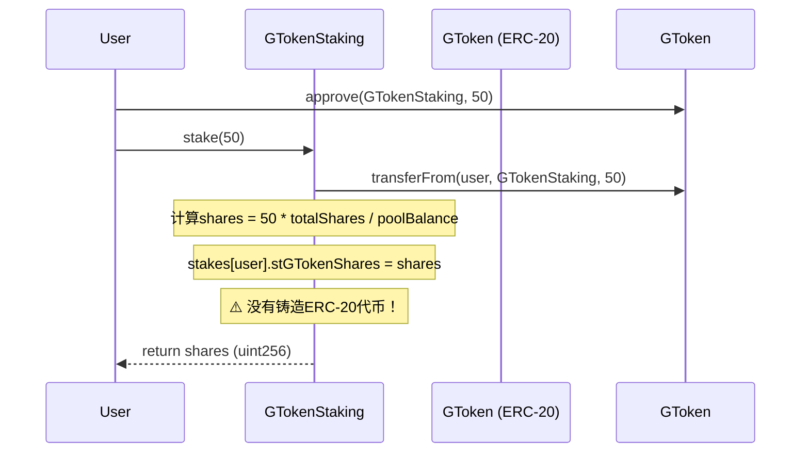
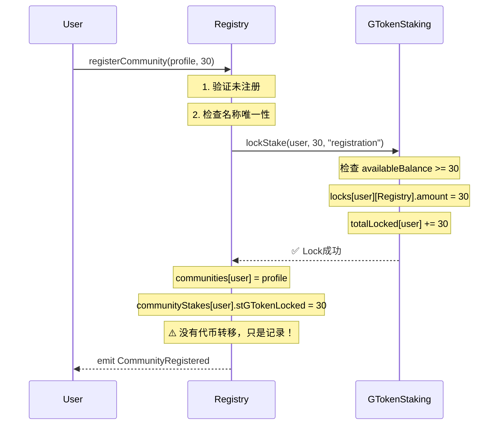

# stGToken Lock Mechanism - 技术架构文档

## 1. 核心架构：完全基于Lido机制

### 1.1 Lido stETH Share System

```solidity
// Lido核心公式
shares = depositAmount * totalShares / totalPooledEther
balance = userShares * totalPooledEther / totalShares
```

### 1.2 我们的GTokenStaking实现

```solidity
/**
 * @notice Enhanced staking contract following Lido stETH best practices
 * @dev Implements stGToken (staked GToken) share system with slash support
 */

// 质押：真实GToken → 虚拟份额
function stake(uint256 amount) external returns (uint256 shares) {
    // 转入真实的GToken ERC-20代币
    IERC20(GTOKEN).safeTransferFrom(msg.sender, address(this), amount);

    // ✅ Lido公式：slash-aware share calculation
    if (totalShares == 0) {
        shares = amount;  // 第一个质押者：1:1
    } else {
        shares = amount * totalShares / (totalStaked - totalSlashed);
        //       ^^^^^^^^^^^^^^^^^^^^^^^^^^^^^^^^^^^^^^^^^^^^^^^^
        //       完全相同的Lido算法，加入slash惩罚支持
    }

    // 存储用户的shares（虚拟份额）
    stakes[msg.sender] = StakeInfo({
        amount: amount,              // 原始GToken数量（历史记录）
        stGTokenShares: shares,      // ✅ 虚拟份额，不是ERC-20代币
        stakedAt: block.timestamp,
        unstakeRequestedAt: 0
    });

    totalStaked += amount;   // 累加真实GToken
    totalShares += shares;   // 累加虚拟份额
}

// 动态价值计算（自动反映slash影响）
function balanceOf(address user) public view returns (uint256 balance) {
    StakeInfo memory info = stakes[user];
    if (info.stGTokenShares == 0) return 0;

    // Slash-aware calculation (Lido公式)
    return info.stGTokenShares * (totalStaked - totalSlashed) / totalShares;
    //     ^^^^^^^^^^^^^^^^^^   ^^^^^^^^^^^^^^^^^^^^^^^^^^^^^^^^ ^^^^^^^^^^^
    //     用户份额              池子净值（扣除slash）           总份额
}
```

---

## 2. stGToken是虚拟份额，不是ERC-20代币

### 2.1 重要区别

| 特性 | Lido stETH | 我们的stGToken |
|------|-----------|---------------|
| **Share机制** | ✅ Lido公式 | ✅ 完全相同 |
| **Slash支持** | ❌ 不支持 | ✅ 内置slash |
| **stETH/stGToken实现** | **ERC-20代币** | **虚拟份额（uint256）** |
| **可转移性** | ✅ 可以transfer | ❌ 绑定地址 |
| **锁定机制** | 独立合约 | 内置mapping |
| **DeFi集成** | ✅ 高（Uniswap/Aave） | ❌ 不适用 |
| **质押门槛** | 无最低限制 | 0.01 GToken |
| **主要用例** | 流动质押 | 声誉抵押 |

### 2.2 为什么不使用ERC-20代币？

#### Lido选择ERC-20的原因：
- ✅ DeFi可组合性（可在Uniswap/Aave使用）
- ✅ 流动性释放（质押资产可交易）
- ✅ 标准化接口（钱包/浏览器支持）

#### 我们选择虚拟份额的原因：
- ✅ **不需要流动性**：注册锁定是长期承诺，不需要二级市场
- ✅ **简化锁定逻辑**：直接在staking合约管理lock，无需额外approval
- ✅ **防止套利攻击**：不可转移避免份额倒卖
- ✅ **Gas优化**：不需要维护ERC-20状态和事件
- ✅ **防止误操作**：用户不会意外转移质押凭证

### 2.3 数据存储方式

```solidity
// GTokenStaking.sol - 没有ERC-20合约
struct StakeInfo {
    uint256 amount;             // 原始存入的GToken（历史记录）
    uint256 stGTokenShares;      // ✅ 虚拟份额（uint256数字）
    uint256 stakedAt;
    uint256 unstakeRequestedAt;
}

// 存储在mapping中，不是ERC-20合约
mapping(address => StakeInfo) public stakes;
```

---

## 3. 三层数据架构

### 3.1 完整的数据流

```
┌─────────────────────────────────────────────────────────────┐
│ 1️⃣ 真实资产层（GToken ERC-20合约）                          │
│   balanceOf[GTokenStaking合约] = 1000 GToken               │
└─────────────────────────────────────────────────────────────┘
                           ↓ transferFrom
┌─────────────────────────────────────────────────────────────┐
│ 2️⃣ 份额层（GTokenStaking合约）                              │
│   stakes[Alice].stGTokenShares = 50 shares                 │
│   stakes[Bob].stGTokenShares = 30 shares                   │
│   totalShares = 80 shares                                  │
│   totalStaked = 1000 GT                                    │
│   totalSlashed = 0 GT                                      │
└─────────────────────────────────────────────────────────────┘
                           ↓ lockStake()
┌─────────────────────────────────────────────────────────────┐
│ 3️⃣ 锁定记录层（双重记录）                                    │
│                                                             │
│   GTokenStaking合约:                                        │
│     locks[Alice][Registry].amount = 30 shares              │
│     locks[Alice][Registry].purpose = "registration"        │
│     totalLocked[Alice] = 30 shares                         │
│                                                             │
│   Registry合约:                                             │
│     communityStakes[Alice].stGTokenLocked = 30 shares      │
│     communityStakes[Alice].isActive = true                 │
└─────────────────────────────────────────────────────────────┘
```

### 3.2 为什么双重记录？

| 合约 | 记录作用 | 为什么需要 |
|------|---------|-----------|
| **GTokenStaking** | `locks[user][locker]` | **真相来源**：防止重复锁定，检查可用余额 |
| **Registry** | `communityStakes[user]` | **业务状态**：跟踪失败次数、slash历史、激活状态 |

**关键规则**：
- ✅ GTokenStaking是**资产控制层**（authoritative source）
- ✅ Registry是**业务逻辑层**（business state）
- ⚠️ Registry的`stGTokenLocked`必须与GTokenStaking的`locks`同步

---

## 4. 锁定机制防重复使用

### 4.1 可用余额计算

```solidity
// GTokenStaking.sol
function availableBalance(address user) public view returns (uint256) {
    uint256 userShares = stakes[user].stGTokenShares;  // 总质押份额
    uint256 locked = totalLocked[user];                 // 已锁定总量

    return userShares > locked ? userShares - locked : 0;  // ✅ 可用 = 总量 - 已锁定
}
```

### 4.2 锁定时的检查

```solidity
function lockStake(address user, uint256 amount, string memory purpose) external {
    // ✅ 关键检查：确保可用余额充足
    uint256 available = availableBalance(user);
    if (available < amount) {
        revert InsufficientAvailableBalance(available, amount);
    }

    // 记录锁定（每个locker独立跟踪）
    locks[user][msg.sender].amount += amount;
    locks[user][msg.sender].purpose = purpose;
    locks[user][msg.sender].lockedAt = block.timestamp;

    // ✅ 累加总锁定量（防止重复使用）
    totalLocked[user] += amount;

    emit StakeLocked(user, msg.sender, amount, purpose);
}
```

### 4.3 防重复使用示例

假设Alice质押了50 GToken：

| 操作 | totalStaked | totalLocked | availableBalance | 结果 |
|------|-------------|-------------|------------------|------|
| 初始质押50 GT | 50 | 0 | 50 | ✅ 成功 |
| Registry锁定30 GT | 50 | 30 | 20 | ✅ 成功 |
| SuperPaymaster再锁30 GT | 50 | 30 | 20 | ❌ **失败**（余额不足） |
| SuperPaymaster锁定20 GT | 50 | 50 | 0 | ✅ 成功（刚好用完） |
| 再尝试锁定任意数量 | 50 | 50 | 0 | ❌ **失败**（无可用余额） |

**结论**：系统检查的是**未锁定数量**（`availableBalance`），而不是总质押数量。

---

## 5. 完整注册流程

### 5.1 质押流程（Stake GToken → 获得虚拟份额）



### 5.2 注册锁定流程（Lock虚拟份额 → 注册成功）



### 5.3 关键点总结

| 步骤 | 资产变化 | 数据变化 |
|------|---------|---------|
| **Stake** | GToken从用户→GTokenStaking | `stakes[user].stGTokenShares` += shares |
| **Lock** | ❌ 无资产转移 | `totalLocked[user]` += amount<br>`locks[user][Registry]` = LockInfo |
| **Register** | ❌ 无资产转移 | `communityStakes[user]` = CommunityStake |

---

## 6. Slash机制如何影响Share价值

### 6.1 Slash操作

```solidity
// GTokenStaking.sol
function slash(
    address operator,
    uint256 amount,
    string calldata reason
) external returns (uint256 slashed) {
    // 只有授权的slasher（Registry/SuperPaymaster）可调用
    if (!authorizedSlashers[msg.sender]) {
        revert UnauthorizedSlasher(msg.sender);
    }

    // 计算实际slash数量（不能超过余额）
    uint256 operatorBalance = balanceOf(operator);
    slashed = amount > operatorBalance ? operatorBalance : amount;

    // ✅ 关键：销毁GToken，但不减少totalShares
    // 这会降低每个share的价值（影响所有质押者）
    totalSlashed += slashed;

    // 将slashed的GToken转给Treasury
    IERC20(GTOKEN).safeTransfer(treasury, slashed);

    emit Slashed(operator, slashed, reason, block.timestamp);

    return slashed;
}
```

### 6.2 Slash影响示例

**初始状态：**
- totalStaked = 1000 GT
- totalSlashed = 0 GT
- totalShares = 1000 shares
- Alice持有50 shares
- Alice余额 = 50 * (1000-0) / 1000 = **50 GT**

**Alice被slash 10 GT后：**
- totalStaked = 1000 GT（不变）
- totalSlashed = 10 GT（新增）
- totalShares = 1000 shares（不变）
- Alice仍持有50 shares
- Alice余额 = 50 * (1000-10) / 1000 = **49.5 GT** ⬇️

**关键特性**：
- ✅ Share数量不变（50 shares仍是50 shares）
- ✅ Share价值降低（每个share价值从1 GT → 0.99 GT）
- ✅ `balanceOf()`自动反映slash影响

---

## 7. 多重锁定（Multi-Locker）机制

### 7.1 支持的Locker类型

```solidity
// GTokenStaking.sol
mapping(address => mapping(address => LockInfo)) public locks;
//      用户地址 =>    Locker合约 => 锁定信息

// 支持的Locker示例：
// - Registry: 社区注册锁定
// - SuperPaymaster: 运营商注册锁定
// - MySBT: SBT会员锁定
```

### 7.2 多重锁定示例

Alice质押100 GT，可以同时被多个合约锁定：

```solidity
locks[Alice][Registry].amount = 30 GT        // Registry锁定30
locks[Alice][SuperPaymaster].amount = 50 GT  // SuperPaymaster锁定50
locks[Alice][MySBT].amount = 20 GT           // MySBT锁定20

totalLocked[Alice] = 100 GT                  // 总锁定100
availableBalance[Alice] = 0 GT               // 无可用余额
```

### 7.3 解锁需要对应的Locker

```solidity
function unlockStake(address user, uint256 amount) external {
    // ✅ 只有锁定者自己可以解锁
    LockInfo storage lock = locks[user][msg.sender];

    if (lock.amount < amount) {
        revert InsufficientLockedAmount(lock.amount, amount);
    }

    // 计算退出费用（根据锁定时长）
    uint256 exitFee = _calculateExitFee(msg.sender, user, amount);
    uint256 netAmount = amount - exitFee;

    // 更新锁定记录
    lock.amount -= amount;
    totalLocked[user] -= amount;

    // 转移退出费用到Treasury
    if (exitFee > 0) {
        address recipient = lockerConfigs[msg.sender].feeRecipient;
        if (recipient == address(0)) recipient = treasury;
        // ... 转账逻辑
    }

    emit StakeUnlocked(user, msg.sender, amount, exitFee, netAmount);
}
```

---

## 8. 业界对比

### 8.1 Lido stETH vs 我们的stGToken

| 特性 | Lido stETH | GTokenStaking |
|------|-----------|---------------|
| **Share公式** | ✅ 相同 | ✅ 相同 |
| **代币形式** | ERC-20（可转移） | 虚拟份额（不可转移） |
| **Slash支持** | ❌ 不支持 | ✅ 内置 |
| **锁定机制** | 需外部合约 | 内置multi-locker |
| **DeFi集成** | ✅ 高 | ❌ 不适用 |
| **主要用途** | ETH流动质押 | 声誉抵押/注册锁定 |

### 8.2 业界其他Lock方案

| 项目 | Token形式 | Lock方式 | 用例 |
|------|----------|---------|------|
| **Lido** | ERC-20 | 独立lock合约（如Curve） | DeFi流动性 |
| **Eigenlayer** | 虚拟份额 | 内置strategy lock | 重质押 |
| **Convex** | ERC-20 | 投票托管（veCRV） | 治理锁定 |
| **我们** | 虚拟份额 | 内置multi-locker | 注册/声誉 |

---

## 9. 技术要点总结

### 9.1 核心设计原则

1. ✅ **Share机制**：完全遵循Lido stETH最佳实践
2. ✅ **Slash感知**：自动计算价值（totalStaked - totalSlashed）
3. ✅ **防重复使用**：通过`totalLocked`跟踪累积锁定
4. ✅ **多重锁定**：支持多个协议同时锁定同一用户
5. ✅ **虚拟份额**：无需ERC-20，简化架构
6. ✅ **原子性**：锁定失败则注册失败（事务回滚）

### 9.2 安全考虑

| 风险 | 防护措施 |
|------|---------|
| **重复锁定** | `availableBalance`检查 |
| **Slash攻击** | 只允许授权slasher |
| **Unlock攻击** | 只有locker自己可解锁 |
| **整数溢出** | Solidity 0.8+内置检查 |
| **重入攻击** | ReentrancyGuard + CEI模式 |

### 9.3 Gas优化

- ✅ 无ERC-20 transfer/approval（节省~50k gas）
- ✅ 单次存储写入（StakeInfo打包）
- ✅ View函数计算（无状态变更）
- ✅ 批量查询支持（getLockInfo）

---

## 10. 开发者常见问题

### Q1: 为什么Registry也要记录stGTokenLocked？
A: **双重记录**：
- GTokenStaking：资产控制（真相来源）
- Registry：业务状态（失败计数、slash历史）

### Q2: stGToken能转移给别人吗？
A: **不能**。这是虚拟份额，绑定地址。如需流动性，考虑：
- 方案A：部署ERC-20包装器（wrappedStGToken）
- 方案B：直接使用Lido stETH模式

### Q3: Slash会影响其他质押者吗？
A: **不会**。Slash只减少被惩罚者的余额：
```solidity
slashed = balanceOf(operator);  // 只影响operator
totalSlashed += slashed;        // 全局记录
```

### Q4: 如何查询用户的锁定状态？
A:
```solidity
// 总份额
uint256 total = stakes[user].stGTokenShares;

// 总锁定
uint256 locked = totalLocked[user];

// 可用份额
uint256 available = availableBalance(user);

// 特定locker的锁定
uint256 registryLock = locks[user][registryAddress].amount;
```

### Q5: 为什么不直接用ERC-20的approve/transferFrom？
A: **设计哲学不同**：
- ERC-20：用户授权 → 合约转移 → 需要approval
- 虚拟份额：合约内部记录 → 无需approval → Gas更低

---

## 11. 相关文档

- `GTokenStaking.sol` - 核心质押合约
- `Registry.sol` - V2社区注册合约
- `SuperPaymasterRegistry_v1_2.sol` - V1注册合约
- `ISuperPaymasterRegistry.sol` - 注册接口定义
- `PriceCalculationMigration.md` - 价格计算迁移指南
- `Deployment-V4.2.md` - 部署文档

---

## 12. 更新历史

| 版本 | 日期 | 变更 |
|------|------|------|
| 1.0 | 2025-01-26 | 初始版本：基于Lido机制分析 |

---

**结论**：我们的stGToken锁定机制完全遵循Lido stETH的Share系统设计，但用虚拟份额代替ERC-20代币，更适合声誉抵押和注册锁定场景。通过`totalLocked`跟踪机制，系统可靠地防止了份额重复使用，同时支持多协议并行锁定。
